# Explore Redis for Developers

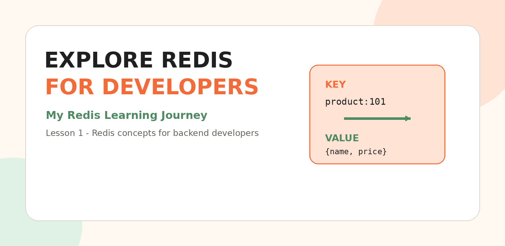

## My Redis Learning Journey - Lesson 1

Welcome to the first lesson of my Redis learning journey.

I am learning Redis as part of my backend-development path with **Java, Spring Boot, microservices, Kafka, RabbitMQ and system design**. The goal is not only to memorize Redis commands, but to understand where Redis fits inside real applications.

## What You Will Learn

- What Redis is
- Why Redis is fast
- How key-value storage works
- Cache hits and cache misses
- Redis data types
- Expiration using TTL
- Common backend use cases
- Redis with Spring Boot and microservices
- Common Redis problems
- A roadmap for the next lessons

---

## 1. What Is Redis?

Redis stands for **Remote Dictionary Server**.

Redis is a fast, in-memory NoSQL data store. It commonly stores information using a simple structure:

```text
key -> value
```

Example:

```text
name -> Pranava
city -> Kent
language -> Java
```

Save a value:

```redis
SET name "Pranava"
```

Read the value:

```redis
GET name
```

Output:

```text
Pranava
```

---

## 2. Redis in a Simple Example

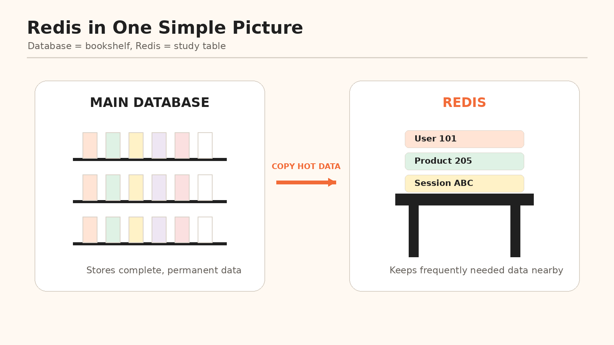

Imagine all your books are stored on a bookshelf in another room. Every time you need information, you must walk to the shelf, find the book and locate the correct page.

Instead, you keep the notes you use most often on your study table.

| Real-world object | Backend meaning |
|---|---|
| Bookshelf | Main database |
| Study table | Redis |
| Frequently used notes | Cached data |

Redis acts like a fast-access table for an application.

---

## 3. Why Is Redis Fast?

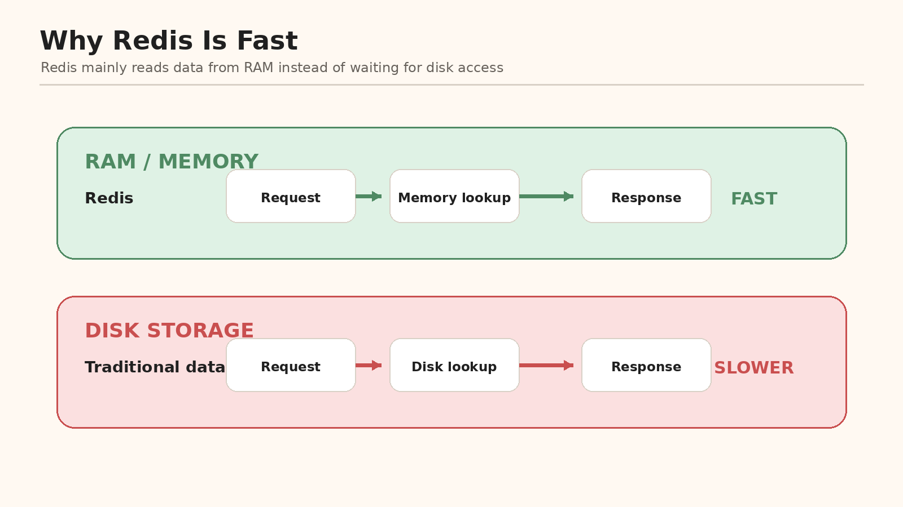

Traditional databases commonly store data on disk. Redis primarily keeps data in RAM.

```text
Disk storage -> slower access
RAM storage  -> faster access
```

Redis is useful when an application needs very fast access to frequently requested or temporary data.

---

## 4. Is Redis a Database?

Yes. Redis is a NoSQL data store.

In many backend applications, Redis is used beside a permanent database rather than replacing it.

```text
PostgreSQL / MySQL -> permanent business data
Redis              -> temporary or frequently accessed data
```

Example:

- PostgreSQL permanently stores product information.
- Redis temporarily stores frequently requested product details.

---

## 5. What Is Caching?

Caching means storing frequently requested information in a faster location.

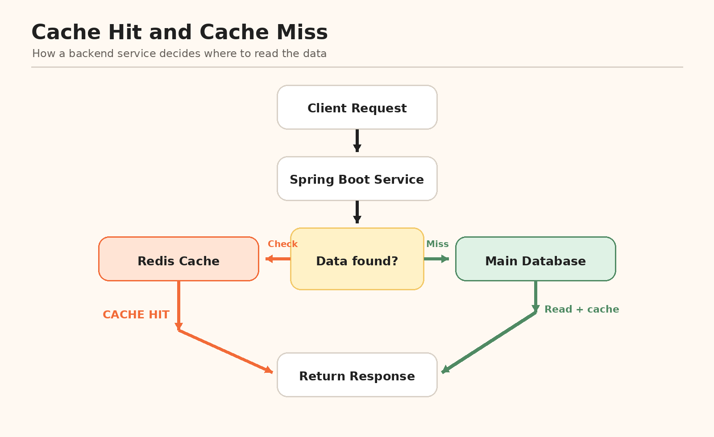

### First Request: Cache Miss

```text
User requests product 101
        |
Application checks Redis
        |
Data is not found
        |
Application reads the database
        |
Application stores the result in Redis
        |
Response is returned
```

### Later Request: Cache Hit

```text
User requests product 101
        |
Application checks Redis
        |
Data is found
        |
Response is returned immediately
```

### Cache Hit

A cache hit means the requested data is already available in Redis.

### Cache Miss

A cache miss means Redis does not contain the requested data, so the application reads the main database.

---

## 6. Common Redis Use Cases

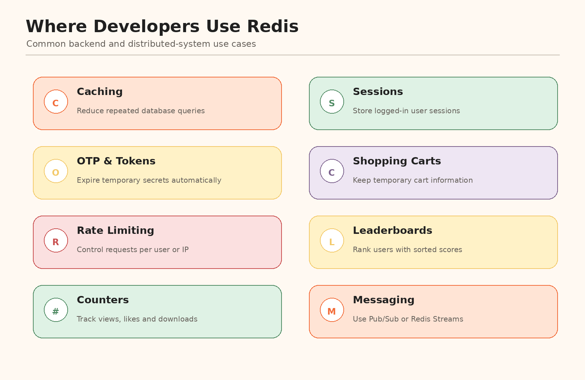

### Caching

Store frequently requested database or API results.

### Login Sessions

```text
session:abc123 -> user:101
```

### OTP Storage

```text
otp:user:101 -> 673921
```

### Shopping Carts

```text
cart:user:101 -> product:1, product:2
```

### Rate Limiting

Count how many requests a user or IP address sends in a time window.

### Leaderboards

Store users with scores and return them in ranked order.

### Counters

Track page views, likes, downloads or API requests.

### Messaging

Redis supports Publish/Subscribe and Redis Streams.

---

## 7. Basic Redis Commands

Test the server:

```redis
PING
```

Response:

```text
PONG
```

Store a value:

```redis
SET language "Java"
```

Read a value:

```redis
GET language
```

Delete a value:

```redis
DEL language
```

Check whether a key exists:

```redis
EXISTS language
```

Set a value that expires after 60 seconds:

```redis
SET otp:101 "673921" EX 60
```

Check the remaining expiration time:

```redis
TTL otp:101
```

> `KEYS *` is useful while learning, but it should normally be avoided in large production systems because scanning every key can block work.

---

## 8. Redis Data Types

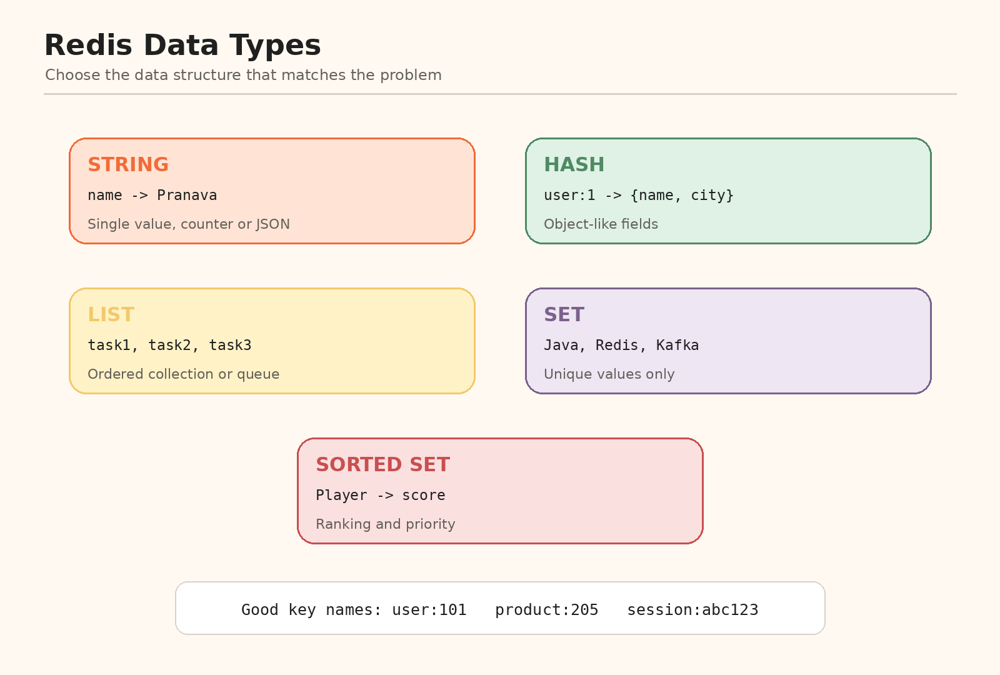

### String

Stores one value.

```redis
SET user:1:name "Pranava"
```

Useful for names, tokens, OTPs, counters and cached JSON.

### Hash

Stores multiple fields under one key.

```redis
HSET user:1 name "Pranava" city "Kent" role "Developer"
HGETALL user:1
```

Useful for user profiles and product information.

### List

Stores values in order.

```redis
LPUSH tasks "Learn Redis"
LPUSH tasks "Learn Spring Boot"
LRANGE tasks 0 -1
```

Useful for queues, task lists and recent activity.

### Set

Stores unique values.

```redis
SADD skills "Java"
SADD skills "Redis"
SADD skills "Java"
SMEMBERS skills
```

Java is stored only once.

### Sorted Set

Stores unique values with scores.

```redis
ZADD leaderboard 100 "Player-A"
ZADD leaderboard 150 "Player-B"
ZADD leaderboard 120 "Player-C"
ZREVRANGE leaderboard 0 -1 WITHSCORES
```

Useful for rankings, leaderboards and priority-based work.

---

## 9. Expiration and TTL

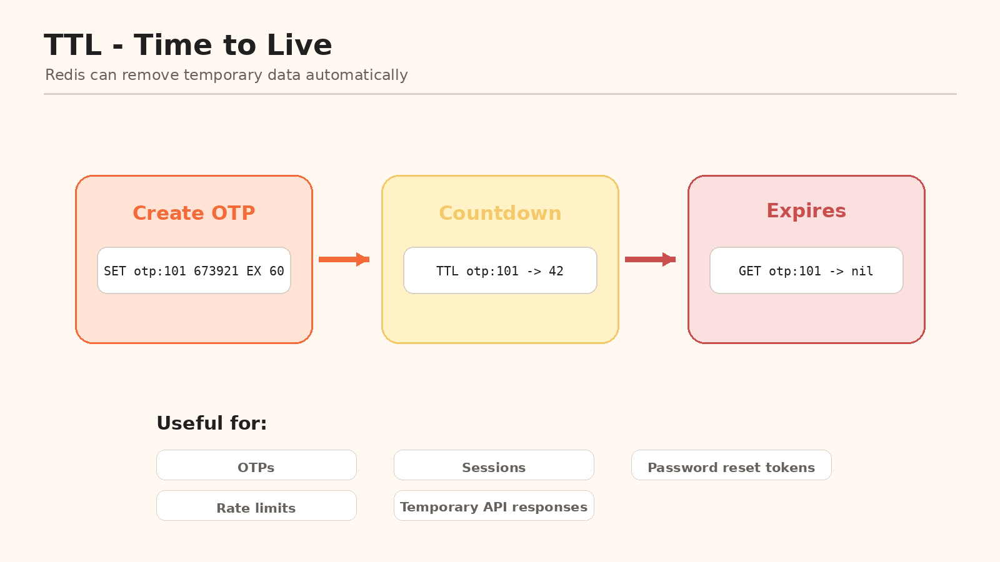

TTL means **Time to Live**.

It tells Redis how long a key should exist.

```redis
SET password-reset:user:101 "temporary-token" EX 300
```

The key expires after 300 seconds, or five minutes.

TTL is useful for:

- OTPs
- Sessions
- Password-reset tokens
- Rate-limiting counters
- Temporary API responses

---

## 10. Redis in a Spring Boot Backend

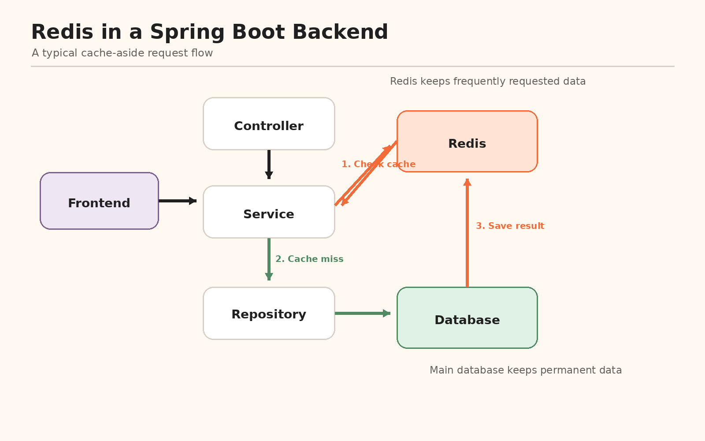

A common request flow is:

```text
Frontend
   |
Controller
   |
Service
   |
Check Redis
   |
Data found?
   |---- Yes -> Return data
   |
   |---- No -> Repository -> Database
                         |
                         -> Save result in Redis
                         |
                         -> Return data
```

Redis helps the service avoid repeated database reads.

A common Spring Boot dependency is:

```xml
<dependency>
    <groupId>org.springframework.boot</groupId>
    <artifactId>spring-boot-starter-data-redis</artifactId>
</dependency>
```

Basic local configuration:

```properties
spring.data.redis.host=localhost
spring.data.redis.port=6379
```

---

## 11. Redis in Microservices

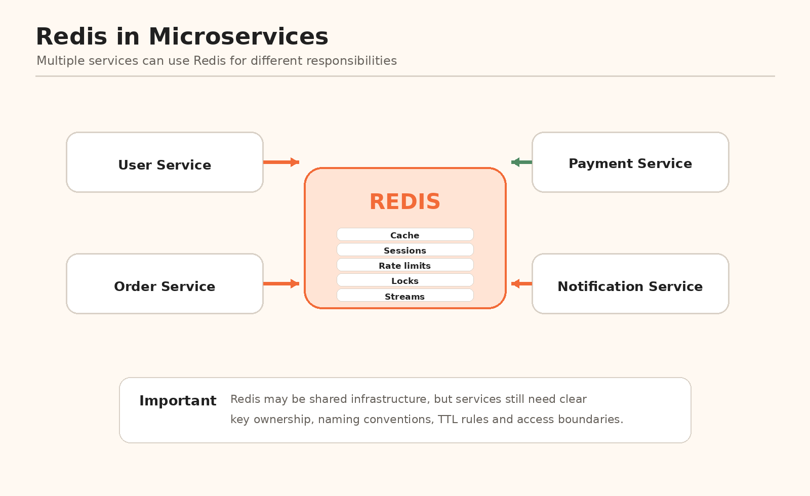

Services such as User, Order, Payment and Notification services may use Redis for:

- Caching
- Shared sessions
- Rate limiting
- Distributed locks
- Real-time counters
- Pub/Sub
- Redis Streams

Use clear key names:

```text
user:101
product:205
order:908
session:abc123
otp:user:101
cart:user:101
```

A shared Redis server does not mean every service should freely change every key. Teams still need clear ownership, key naming and expiration rules.

---

## 12. Redis Is Not Always Required

Use Redis when:

- The same data is requested frequently.
- Faster response time is necessary.
- Temporary data must expire.
- Repeated database queries create load.
- The system needs counters, rankings or rate limits.
- Sessions must be shared across multiple application instances.

Redis may not be necessary when:

- The application is very small.
- Data is not requested repeatedly.
- The main database is already fast enough.
- Redis would add infrastructure complexity without solving a real problem.

Always understand the problem before adding Redis.

---

## 13. The Stale Data Problem

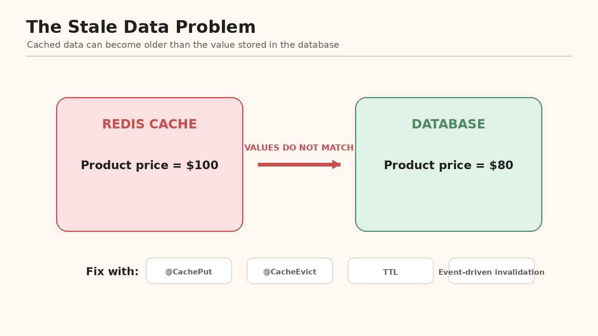

Suppose the database price changes from `$100` to `$80`, but Redis still contains `$100`.

This is stale data.

Possible solutions include:

- Update the cache when the database changes.
- Delete the cache entry after an update.
- Add a reasonable TTL.
- Use event-driven cache invalidation.

With Spring caching, common annotations include:

```java
@Cacheable
@CachePut
@CacheEvict
```

---

## 14. When Redis Becomes Unavailable

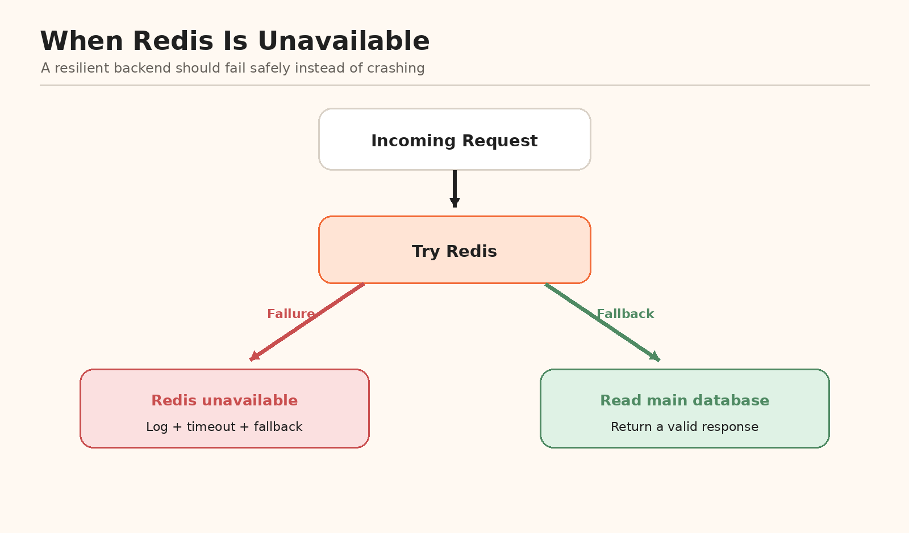

A well-designed application should not automatically crash when Redis is unavailable.

A possible fallback flow is:

```text
Try Redis
   |
Redis unavailable
   |
Log the failure
   |
Read from the main database
   |
Return a valid response
```

Production applications should use:

- Connection and command timeouts
- Error handling
- Fallback logic
- Monitoring
- Logging
- Redis replication or managed high availability where required

---

## 15. What I Learned in Lesson 1

- Redis is an in-memory NoSQL data store.
- Redis commonly stores data using keys and values.
- Redis is often used as a cache beside a permanent database.
- Cache hits avoid repeated database calls.
- Redis supports strings, hashes, lists, sets and sorted sets.
- TTL automatically removes temporary keys.
- Redis is useful for sessions, OTPs, carts, counters, rate limits and leaderboards.
- Redis can support Spring Boot applications and microservices.
- Cache consistency and Redis failures must be handled carefully.
- Redis should solve a real problem instead of being added only because it is popular.

---

## 16. Simple Way to Remember Redis

```text
Main database = Permanent storage room
Redis         = Fast-access table
Key           = Label
Value         = Stored information
TTL           = Automatic expiration timer
Cache hit     = Data found in Redis
Cache miss    = Data not found in Redis
```

---

## My Redis Roadmap

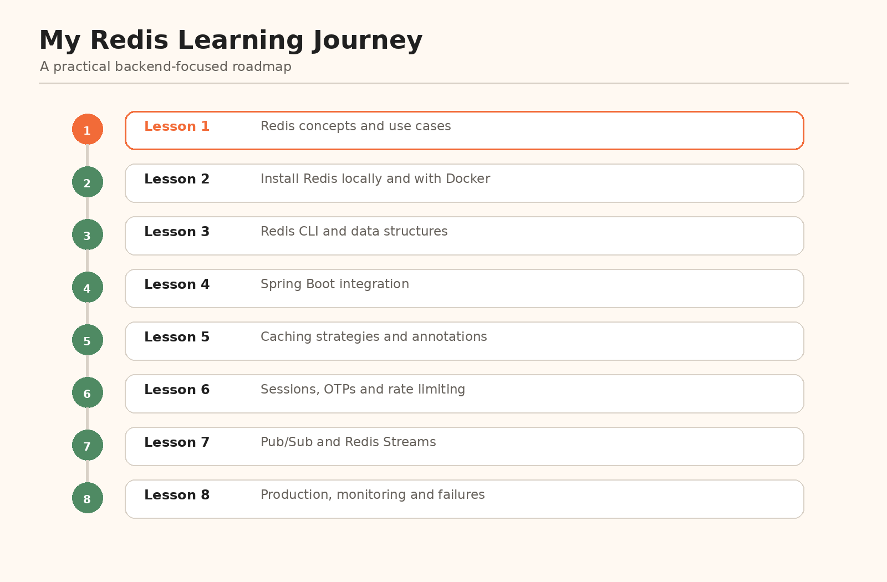

My goal is to understand Redis from basic commands to production use with Java and Spring Boot.

### Next Lesson: Installing and Running Redis

The next lesson will cover:

- Installing Redis locally
- Running Redis with Docker
- Connecting through Redis CLI
- Testing common commands
- Understanding basic Redis configuration
- Viewing Redis data

---

## Repository Structure

```text
redis-learning-journey-lesson-01/
|-- README.md
`-- images/
    |-- 00-cover.png
    |-- 01-redis-analogy.png
    |-- 02-why-redis-is-fast.png
    |-- 03-cache-hit-miss-flow.png
    |-- 04-redis-use-cases.png
    |-- 05-redis-data-types.png
    |-- 06-ttl-lifecycle.png
    |-- 07-spring-boot-redis-architecture.png
    |-- 08-redis-microservices.png
    |-- 09-stale-data.png
    |-- 10-redis-failure-fallback.png
    `-- 11-learning-roadmap.png
```
