# Explore Redis for Developers

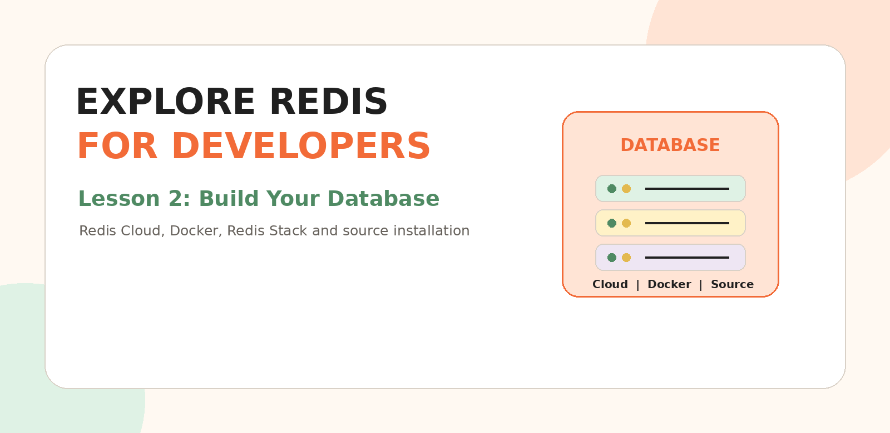

# Lesson 2: Build Your Database

Welcome to the second lesson of my Redis learning journey.

In Lesson 1, we learned what Redis is, why it is fast, how caching works and where backend developers use Redis.

Now it is time to put that learning into action by creating a real Redis database.

This lesson explains three setup options:

1. Redis Cloud
2. Redis Open Source or Redis Stack with Docker
3. Redis from source

---

## What You Will Learn

- What it means to build a Redis database
- How to create a free Redis Cloud database
- How to select a cloud provider and region
- How to understand Redis connection details
- How to run Redis locally using Docker
- How to run Redis Stack with Redis Insight
- How Docker persistence works
- How to compile Redis from source
- How to verify the database with Redis commands
- How to troubleshoot common setup problems
- How to keep credentials secure

---

## 1. What Does “Build Your Database” Mean?

A Redis database needs a running Redis server.

Think about opening a small store.

Before customers can buy something, you need:

```text
A building
A door
A store manager
A secure key
Shelves for products
```

A Redis database also needs similar things:

```text
Redis server      = Building
Host and port     = Address and door
Username/password = Secure key
Memory            = Shelves
Redis client      = Person entering the store
```

When the Redis server is running and your client can connect to it, your database is ready.

---

## 2. Choose Your Setup Option

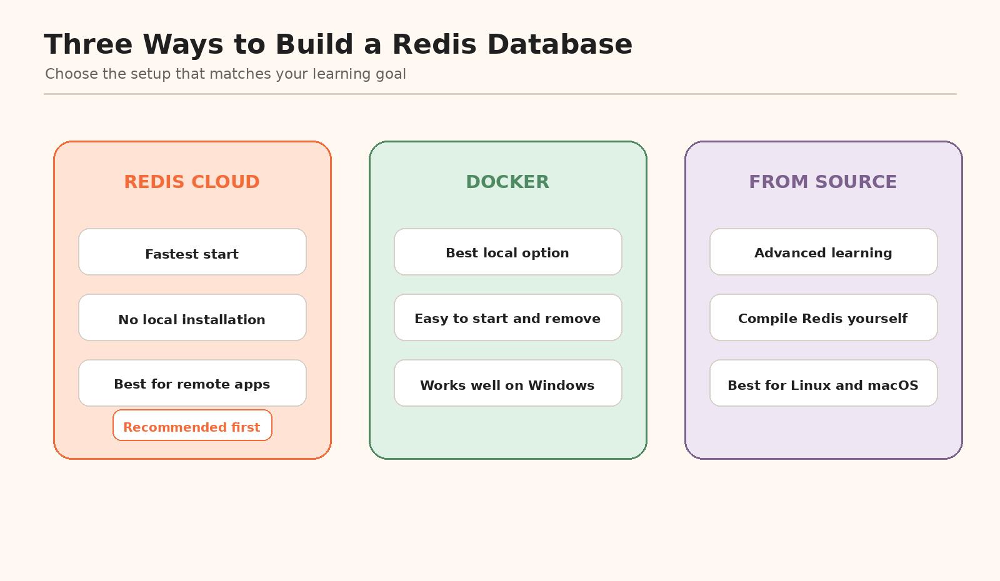

| Option | Best for | Installation needed? | Internet needed? |
|---|---|---:|---:|
| Redis Cloud | Beginners, remote apps and quick prototypes | No Redis server installation | Yes |
| Docker | Local backend development and repeatable environments | Docker Desktop or Docker Engine | Initially |
| From source | Learning compilation and Redis internals | Build tools and libraries | Initially |

### My recommendation

For a beginner:

```text
First choice  -> Redis Cloud
Second choice -> Docker
Advanced path -> Build from source
```

You can complete both Redis Cloud and Docker. This gives you experience with a remote database and a local database.

---

# Part A: Redis Cloud

## 3. Create a Redis Cloud Account

Open:

```text
https://redis.io/try-free/
```

You can create an account using email, Google or GitHub.

After registration, check your email and activate the account.

Do not share your Redis Cloud password or database credentials in GitHub, LinkedIn screenshots or public documentation.

---

## 4. Create a Free Redis Cloud Database

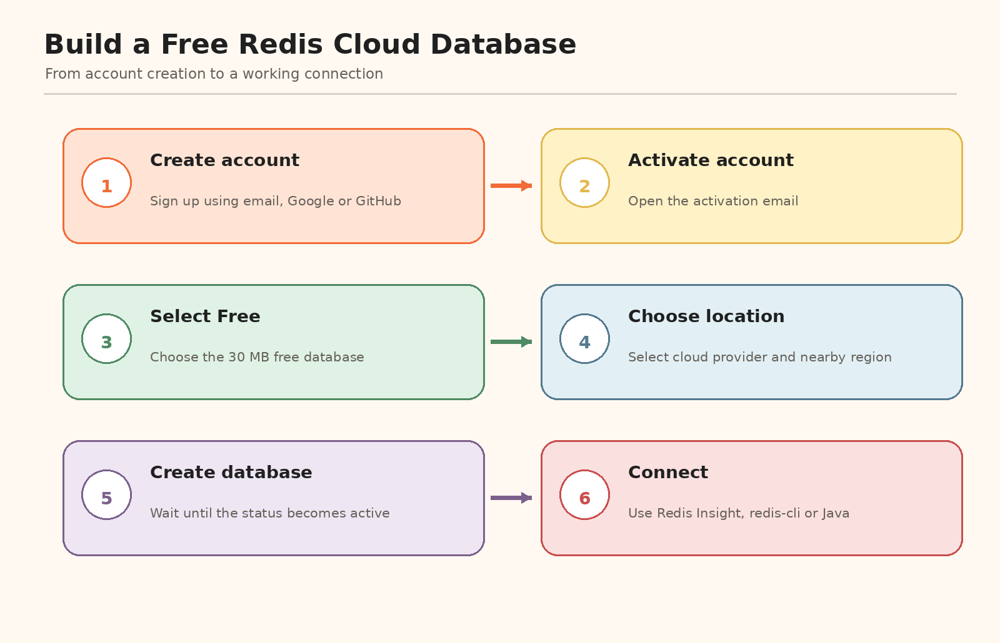

Follow these steps:

1. Sign in to Redis Cloud.
2. Select **New database**.
3. Select the free option.
4. Enter or accept a database name.
5. Select the available Redis version.
6. Choose a cloud vendor.
7. Choose a preferred region.
8. Select **Create database**.
9. Wait until the database status becomes active.

The current free database is intended for learning and prototypes and provides 30 MB of storage. An account can have one free database at a time.

### Suggested database name

```text
redis-learning-journey
```

A good name tells you why the database exists.

---

## 5. Select a Cloud Provider

Redis Cloud can provide region choices from cloud platforms such as:

- Amazon Web Services
- Google Cloud
- Microsoft Azure

For learning, the provider is usually less important than choosing a nearby region.

If your future application is already running in one cloud provider, placing Redis in the same provider and a nearby region can simplify the architecture.

---

## 6. Choose a Preferred Region

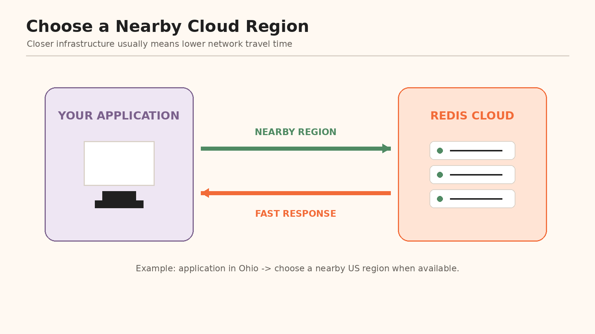

A region is the physical area where your database runs.

Example:

```text
Application is in the eastern United States
                |
Choose an available nearby US region
                |
Network travel distance is reduced
```

Do not select a distant region only because its name looks familiar.

For a real application, consider:

- Distance from the application server
- Data-residency requirements
- Service availability
- Cost
- Disaster-recovery plan

For this learning lesson, select a nearby available region.

---

## 7. Wait for the Database to Become Active

After you select **Create database**, the database may temporarily show a pending status.

```text
Pending -> Redis is preparing the database
Active  -> The database is ready
```

Do not try to connect until the database becomes active.

---

## 8. Understand the Connection Details

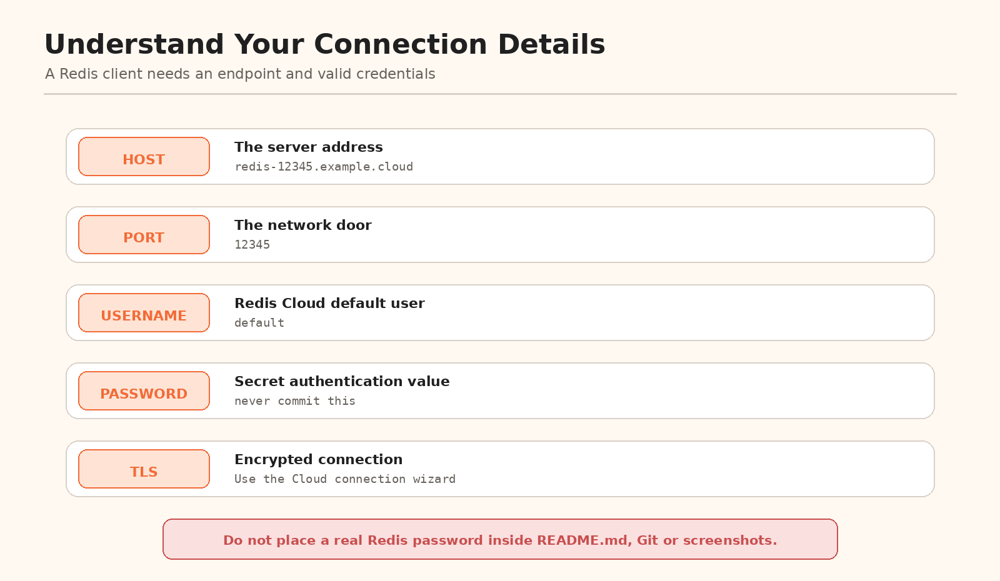

Open the database details and connection wizard.

You will see values similar to:

```text
Host
Port
Username
Password
Connection method
TLS or secure connection information
```

### Host

The host is the database server address.

```text
redis-example.cloud-provider.com
```

### Port

The port is the network door used to reach Redis.

Local Redis commonly uses:

```text
6379
```

A Redis Cloud database may provide a different port. Always copy the exact port shown in the console.

### Username

Redis Cloud provides a default user named:

```text
default
```

### Password

The password proves that your client is allowed to access the database.

Never place the actual password in:

- `README.md`
- Java source code
- Git commits
- LinkedIn posts
- Screenshots
- Docker Compose files committed publicly

Use environment variables or a secrets manager.

---

## 9. Connect to Redis Cloud

The connection wizard provides supported connection options, including:

- Redis Insight
- `redis-cli`
- Java clients such as Jedis or Lettuce
- Other programming-language clients

Copy the generated command from the connection wizard because the exact host, port and security arguments belong to your database.

### Safe placeholder example

```bash
redis-cli \
  -h YOUR_REDIS_HOST \
  -p YOUR_REDIS_PORT \
  --user default \
  --pass YOUR_REDIS_PASSWORD
```

For a secure Cloud database, use the TLS or URI command provided by Redis Cloud rather than guessing the security options.

### Test the connection

```redis
PING
```

Expected response:

```text
PONG
```

---

## 10. Open Redis Insight

Redis Insight is a graphical tool for viewing and managing Redis data.

Redis Cloud may allow you to launch Redis Insight from the browser. Redis Insight is also available as a desktop application.

With Redis Insight, you can:

- View keys
- Run commands
- Inspect values
- Explore data types
- View memory usage
- Learn Redis interactively

Do not confuse Redis Insight with the Redis server.

```text
Redis server  -> Stores and processes the data
Redis Insight -> Helps you view and manage the data
```

---

# Part B: Redis with Docker

## 11. Why Use Docker?

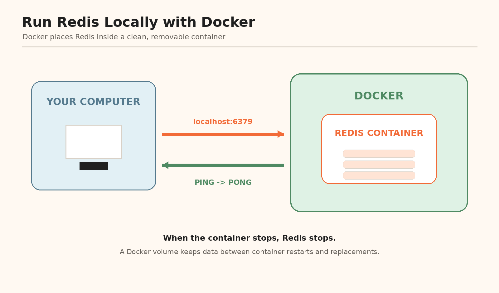

Docker allows you to run Redis inside an isolated container.

```text
Docker image     = Recipe
Docker container = Running Redis created from the recipe
```

Docker is especially useful when:

- You use Windows.
- You want a repeatable setup.
- You want to delete Redis cleanly.
- Multiple developers need the same version.
- You are learning microservices.

---

## 12. Check Docker

Install Docker Desktop on Windows or macOS, or Docker Engine on Linux.

Check that Docker works:

```bash
docker --version
```

Check Docker Compose:

```bash
docker compose version
```

---

## 13. Fastest Docker Command

Run Redis Open Source:

```bash
docker run -d \
  --name redis \
  -p 6379:6379 \
  redis:8
```

On PowerShell, run it on one line:

```powershell
docker run -d --name redis -p 6379:6379 redis:8
```

What each part means:

```text
docker run       -> Create and start a container
-d               -> Run in the background
--name redis     -> Name the container
-p 6379:6379     -> Map computer port 6379 to Redis port 6379
redis:8          -> Use the Redis major-version 8 image
```

Check the container:

```bash
docker ps
```

Connect:

```bash
docker exec -it redis redis-cli
```

Test:

```redis
PING
```

Expected result:

```text
PONG
```

---

## 14. Use the Included Docker Compose File

This lesson package includes:

```text
docker-compose.yml
```

Start Redis:

```bash
docker compose up -d
```

Check its status:

```bash
docker compose ps
```

Connect to Redis:

```bash
docker exec -it redis-learning redis-cli
```

View logs:

```bash
docker compose logs redis
```

Stop Redis without deleting the container:

```bash
docker compose stop
```

Start it again:

```bash
docker compose start
```

Remove the container and network:

```bash
docker compose down
```

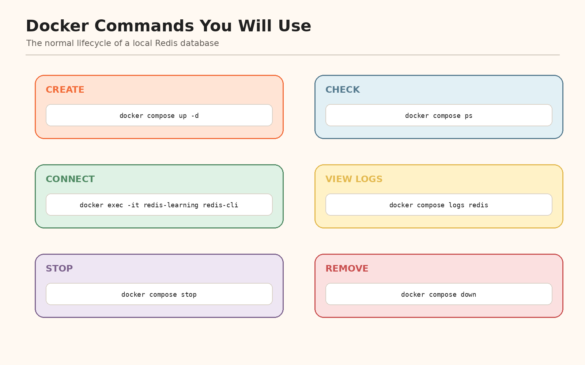

---

## 15. Understand Docker Persistence

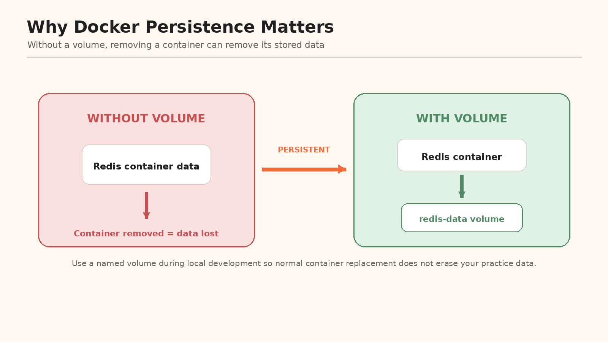

A container should be treated as replaceable.

Without a persistent volume:

```text
Create container
Store data
Remove container
Data may disappear
```

With a persistent volume:

```text
Create container
Store data in volume
Remove container
Create a new container
Attach the same volume
Data is still available
```

The included Docker Compose file creates:

```yaml
volumes:
  redis-data:
```

and attaches it to:

```text
/data
```

This allows Redis data to survive normal container replacement.

### Important difference

```bash
docker compose down
```

Normally keeps the named volume.

```bash
docker compose down -v
```

Removes the containers **and the volume**.

Use `-v` only when you intentionally want to delete the local Redis data.

---

## 16. Run Redis Stack with Docker

Redis Stack version 7.x documentation describes two images.

### Redis Stack server only

```bash
docker run -d \
  --name redis-stack-server \
  -p 6379:6379 \
  redis/redis-stack-server:latest
```

### Redis Stack with Redis Insight

```bash
docker run -d \
  --name redis-stack \
  -p 6379:6379 \
  -p 8001:8001 \
  redis/redis-stack:latest
```

Open Redis Insight:

```text
http://localhost:8001
```

Connect with `redis-cli`:

```bash
docker exec -it redis-stack redis-cli
```

### Which Docker image should I use?

For current core Redis learning:

```text
redis:8
```

For tutorials specifically written for the older Redis Stack 7.x packaging:

```text
redis/redis-stack
```

The Redis Stack installation page is currently listed under archived version 7.x documentation. Follow the current Redis Open Source Docker instructions unless your tutorial specifically requires the Stack image.

---

# Part C: Build Redis from Source

## 17. What Does “From Source” Mean?

Building from source means:

```text
Download Redis source code
          |
Compile the code
          |
Create Redis executable files
          |
Run redis-server
```

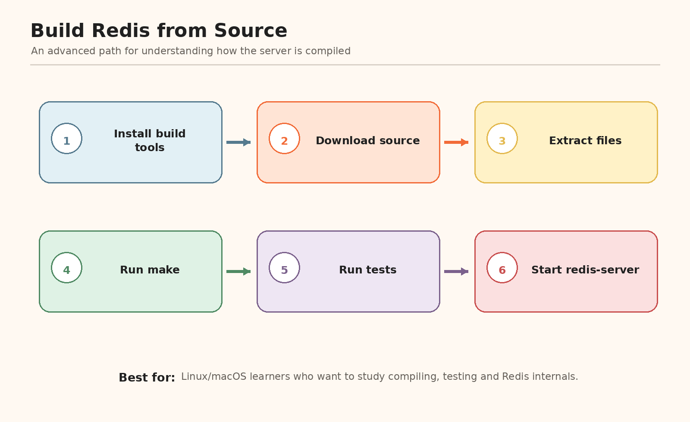

This path is useful when:

- You want to understand compiling.
- You want to inspect Redis source code.
- You need custom build flags.
- You are learning systems programming.
- You are working on Redis itself.

It is not the easiest starting method.

---

## 18. Current Redis 8 Source-Build Guidance

Redis provides platform-specific Redis 8 build instructions for supported Linux distributions and macOS versions.

Use the current guide:

```text
https://redis.io/docs/latest/operate/oss_and_stack/install/build-stack/
```

Select your operating system and follow its dependency, download, build, test and start instructions.

### General idea

```bash
# Install the required tools for your operating system.

# Download the Redis release source archive.

# Extract it.
tar -xzf redis-<version>.tar.gz

# Enter the folder.
cd redis-<version>

# Build according to the current platform instructions.
make

# Optionally test the build.
make test

# Start Redis.
src/redis-server
```

The current Redis 8 build can require more platform-specific tools and build flags than older Redis 7 instructions, especially when building all integrated data structures. Use the current OS-specific page instead of assuming that one short command works everywhere.

---

## 19. Older Redis 7.x Source Instructions

The source link originally provided is an archived Redis Community Edition and Redis Stack 7.x guide:

```text
https://redis.io/docs/latest/operate/oss_and_stack/install/archive/install-redis/install-redis-from-source/
```

Its simplified flow is:

```bash
wget https://download.redis.io/redis-stable.tar.gz
tar -xzvf redis-stable.tar.gz
cd redis-stable
make
sudo make install
redis-server
```

Use it to understand the basic compilation flow, but use the current Redis 8 platform-specific build guide for a modern installation.

---

# Part D: Verify Your Database

## 20. Run a Small Database Test

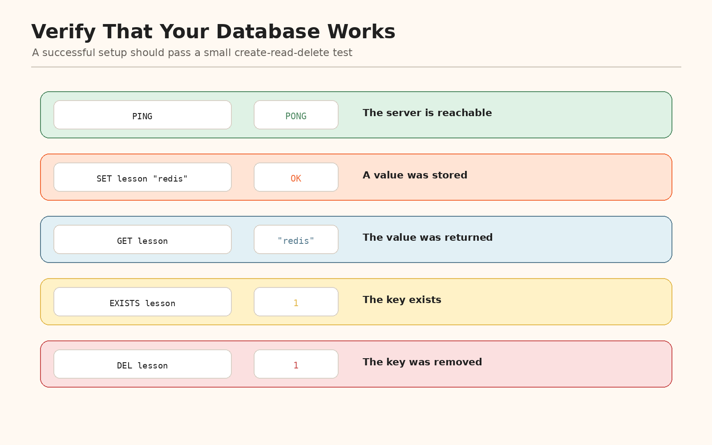

Open `redis-cli` and run:

```redis
PING
```

Expected:

```text
PONG
```

Create a key:

```redis
SET lesson "redis"
```

Read it:

```redis
GET lesson
```

Check whether it exists:

```redis
EXISTS lesson
```

Delete it:

```redis
DEL lesson
```

Check again:

```redis
EXISTS lesson
```

If these commands work, you have successfully created, read and removed Redis data.

---

## 21. Add Practice Data

This package includes:

```text
redis-sample-commands.txt
```

Example user profile:

```redis
HSET learner:1 name "Pranava" topic "Redis" lesson 2
HGETALL learner:1
```

Create a temporary OTP:

```redis
SET otp:learner:1 "482911" EX 60
TTL otp:learner:1
```

This proves that the database supports basic keys, hashes and expiration.

---

# Part E: Security and Troubleshooting

## 22. Protect Your Credentials

Use an environment file locally:

```text
.env
```

Use a safe example file in Git:

```text
.env.example
```

Add the real `.env` file to `.gitignore`:

```gitignore
.env
```

Your application should read:

```text
REDIS_HOST
REDIS_PORT
REDIS_USERNAME
REDIS_PASSWORD
REDIS_SSL
```

Never hardcode a real password in source code.

For production, use the secret-management service provided by your cloud or deployment platform.

---

## 23. Do Not Expose Local Redis Publicly

A production Redis database should use:

- Authentication
- Network restrictions
- Encryption where required
- Least-privilege users
- Secret management
- Backups and monitoring
- High availability where the business needs it

Do not place a production Redis server directly on the public internet.

---

## 24. Common Problems

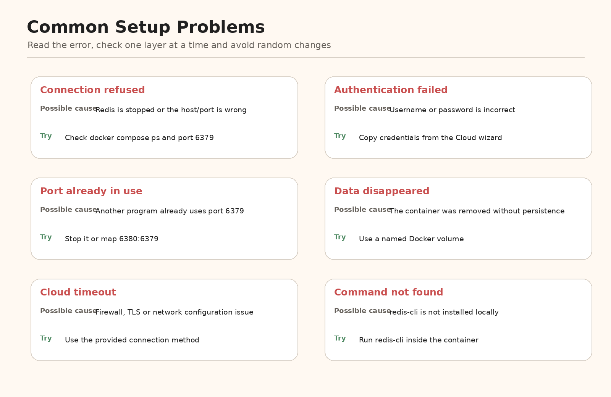

### Connection refused

Check:

```bash
docker compose ps
docker compose logs redis
```

### Port 6379 is already in use

Run Redis on local port 6380:

```bash
docker run -d --name redis-alt -p 6380:6379 redis:8
```

Connect:

```bash
redis-cli -h localhost -p 6380
```

### Authentication failed

Check the username, password, Cloud connection instructions and TLS requirements.

### `redis-cli` is not installed

Run it inside the Docker container:

```bash
docker exec -it redis-learning redis-cli
```

### Data disappeared

Check whether you removed the volume, ran `docker compose down -v`, connected to another Redis instance or deleted the Cloud database.

### Cloud connection times out

Check the internet connection, endpoint, port, TLS requirement, firewall, VPN and database status.

---

# Part F: What I Learned

## 25. Lesson 2 Summary

I learned that:

- A Redis database requires a running Redis server.
- Redis Cloud is the easiest way to create a remotely accessible database.
- The current Redis Cloud free option provides 30 MB for learning and prototypes.
- A Cloud connection needs a host, port, username, password and security settings.
- Docker is an easy and repeatable way to run Redis locally.
- Docker port mapping connects my computer to the Redis container.
- A Docker volume helps preserve Redis data.
- Redis Stack version 7.x images can include Redis Insight for local development.
- Building from source is an advanced installation option.
- Current Redis 8 source builds use platform-specific instructions.
- `PING` and `PONG` verify that Redis is reachable.
- Credentials must never be committed to Git.

---

## 26. Completion Checklist

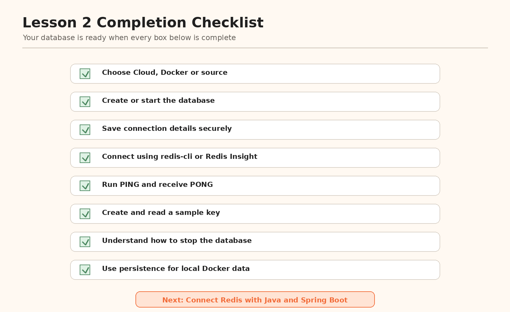

- [ ] I selected Redis Cloud, Docker or source installation.
- [ ] My Redis database is running.
- [ ] I know the host and port.
- [ ] I stored credentials securely.
- [ ] I connected using Redis Insight or `redis-cli`.
- [ ] `PING` returned `PONG`.
- [ ] I created and read a key.
- [ ] I deleted a key.
- [ ] I understand how to stop Redis.
- [ ] I understand Docker persistence.
- [ ] I did not expose a real password.

---

# Project Files

```text
redis-learning-journey-lesson-02/
|-- README.md
|-- docker-compose.yml
|-- .env.example
|-- redis-sample-commands.txt
`-- images/
    |-- 01-cover.png
    |-- 01-setup-options.png
    |-- 02-redis-cloud-steps.png
    |-- 03-choose-region.png
    |-- 04-connection-details.png
    |-- 05-docker-architecture.png
    |-- 06-docker-lifecycle.png
    |-- 07-docker-persistence.png
    |-- 08-source-build-flow.png
    |-- 09-verify-database.png
    |-- 10-troubleshooting.png
    `-- 11-completion-checklist.png
```

---

# Official References

- Try Redis Cloud: https://redis.io/try-free/
- Redis Cloud quick start: https://redis.io/docs/latest/operate/rc/rc-quickstart/
- Create a free database: https://redis.io/docs/latest/operate/rc/databases/create-database/create-free-database/
- Install Redis Open Source: https://redis.io/docs/latest/operate/oss_and_stack/install/install-stack/
- Run Redis Open Source with Docker: https://redis.io/docs/latest/operate/oss_and_stack/install/install-stack/docker/
- Build and run Redis Open Source: https://redis.io/docs/latest/operate/oss_and_stack/install/build-stack/
- Archived Redis Stack Docker guide: https://redis.io/docs/latest/operate/oss_and_stack/install/archive/install-stack/docker/
- Archived Redis 7.x source guide: https://redis.io/docs/latest/operate/oss_and_stack/install/archive/install-redis/install-redis-from-source/
- Redis development updates: https://redis.io/docs/latest/develop/whats-new/

---

# Next Lesson

## Lesson 3: Connect Redis with Java and Spring Boot

The next lesson will cover:

- Creating a Spring Boot project
- Adding the Redis dependency
- Connecting to local Redis
- Connecting to Redis Cloud
- Using `StringRedisTemplate`
- Saving and reading values
- Handling connection errors
- Organizing controller, service and configuration classes
