# Redis Insight for Developers

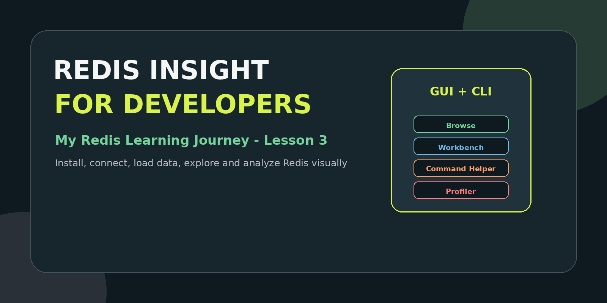

# My Redis Learning Journey — Lesson 3

In Lesson 1, I learned what Redis is and where backend developers use it.

In Lesson 2, I created a Redis database using Redis Cloud or Docker.

In Lesson 3, I will learn how to **see, query, manage and debug Redis data using Redis Insight**.

---

## Learning Objectives

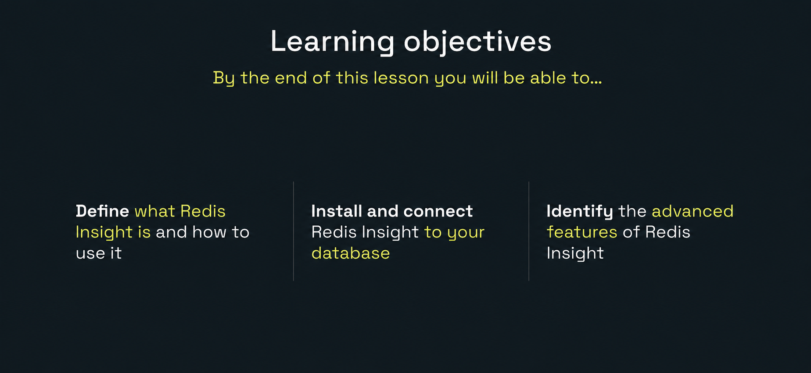

By the end of this lesson, I will be able to:

- Define Redis Insight and explain why developers use it.
- Install Redis Insight on a supported platform.
- Connect Redis Insight to a Redis Cloud or local database.
- Load sample data and explore Redis data types visually.
- Use Browse, CLI, Command Helper, Workbench and Insights.
- Use the Profiler carefully during short debugging sessions.

---

## 1. What Is Redis Insight?

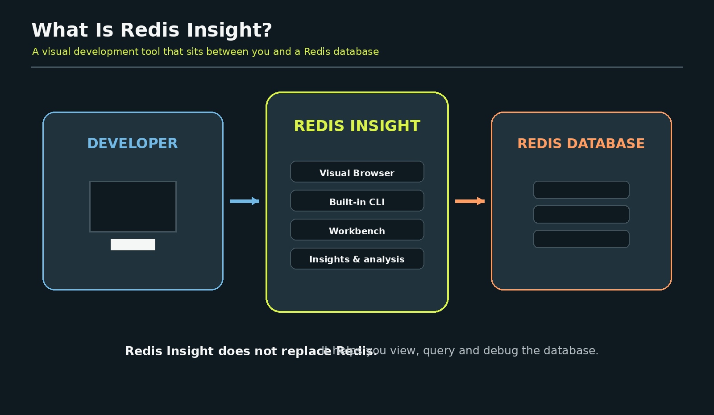

Redis Insight is Redis’s visual client for creating, viewing, querying, managing and analyzing Redis data. It supports both GUI-based and CLI-based interaction.

Think of Redis as a storage room filled with labeled boxes.

```text
Redis server  = Storage room
Redis keys    = Labels on boxes
Redis values  = Items inside the boxes
Redis Insight = A window that lets us inspect and manage everything
```

Redis Insight does **not** replace the Redis database. It connects to a running database and makes it easier to understand what is happening inside it.

---

## 2. Why Backend Developers Use Redis Insight

When a Spring Boot application writes data to Redis, the data is normally invisible unless we use commands or a visual tool.

Redis Insight helps a developer answer questions such as:

- Did my application create the expected cache key?
- Does the key have the correct TTL?
- Is the value a String, Hash, JSON document, List, Set or Sorted Set?
- Did `@CacheEvict` remove the stale value?
- Is my session or OTP expiring correctly?
- What commands did the application send during a test?
- Which keys consume significant memory?

Example development flow:

```text
Spring Boot application
        |
        | SET / GET / HSET / EXPIRE
        v
Redis database
        ^
        | inspect keys, TTL and values
        |
Redis Insight
```

---

## 3. Ways to Install or Open Redis Insight

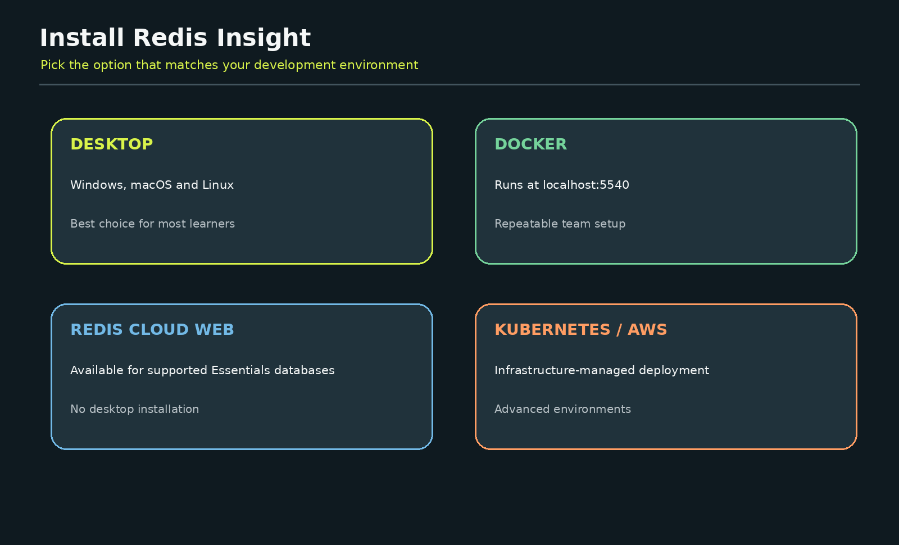

Redis currently documents several installation options:

- Desktop application
- Docker
- Kubernetes
- AWS EC2
- Browser-based Redis Insight for supported Redis Cloud databases

For this lesson, the easiest options are:

```text
Redis Cloud database -> Launch from Cloud when supported
Windows/macOS/Linux  -> Install the desktop application
Docker learner       -> Run the Redis Insight container
```

### Desktop support

The official desktop guide lists Windows 10/11, multiple current macOS versions, Ubuntu and Debian versions. Always check the current support table before installing.

Official download page:

```text
https://redis.io/insight
```

Official desktop instructions:

```text
https://redis.io/docs/latest/operate/redisinsight/install/install-on-desktop/
```

---

## 4. Install Redis Insight on Desktop

1. Open the Redis Insight download page.
2. Select the installer for Windows, macOS or Linux.
3. Download and run the installer.
4. Complete the normal installation steps for your operating system.
5. Open Redis Insight like any other desktop application.

Redis also lists distribution options through stores and package platforms such as Microsoft Store, Apple Store, Snapcraft and Flathub.

---

## 5. Run Redis Insight with Docker

The official Docker image uses port `5540`.

Without persistence:

```bash
docker run -d \
  --name redisinsight \
  -p 5540:5540 \
  redis/redisinsight:latest
```

With a persistent volume:

```bash
docker run -d \
  --name redisinsight \
  -p 5540:5540 \
  -v redisinsight:/data \
  redis/redisinsight:latest
```

Open it in the browser:

```text
http://localhost:5540
```

Health endpoint:

```text
http://localhost:5540/api/health/
```

This lesson package includes a `docker-compose.yml` that starts both Redis and Redis Insight.

Start both services:

```bash
docker compose up -d
```

Open Redis Insight:

```text
http://localhost:5540
```

For the Redis host inside Docker Compose, use:

```text
redis
```

Do not use `localhost` from the Redis Insight container because `localhost` would mean the Redis Insight container itself.

---

## 6. Connect from the Redis Cloud Portal

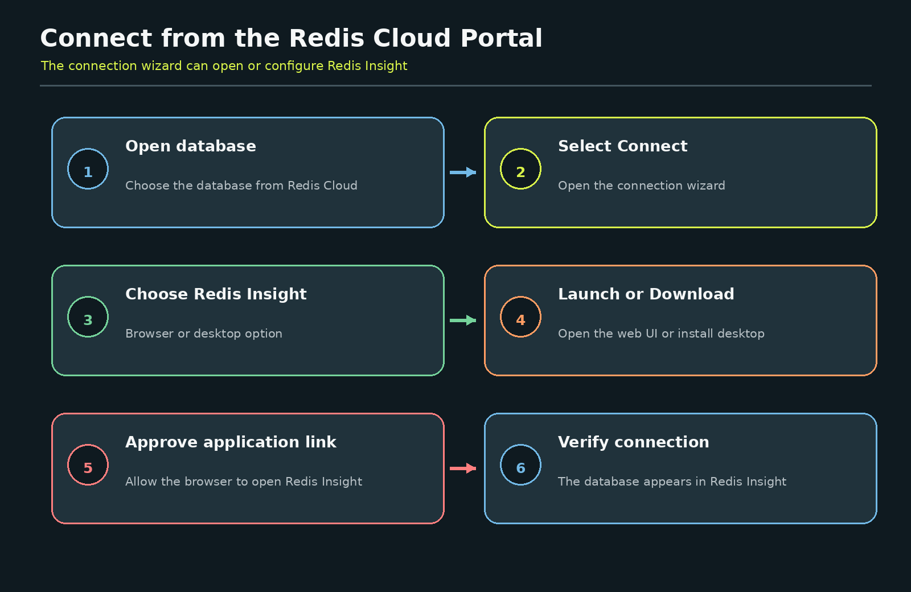

Open the Redis Cloud console and select the database created in Lesson 2.

1. Select **Connect** to open the connection wizard.
2. Choose **Redis Insight**.
3. Use one of the available connection methods.

Redis Cloud currently supports two Redis Insight paths:

### Browser-based Redis Insight

When available for the database, select **Launch Redis Insight web** or **Open with Redis Insight**. The browser version opens in a new tab.

The official documentation notes that browser-based Redis Insight is available for Essentials databases and contains a subset of the desktop features.

### Desktop Redis Insight

1. Download and install Redis Insight.
2. Return to the Cloud connection wizard.
3. Select **Open with Redis Insight**.
4. Allow the browser to open the Redis Insight application.
5. Confirm that the database appears in Redis Insight.

Official connection guide:

```text
https://redis.io/docs/latest/operate/rc/databases/connect/
```

---

## 7. Connect Manually

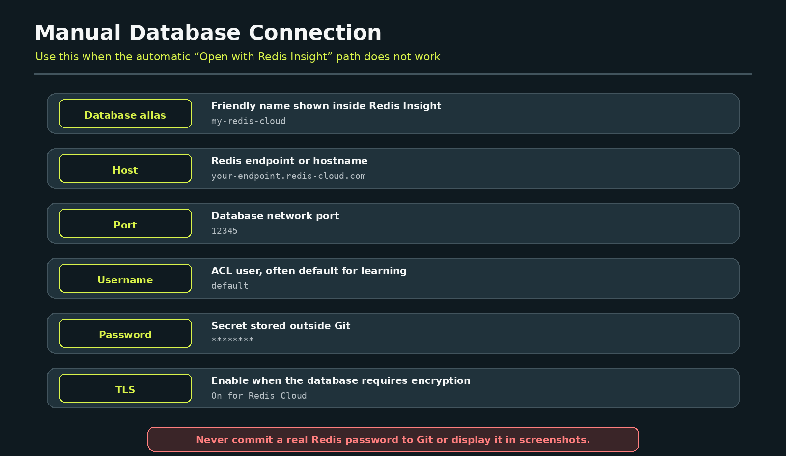

Use manual connection when the automatic application link does not work.

You may need:

```text
Database alias
Host
Port
Username
Password
TLS setting
```

For Redis Cloud, copy the exact values from the connection wizard. Do not guess the host, port or TLS settings.

### Local Redis

When Redis Insight is installed directly on the same computer as Redis:

```text
Host: localhost
Port: 6379
```

### Docker Compose setup

When Redis and Redis Insight run in the same Compose file:

```text
Host: redis
Port: 6379
```

### Security rule

Never expose a real password in:

- GitHub
- README screenshots
- LinkedIn posts
- Java source code
- Docker Compose files committed publicly

---

## 8. Load Sample Data

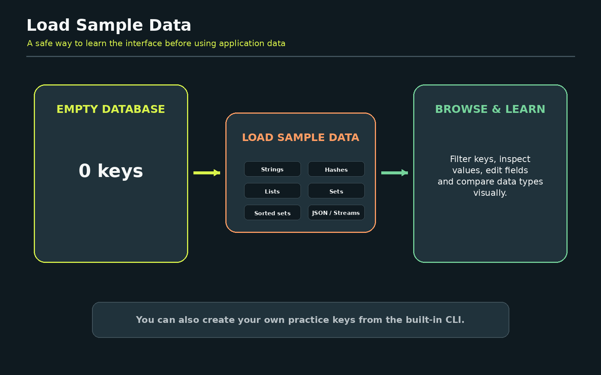

After connecting, open **Browse**.

For an empty database, Redis Insight can provide a **Load sample data** option. This creates example data so that you can explore the interface without waiting for an application to generate keys.

Sample data helps you learn:

- How different key types appear
- How values are formatted
- How TTL is displayed
- How keys are filtered
- How namespaces group related keys
- How values can be edited or deleted

You can also use the included `sample-commands.txt` file to create your own learning data.

---

## 9. Redis Insight Feature Map

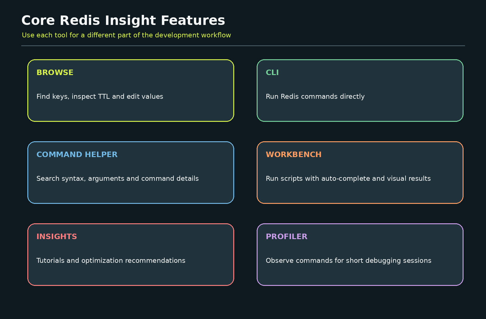

### Browse

Browse lets you inspect, filter and visualize Redis data structures. Depending on the connected database and supported features, it can create, read, update and delete Strings, Hashes, Lists, Sets, Sorted Sets, Streams and JSON values.

### CLI

The built-in CLI runs Redis commands directly against the selected database.

### Command Helper

Command Helper explains command syntax, arguments and usage while you work. This is valuable when you are learning commands such as `SET`, `EXPIRE`, `HSET`, `ZADD` and `XADD`.

### Workbench

Workbench is an advanced command interface with auto-complete and support for visualizing complex command results.

### Insights

The Insights panel provides interactive tutorials and recommendations related to performance and memory usage.

### Profiler

Profiler can show commands sent to Redis during a debugging session. Use it carefully because command monitoring can add significant load.

---

## 10. Browse Keys Visually

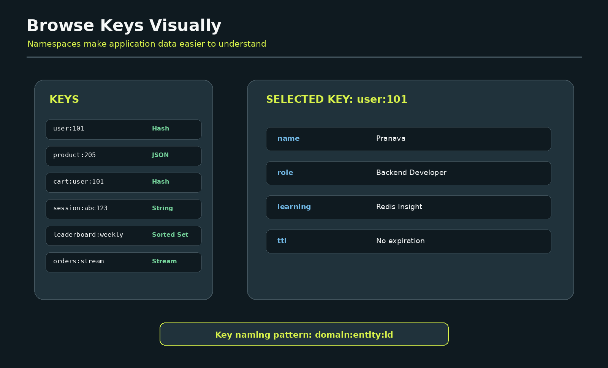

Use clear key naming conventions:

```text
user:101
product:205
cart:user:101
session:abc123
leaderboard:weekly
orders:stream
```

The colon is commonly used as a namespace separator.

```text
domain:entity:id
```

In Browse, practice the following:

1. Filter keys using `user:*`.
2. Select a key.
3. Check its data type.
4. Inspect its TTL.
5. Edit a practice value.
6. Refresh the key.
7. Delete only a practice key.

Never experiment with destructive actions against an important production database.

---

## 11. Use CLI and Command Helper

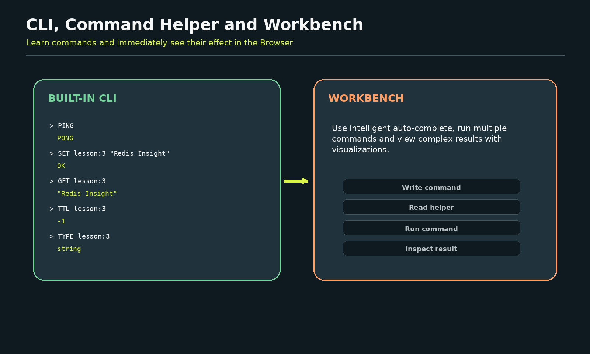

Open the built-in CLI and run:

```redis
PING
```

Expected result:

```text
PONG
```

Create a learning key:

```redis
SET lesson:3 "Redis Insight"
```

Read it:

```redis
GET lesson:3
```

Check its type:

```redis
TYPE lesson:3
```

Check its TTL:

```redis
TTL lesson:3
```

A result of `-1` means that the key exists but does not have an expiration.

Create it with an expiration:

```redis
SET lesson:3 "Redis Insight" EX 300
```

Use Command Helper whenever you do not remember a command’s arguments. The goal is to understand the command rather than copy it blindly.

---

## 12. Use Workbench

Workbench is helpful when you want to run several related commands and compare their results.

Example:

```redis
HSET developer:101 name "Pranava" focus "Java Backend"
HGETALL developer:101
EXPIRE developer:101 600
TTL developer:101
```

A useful learning cycle is:

```text
Write command in Workbench
          |
Run command
          |
Inspect result
          |
Open Browse
          |
Confirm that the key changed
```

This connects command-line learning with visual understanding.

---

## 13. Profiler Safety

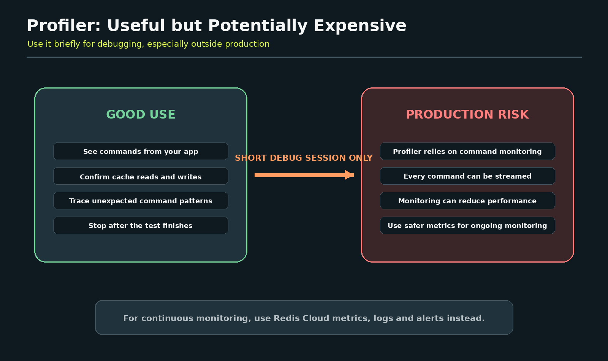

Profiler is helpful when you want to see which commands an application sends.

For example, start a Spring Boot application and call an endpoint. The profiler may show operations such as:

```text
GET products::101
SET products::101 ...
EXPIRE products::101 300
DEL products::101
```

This helps verify whether caching is working.

However, Redis command monitoring can stream every command processed by the server and can affect performance. Therefore:

- Prefer a local or development database.
- Start the profiler only for a short test.
- Stop it immediately after the test.
- Avoid using it as permanent production monitoring.
- Use Redis Cloud metrics, logs and alerts for ongoing operational monitoring.

---

## 14. Advanced Features to Explore

After the basics, explore these areas depending on your Redis version and database capabilities:

- JSON formatting and editing
- Streams and consumer groups
- Search indexes and query profiling
- Vector Sets and similarity search
- Geospatial result visualization
- Memory and performance insights
- Development versus production database labels and safety guardrails

Redis Insight changes over time, so review the current release notes before teaching version-specific screens.

Official release notes:

```text
https://redis.io/docs/latest/develop/tools/insight/release-notes/
```

---

## 15. Hands-on Practice Lab

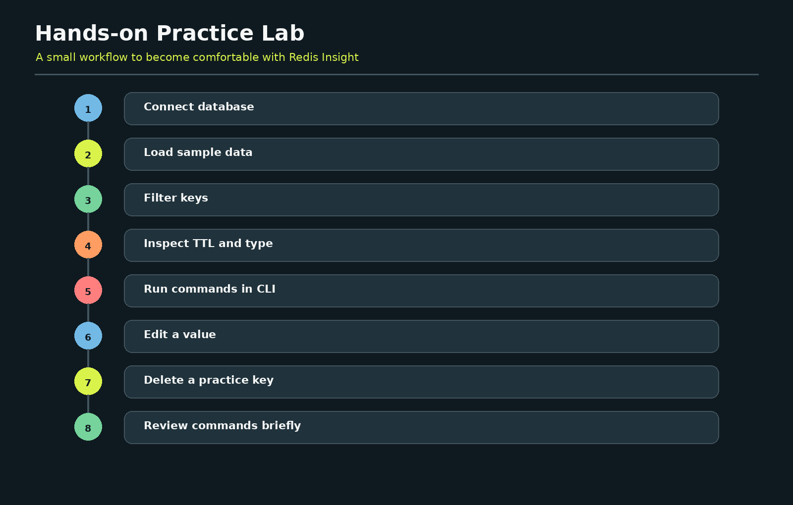

Complete this lab:

### Task 1: Connect

Connect Redis Insight to either:

- The Redis Cloud database from Lesson 2, or
- The local Docker database included in this package

### Task 2: Verify

```redis
PING
```

### Task 3: Load data

Use **Load sample data** or run the commands in `sample-commands.txt`.

### Task 4: Browse

Find these practice keys:

```text
lesson:3
developer:101
learning:topics
backend:skills
learning:progress
otp:developer:101
```

### Task 5: Inspect

For each key, identify:

- Data type
- Value
- TTL
- Namespace

### Task 6: Modify

Edit one practice field and verify it with the CLI.

### Task 7: Delete

Delete only the `lesson:3` practice key.

### Task 8: Observe

Run the profiler briefly while executing two commands, then stop it. Perform this against a development database only.

---

## 16. Common Problems

### Redis Insight cannot connect

Check:

- Is Redis running?
- Is the database active?
- Is the host correct?
- Is the port correct?
- Is the username correct?
- Is the password correct?
- Does Redis Cloud require TLS?
- Is a firewall or VPN blocking the connection?

### Docker Redis Insight cannot reach Redis

When both containers are in the same Compose network, use:

```text
Host: redis
Port: 6379
```

Do not use `localhost` between containers.

### Browser-based features are missing

The Redis Cloud browser version provides a subset of desktop features. Install the desktop version when you need tools that are not available in the browser experience.

### Sample data option is not visible

The database may already contain data, the UI version may differ, or the connected database may not support the same sample options. Use `sample-commands.txt` instead.

### Profiler is slowing the database

Stop the profiler immediately. Use it only for a short, controlled debugging session.

---

## 17. Key Takeaways

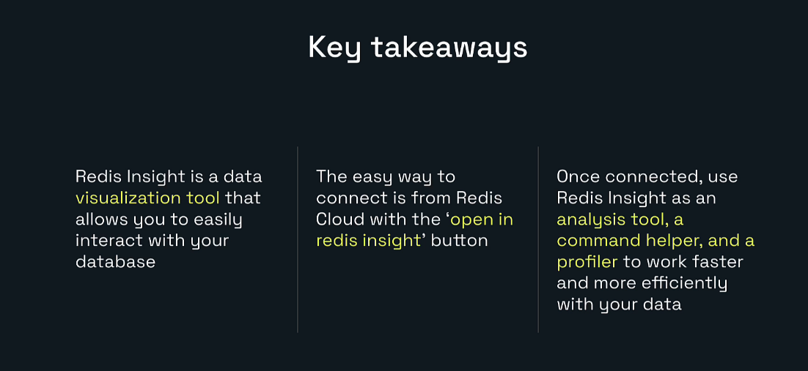

- Redis Insight is a visual tool for interacting with Redis data.
- The easiest Cloud connection is through the Redis Cloud connection wizard.
- Desktop Redis Insight provides the full local application experience.
- Browse helps us inspect keys, data types, TTL and values.
- CLI and Command Helper help us learn Redis commands.
- Workbench supports more advanced command workflows and visual results.
- Insights can provide tutorials and optimization recommendations.
- Profiler is useful for short debugging sessions but is not a permanent production-monitoring solution.
- Credentials must remain private.

---

## Lesson 3 Completion Checklist

- [ ] Redis Insight is installed or opened in Redis Cloud.
- [ ] A Redis database is connected.
- [ ] `PING` returns `PONG`.
- [ ] Sample data or practice data is loaded.
- [ ] I can filter and inspect keys in Browse.
- [ ] I can identify key type and TTL.
- [ ] I can run commands in the built-in CLI.
- [ ] I used Command Helper.
- [ ] I ran commands in Workbench.
- [ ] I understand the Profiler risk.
- [ ] I did not expose credentials.

---

## Project Structure

```text
redis-learning-journey-lesson-03/
|-- README.md
|-- docker-compose.yml
|-- sample-commands.txt
`-- images/
    |-- 00-cover.png
    |-- 01-learning-objectives.png
    |-- 02-what-is-redis-insight.png
    |-- 03-install-options.png
    |-- 04-cloud-connection-flow.png
    |-- 05-manual-connection.png
    |-- 06-load-sample-data.png
    |-- 07-feature-map.png
    |-- 08-browser-keys.png
    |-- 09-cli-workbench.png
    |-- 10-profiler-safety.png
    |-- 11-practice-lab.png
    `-- 12-key-takeaways.png
```

---

## Official References

- Redis Insight: https://redis.io/insight
- Redis Insight documentation: https://redis.io/docs/latest/develop/tools/insight/
- Install Redis Insight: https://redis.io/docs/latest/operate/redisinsight/install/
- Install on desktop: https://redis.io/docs/latest/operate/redisinsight/install/install-on-desktop/
- Install with Docker: https://redis.io/docs/latest/operate/redisinsight/install/install-on-docker/
- Connect to Redis Cloud: https://redis.io/docs/latest/operate/rc/databases/connect/
- Redis Insight on Redis Cloud: https://redis.io/docs/latest/operate/rc/databases/connect/insight-cloud/
- Release notes: https://redis.io/docs/latest/develop/tools/insight/release-notes/
- MONITOR command warning: https://redis.io/docs/latest/commands/monitor/

---

# Next Lesson

## Lesson 4: Redis Data Types for Backend Developers

The next lesson will cover:

- Strings
- Hashes
- Lists
- Sets
- Sorted Sets
- Streams
- JSON
- Choosing the correct type for Java and Spring Boot use cases
