# Explore Redis for Developers


# My Redis Learning Journey — Lesson 4

## Explore Keys, Values, and Strings

In the previous lessons, I learned what Redis is, created a database, and connected it to Redis Insight.

In this lesson, I am learning the foundation of working with Redis data:

- Keys
- Values
- Key-value pairs
- Redis strings
- Naming conventions
- Keyspaces
- Creating, reading, updating, and removing data

This lesson includes a hands-on Redis Insight lab using `SET`, `GET`, and `UNLINK`.

---

## Learning Objectives

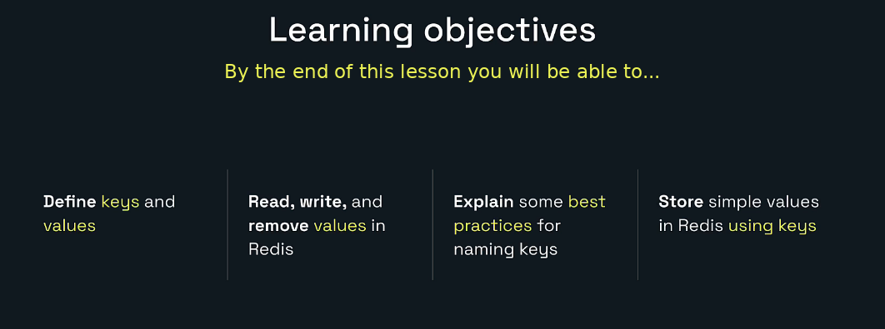

By the end of this lesson, I will be able to:

- Define keys and values.
- Read, write, and remove values in Redis.
- Explain useful key-naming practices.
- Store simple values using Redis keys.
- View and inspect key-value pairs in Redis Insight.
- Explain why Redis strings can store more than plain text.

---

# 1. What Is a Key-Value Pair?


Redis stores data using **key-value pairs**.

A key-value pair contains:

```text
Key   -> A unique name or label
Value -> The data stored under that name
```

A simple example is:

```text
color -> blue
```

Here:

```text
color = key
blue  = value
```

To retrieve the value, Redis does not search every stored value. We provide the key, and Redis returns the value associated with it.

```redis
GET color
```

Possible result:

```text
"blue"
```

---

# 2. What Is a Value?

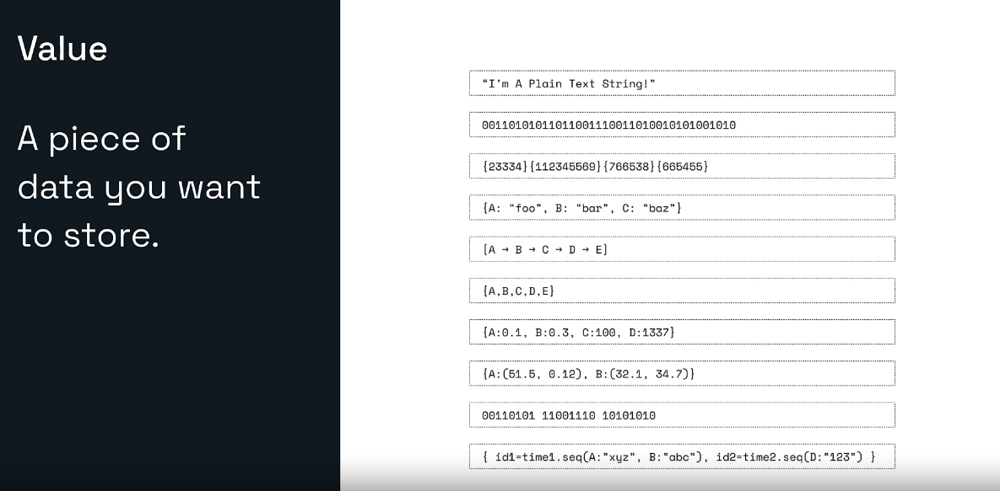

A **value** is the data that we want Redis to store.

The value might represent:

- Plain text
- A number
- Binary data
- Serialized JSON
- A session token
- A cached response
- A counter
- An encoded image or document
- Data used by another Redis structure

Examples:

```text
"Redis"
42
"user-101"
{"id":101,"name":"Hero"}
000101010101
```

Redis does not need to understand the business meaning of the value. It stores and returns the bytes that the application gives it.

---

# 3. What Is a Key?

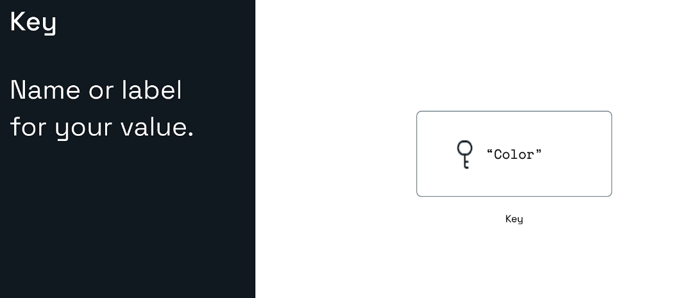

A **key** is the name or label used to find a value.

Example:

```text
Key:   color
Value: blue
```

The key should answer a useful question:

> What data will I receive when I use this key?

For example:

```text
user:101:name
product:483726:sku
session:abc123
otp:user:101
```

These names communicate more meaning than generic keys such as:

```text
data
item
value
123456
```

---

# 4. The Key and Value Work Together

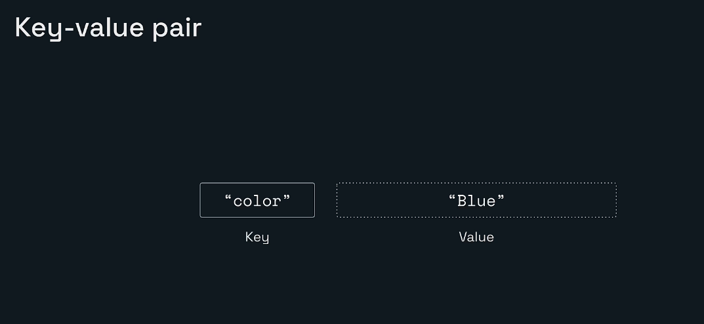

A key and its associated value form a key-value pair:

```text
"color" -> "Blue"
```

Redis commands typically work by receiving a key.

For example:

```redis
SET color Blue
GET color
UNLINK color
```

In each command, `color` tells Redis which stored item should be created, read, or removed.

---

# 5. Key-Value Thinking in Programming Languages

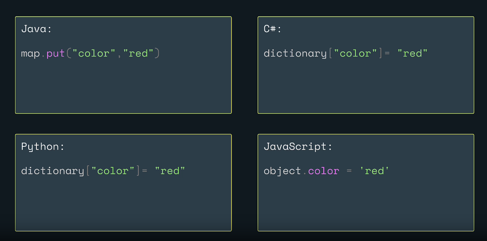

The key-value idea is already common in programming.

### Java

```java
Map<String, String> map = new HashMap<>();
map.put("color", "red");
```

### C#

```csharp
var dictionary = new Dictionary<string, string>();
dictionary["color"] = "red";
```

### Python

```python
dictionary = {}
dictionary["color"] = "red"
```

### JavaScript

```javascript
const object = {};
object.color = "red";
```

Redis is different from an in-process map because Redis runs as a separate server.

```text
Java Map
    -> Exists inside one Java application process

Redis
    -> Runs as a server
    -> Can be accessed by multiple applications
    -> Can be shared by multiple application instances
    -> Can apply expiration and persistence
```

The comparison helps us understand the data model, but Redis is more than a normal programming-language dictionary.

---

# 6. One Key Can Point to Different Types of Values

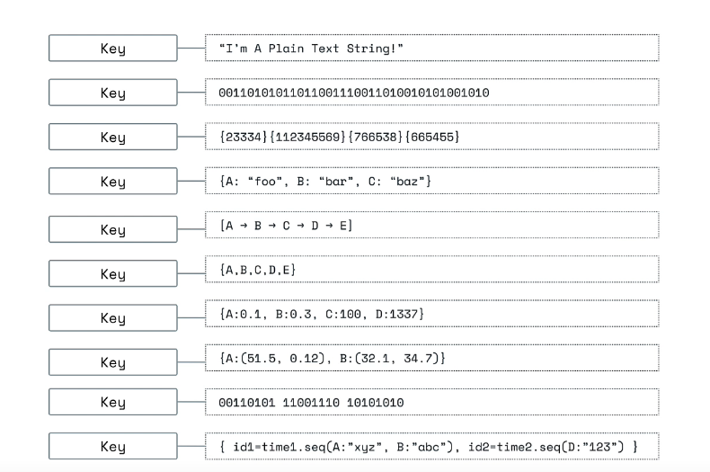

A key can be associated with different Redis data types.

Examples include:

```text
String
Hash
List
Set
Sorted set
Stream
Bitmap
Bit field
Geospatial index
HyperLogLog
JSON
```

The key identifies the stored item, while the Redis data type controls which commands can operate on its value.

For example:

```redis
SET user:101:name "Hero"
```

creates a string value.

```redis
HSET user:101 name "Hero" city "Kent"
```

creates a hash value.

A key can hold only one value type at a time. Replacing a key using a command such as `SET` can overwrite its previous value.

---

# 7. Redis Data Types at a Glance

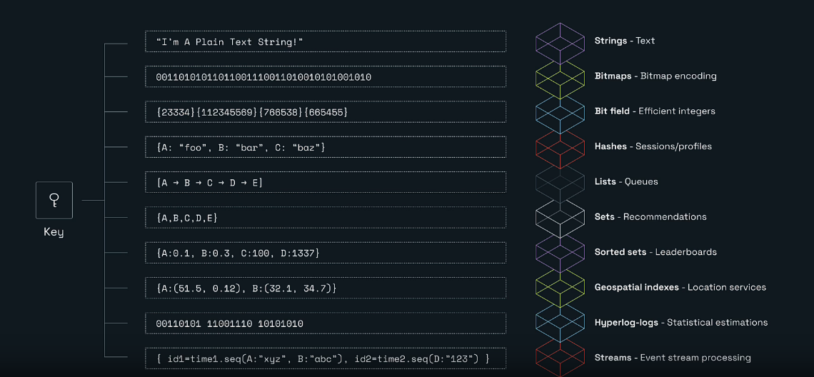

| Data type | Simple use case |
|---|---|
| String | Text, counters, tokens, serialized data |
| Bitmap | Compact yes/no flags |
| Bit field | Efficient integer fields |
| Hash | User profile or object fields |
| List | Queue or ordered history |
| Set | Unique tags or recommendations |
| Sorted set | Leaderboard or ranking |
| Geospatial index | Nearby-location search |
| HyperLogLog | Approximate unique counts |
| Stream | Event-stream processing |

This lesson focuses on **strings**, the simplest Redis value type.

---

# 8. Redis Strings Are Binary-Safe

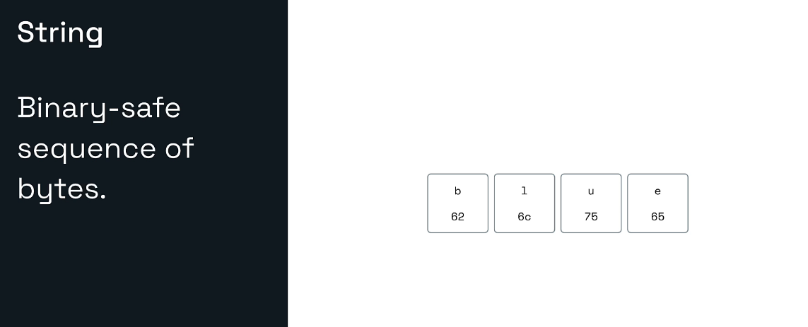

A Redis string is a **binary-safe sequence of bytes**.

This means Redis can store:

- UTF-8 text
- Integers represented as strings
- Serialized objects
- Encoded binary information
- Counters
- Bitmaps and bit fields

For example, the text:

```text
blue
```

is stored as bytes.

Redis returns those bytes to the application. The application decides how to interpret them.

---

# 9. Strings Can Store More Than Plain Text

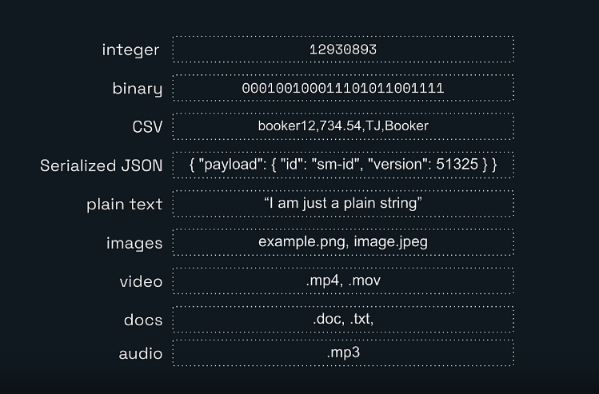

A Redis string can contain data such as:

```text
Integer
Binary
CSV
Serialized JSON
Plain text
Encoded image data
Encoded video data
Document bytes
Audio bytes
```

However, “Redis can store it” does not always mean “Redis is the best place to store it.”

Large videos, documents, or images consume memory quickly. A common production design is:

```text
Object storage -> Stores the large file
Redis          -> Stores frequently used metadata, URLs, tokens, or cached content
```

Redis strings are especially useful for:

- Cached API responses
- Session tokens
- Configuration values
- Counters
- Feature flags
- OTPs
- Small serialized objects
- Frequently accessed text

---

# 10. Naming Keys

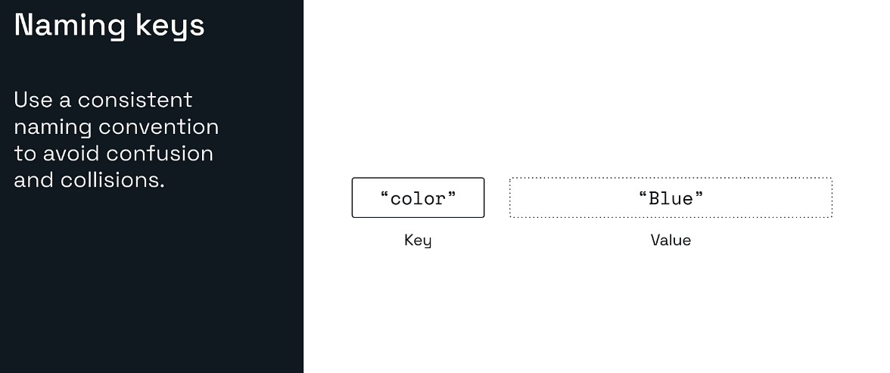

Good key names make Redis easier to understand, debug, and maintain.

A consistent format reduces:

- Confusion
- Accidental collisions
- Incorrect deletions
- Difficulty searching in Redis Insight
- Difficulty identifying key ownership

A widely used naming style is:

```text
entity:id:field
```

Examples:

```text
user:101:name
user:101:email
product:483726:sku
order:908:status
```

A larger system might include the application, environment, service, or feature:

```text
shop:dev:user:101:name
shop:prod:order:908:status
auth:prod:session:abc123
```

---

# 11. Better Key-Naming Examples

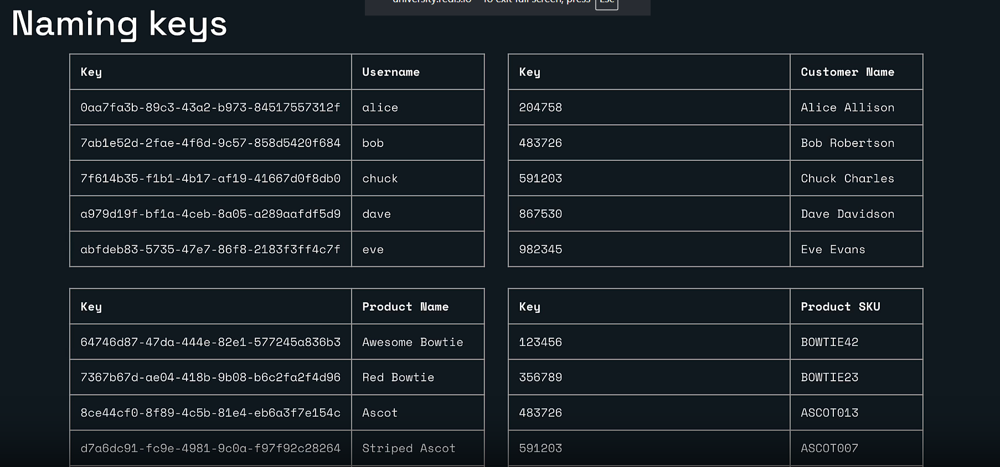

A generated identifier can be unique, but it may not explain what the key stores.

For example:

```text
0aa7fa3b-89c3-43a2-b973-84517557312f
```

may be unique, but the name alone does not reveal whether it belongs to:

- A user
- A product
- A session
- An order
- A notification

A more descriptive key is:

```text
user:id:0aa7fa3b-89c3-43a2-b973-84517557312f:username
```

Similarly:

```text
product:id:64746d87-47da-444e-82e1-577245a836b3:name
```

For numeric identifiers:

```text
customer:204758:name
product:483726:sku
```

The exact convention may differ between teams. Consistency matters more than copying one universal format.

---

# 12. Why Generic Numeric Keys Can Collide

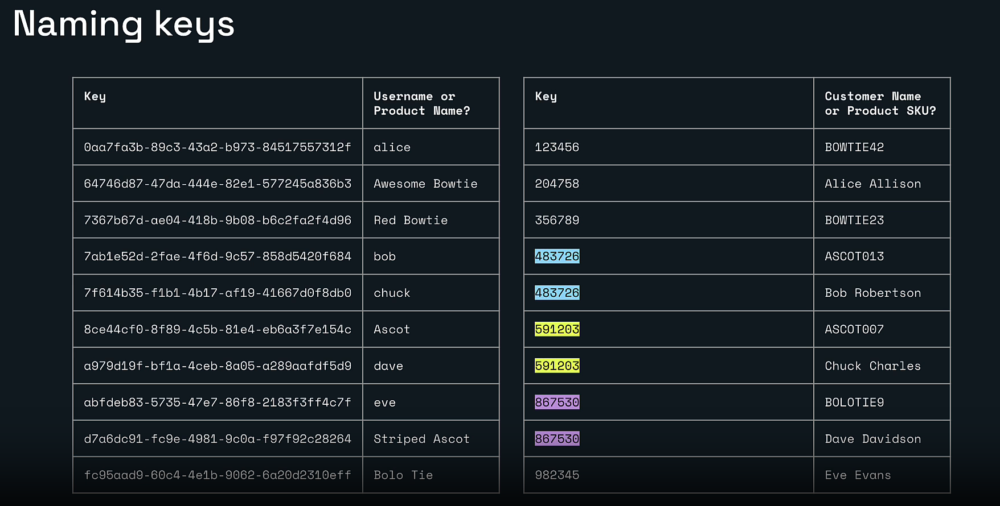

Consider using only numeric identifiers:

```text
483726
591203
867530
```

The number `483726` could represent:

```text
A customer ID
A product ID
An order ID
```

Redis keys must be unique inside the selected database. If unrelated features use the same key, one operation can overwrite or remove another feature’s data.

Instead of:

```text
483726
```

use:

```text
customer:483726:name
product:483726:sku
```

Now the keys clearly belong to different groups.

---

# 13. Keyspaces and Prefixes

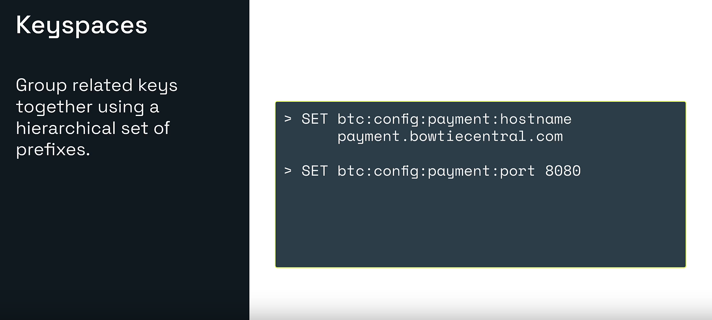

Developers often use colon-separated prefixes to group related keys.

Example:

```redis
SET btc:config:payment:hostname payment.bowtiecentral.com
SET btc:config:payment:port 8080
```

This gives us a logical structure:

```text
btc
└── config
    └── payment
        ├── hostname
        └── port
```

Redis itself does not treat these as folders. The colon structure is a naming convention used by developers and tools.

Benefits include:

- Easier browsing in Redis Insight
- Easier searching by pattern
- Clear ownership
- Fewer naming collisions
- Easier debugging

### Recommended practices

Use:

```text
service:entity:id:field
```

Avoid:

```text
Very generic keys
Unexplained numeric IDs
Random capitalization
Spaces
Different separators in the same project
Extremely long keys without a reason
```

### Production note about searching

During learning, Redis Insight can help browse and filter keys.

In production code, avoid using:

```redis
KEYS *
```

against a large database because it can block Redis while scanning the complete keyspace.

Applications should use `SCAN`-based approaches when incremental key iteration is required.

---

# 14. Redis Strings Support More Than SET and GET

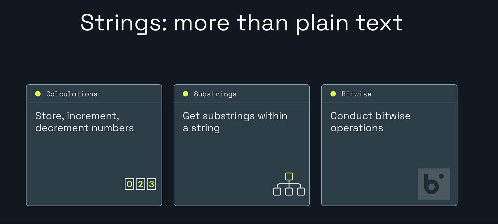

Redis strings support several categories of operations.

## Calculations

Redis can treat a string value as an integer.

```redis
SET page:views 10
INCR page:views
INCRBY page:views 5
DECR page:views
GET page:views
```

Possible final value:

```text
15
```

Useful for:

- Page views
- API request counts
- Inventory counters
- Retry counts
- Likes

## Substrings

Redis can return part of a string.

```redis
SET greeting "Hello Redis"
GETRANGE greeting 0 4
```

Result:

```text
"Hello"
```

## Bitwise operations

Redis strings also support bit-level operations.

Examples include:

```redis
SETBIT
GETBIT
BITCOUNT
BITOP
```

These are useful for compact flags, activity tracking, and specialized analytics.

---

# 15. Hands-On Lab: Get and Set a String

## Lab Goal

In this lab, I will:

1. Create a string.
2. Read the string.
3. View it in Redis Insight.
4. Update the string.
5. Remove the string.
6. Confirm the command responses.

## Prerequisites

Before beginning:

- Redis is running.
- Redis Insight is installed or available in the browser.
- The Redis database is connected in Redis Insight.
- The Redis Insight CLI is open.

Test the connection:

```redis
PING
```

Expected response:

```text
PONG
```

---

## Step 1: Store a String with SET

Run:

```redis
SET color red
```

Expected response:

```text
OK
```

What happened:

```text
Key   = color
Value = red
Type  = string
```

`SET` creates the key when it does not exist.

---

## Step 2: Read the String with GET

Run:

```redis
GET color
```

Expected response:

```text
"red"
```

`GET` returns the string value stored under the key.

If the key does not exist, `GET` returns a null result.

---

## Step 3: View the Key-Value Pair in Redis Insight

Move from the CLI to the Redis Insight graphical interface.

Depending on the Redis Insight version, open the **Browser** or key-browsing workspace.

1. Refresh the key list.
2. Find the key named `color`.
3. Select the key.
4. Review its value.

The details panel should show information such as:

```text
Key: color
Type: String
Value: red
Length: value length
Memory: approximate space used
```

Redis Insight lets us see the same data that we created through the CLI.

```text
CLI -> Executes Redis commands
GUI -> Helps inspect and manage the resulting data
```

---

## Step 4: Update the String

Run `SET` again using the same key:

```redis
SET color green
```

Expected response:

```text
OK
```

Confirm the new value:

```redis
GET color
```

Expected response:

```text
"green"
```

Important behavior:

```text
SET color red
SET color green
```

does not create two separate `color` keys.

The second command overwrites the current value.

Refresh Redis Insight and select `color` again. Its value should now be:

```text
green
```

---

## Step 5: Remove the String with UNLINK

Run:

```redis
UNLINK color
```

Expected response:

```text
(integer) 1
```

The result `1` means one existing key was removed.

`UNLINK` removes the key from the keyspace immediately and frees its memory asynchronously.

Refresh Redis Insight. The `color` key should no longer appear.

---

## Step 6: Remove the Missing Key Again

Run the same command again:

```redis
UNLINK color
```

Expected response:

```text
(integer) 0
```

The result is `0` because Redis cannot remove a key that does not exist.

This makes command responses useful for understanding what changed:

```text
1 -> One matching key was removed
0 -> No matching key existed
```

---

# 16. Complete Lab Flow

```text
PING
  |
  └── PONG

SET color red
  |
  └── OK

GET color
  |
  └── "red"

Open Redis Insight
  |
  └── Refresh and inspect color

SET color green
  |
  └── OK

GET color
  |
  └── "green"

Refresh Redis Insight
  |
  └── Confirm updated value

UNLINK color
  |
  └── 1

UNLINK color
  |
  └── 0
```

---

# 17. SET, GET, and UNLINK Explained

## SET

```redis
SET key value
```

Purpose:

- Create a string key.
- Replace an existing value.
- Optionally apply conditions or expiration.

Example with expiration:

```redis
SET otp:user:101 "482911" EX 60
```

## GET

```redis
GET key
```

Purpose:

- Return the string value.
- Return null when the key does not exist.

## UNLINK

```redis
UNLINK key [key ...]
```

Purpose:

- Remove one or more keys.
- Return the number of keys removed.
- Free memory asynchronously after removing the keys from the keyspace.

For a small string, both `DEL` and `UNLINK` may appear equally fast. The asynchronous cleanup behavior of `UNLINK` becomes more relevant for large values or complex structures.

---

# 18. Additional Practice

The downloadable package includes:

```text
lesson-04-lab-commands.txt
```

Try the following exercises.

## Exercise 1: Store a User Name

```redis
SET user:101:name "Hero"
GET user:101:name
```

## Exercise 2: Build a Counter

```redis
SET page:views 10
INCR page:views
INCRBY page:views 5
DECR page:views
GET page:views
```

## Exercise 3: Store a Temporary OTP

```redis
SET otp:user:101 "482911" EX 60
TTL otp:user:101
```

## Exercise 4: Work with Multiple Strings

```redis
MSET app:name "Redis Learning Journey" app:lesson "4"
MGET app:name app:lesson
```

## Exercise 5: Append to a String

```redis
SET greeting "Hello"
APPEND greeting " Redis"
GET greeting
STRLEN greeting
```

## Exercise 6: Clean Up

```redis
UNLINK user:101:name page:views otp:user:101 app:name app:lesson greeting
```

---

# 19. Common Lab Problems

## The key does not appear in Redis Insight

Check:

- Did you refresh the Browser?
- Are you connected to the correct Redis database?
- Are you viewing the correct logical database number?
- Is a search filter hiding the key?
- Did the key expire?
- Did you create it in another Redis environment?

## GET returns null

Possible causes:

- The key does not exist.
- The key expired.
- The key name is misspelled.
- You connected to a different database.
- The key was deleted or unlinked.

Check:

```redis
EXISTS color
```

## SET returns OK, but old information is still visible

Refresh the Redis Insight Browser and reopen the key.

## WRONGTYPE error

A `WRONGTYPE` response means the command does not match the value’s data type.

For example, `GET` only works with string values.

Inspect the type:

```redis
TYPE your-key
```

## The key name contains spaces

Redis can accept spaces when the key is quoted, but spaces make commands and operational work harder.

Instead of:

```redis
SET "user 101 name" "Hero"
```

prefer:

```redis
SET user:101:name "Hero"
```

---

# 20. Backend Developer Perspective

In a Java and Spring Boot application, the same Redis ideas remain unchanged.

A service might store:

```text
user:101:profile
product:205:details
session:abc123
rate-limit:user:101
```

The application sends commands through a Redis client such as Lettuce or Jedis.

Conceptually:

```text
Spring Boot Service
        |
        | SET product:205:details ...
        v
      Redis
        |
        | GET product:205:details
        v
Fast response returned to the application
```

Before learning Spring Boot integration, it is important to understand these core Redis operations directly in Redis Insight or `redis-cli`.

---

# 21. Key Takeaways

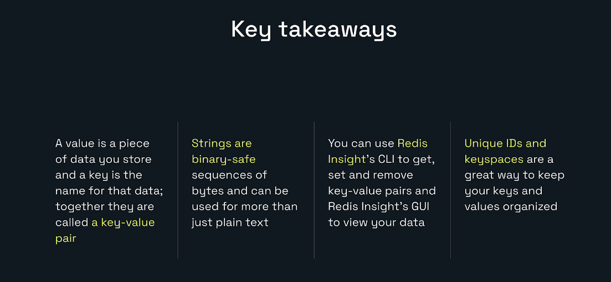

- A value is the data being stored.
- A key is the name used to locate that data.
- Together, they form a key-value pair.
- Redis strings are binary-safe sequences of bytes.
- Redis strings can hold text, numbers, serialized data, and binary content.
- `SET` creates or replaces a string value.
- `GET` reads a string value.
- `UNLINK` removes keys and performs memory cleanup asynchronously.
- The same key cannot safely represent unrelated business entities.
- Namespaces and prefixes help organize keys.
- Colon-separated keyspaces are a developer convention, not real folders.
- Redis Insight provides both CLI and graphical ways to work with data.

---

# 22. Lesson Completion Checklist

- [ ] I can explain a Redis key.
- [ ] I can explain a Redis value.
- [ ] I can identify a key-value pair.
- [ ] I understand that a Redis string stores bytes.
- [ ] I ran `SET color red`.
- [ ] I ran `GET color`.
- [ ] I viewed the key in Redis Insight.
- [ ] I updated the value to `green`.
- [ ] I removed the key with `UNLINK`.
- [ ] I understand why the second `UNLINK` returns `0`.
- [ ] I can create a namespaced key.
- [ ] I know why generic IDs can cause collisions.
- [ ] I completed at least one additional string exercise.

---

# Repository Structure

```text
redis-learning-journey-lesson-04/
|-- README.md
|-- lesson-04-lab-commands.txt
|-- MANIFEST.txt
`-- images/
    |-- 00-cover.png
    |-- 01-learning-objectives.png
    |-- 02-what-is-a-key-value.png
    |-- 03-value-definition.png
    |-- 04-key-definition.png
    |-- 05-key-value-pair.png
    |-- 06-key-value-pairs-in-programming.png
    |-- 07-keys-and-values-examples.png
    |-- 08-redis-data-types-overview.png
    |-- 09-string-as-bytes.png
    |-- 10-string-value-examples.png
    |-- 11-naming-keys-introduction.png
    |-- 12-good-key-naming-examples.png
    |-- 13-key-collision-problem.png
    |-- 14-keyspaces.png
    |-- 15-strings-more-than-plain-text.png
    `-- 16-key-takeaways.png
```

---

# Official References

- Redis strings: https://redis.io/docs/latest/develop/data-types/strings/
- Redis data types: https://redis.io/docs/latest/develop/data-types/
- Redis command reference: https://redis.io/docs/latest/commands/
- `SET`: https://redis.io/docs/latest/commands/set/
- `GET`: https://redis.io/docs/latest/commands/get/
- `UNLINK`: https://redis.io/docs/latest/commands/unlink/
- Redis Insight: https://redis.io/docs/latest/develop/tools/insight/
- Redis client tools: https://redis.io/docs/latest/develop/tools/

---

# Next Lesson

## Lesson 5: Expiration, Counters, and Advanced String Commands

The next lesson can cover:

- `EXPIRE`
- `TTL`
- `SET EX`
- `INCR`
- `INCRBY`
- `DECR`
- `APPEND`
- `STRLEN`
- `MSET`
- `MGET`
- Conditional writes with `NX` and `XX`
- Practical OTP, counter, and rate-limiting examples
