# Explore Redis for Developers

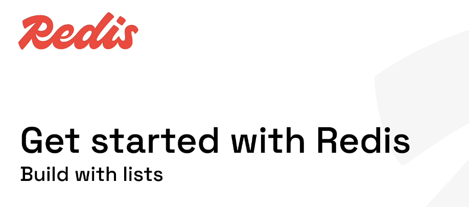

# My Redis Learning Journey — Lesson 5

## Build with Redis Lists

In Lesson 4, I learned how Redis stores keys, values, and strings.

In this lesson, I am learning how Redis stores and manages an **ordered collection of elements** using lists.

The hands-on lab covers:

- Creating lists with `LPUSH`
- Checking list size with `LLEN`
- Removing elements with `RPOP`
- Building a FIFO queue
- Reading ranges with `LRANGE`
- Using positive and negative indexes
- Reading one item with `LINDEX`
- Viewing list data in Redis Insight
- Understanding practical backend use cases

---

## Learning Objectives

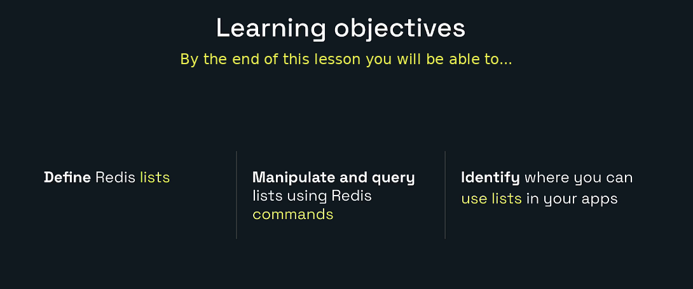

By the end of this lesson, I will be able to:

- Define a Redis list.
- Explain the head and tail of a list.
- Manipulate lists using Redis commands.
- Query ranges using positive and negative indexes.
- Use Redis lists as queues and stacks.
- Identify where lists are useful in backend applications.

---

# 1. What Is a Redis List?

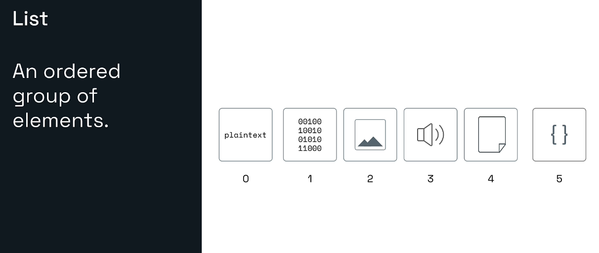

A Redis list is an **ordered collection of binary-safe string values**.

Example:

```text
Index 0 -> product-105
Index 1 -> product-207
Index 2 -> product-309
```

Important properties:

- Order is preserved.
- Duplicate elements are allowed.
- Elements can be added to either end.
- Elements can be removed from either end.
- Every list item is stored as a Redis string value.
- The list itself is stored under one Redis key.

Example key:

```text
products:recent:alice
```

Possible list:

```text
[ASCOT13, BOLOTIE23, BOWTIE42]
```

The key identifies the entire list. Individual elements do not have separate Redis keys.

---

# 2. Redis Lists and Programming-Language Lists

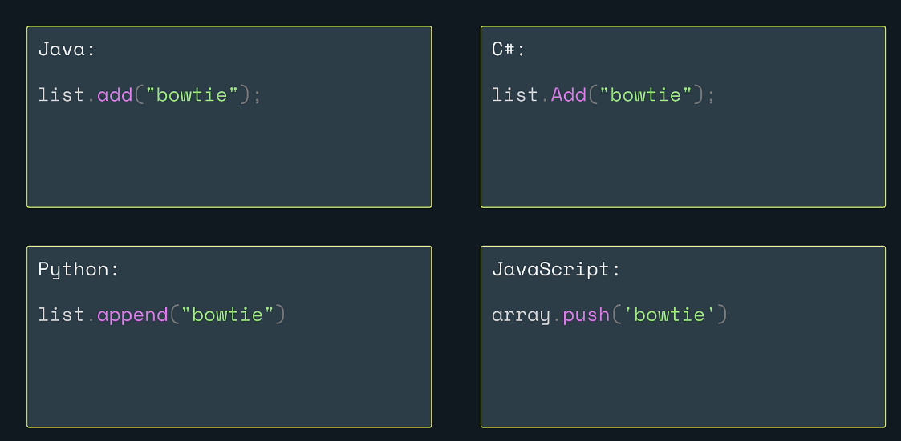

Ordered collections are already familiar to developers.

## Java

```java
List<String> products = new ArrayList<>();
products.add("bowtie");
```

## C#

```csharp
var products = new List<string>();
products.Add("bowtie");
```

## Python

```python
products = []
products.append("bowtie")
```

## JavaScript

```javascript
const products = [];
products.push("bowtie");
```

A Redis list follows the same broad idea of ordered elements, but it runs inside the Redis server.

```text
Java List
    -> Exists inside one Java application process

Redis List
    -> Exists inside Redis
    -> Can be shared by many application instances
    -> Can survive application restarts
    -> Can be updated atomically through Redis commands
```

---

# 3. Head, Tail, Left, and Right

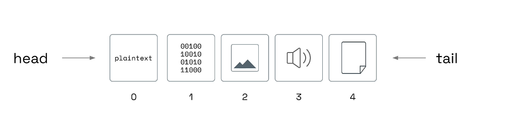

Redis describes the two ends of a list as:

```text
Left side  = Head
Right side = Tail
```

Example:

```text
Head                                              Tail
  |                                                 |
  v                                                 v
[ASCOT12, BOLOTIE52, BOWTIE13BLU, BOWTIE23GRN, BOWTIE42RED]
```

The command name tells us which side it uses:

| Command | Meaning |
|---|---|
| `LPUSH` | Add to the left or head |
| `RPUSH` | Add to the right or tail |
| `LPOP` | Remove and return from the left |
| `RPOP` | Remove and return from the right |

Easy memory rule:

```text
L = Left
R = Right
PUSH = Add
POP = Remove and return
```

---

# 4. LPUSH and RPOP: A FIFO Queue

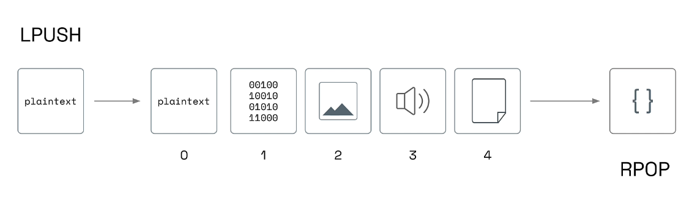

A queue processes the oldest item first.

```text
First In, First Out
```

This is called **FIFO**.

One Redis queue pattern is:

```text
LPUSH -> Add new items on the left
RPOP  -> Remove old items from the right
```

Example:

```redis
LPUSH jobs job-1
LPUSH jobs job-2
LPUSH jobs job-3
```

The list becomes:

```text
[job-3, job-2, job-1]
```

Now:

```redis
RPOP jobs
```

returns:

```text
job-1
```

The first item inserted is the first one removed.

Another valid FIFO pattern is:

```text
RPUSH + LPOP
```

The main idea is to insert on one side and remove from the opposite side.

---

# 5. RPUSH and LPOP

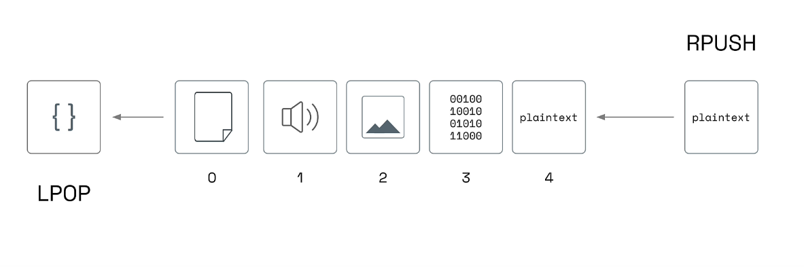

`RPUSH` adds items to the right side:

```redis
RPUSH tasks task-1 task-2 task-3
```

Result:

```text
[task-1, task-2, task-3]
```

`LPOP` removes the item on the left:

```redis
LPOP tasks
```

Result:

```text
task-1
```

This is also FIFO queue behavior.

## Stack behavior

A stack processes the newest item first.

```text
Last In, First Out
```

This is called **LIFO**.

Use the same side for both operations:

```text
LPUSH + LPOP
```

or:

```text
RPUSH + RPOP
```

Example:

```redis
LPUSH browser:history /home
LPUSH browser:history /products
LPUSH browser:history /products/42
LPOP browser:history
```

Result:

```text
/products/42
```

The most recently inserted item is removed first.

---

# 6. Positive and Negative Indexes

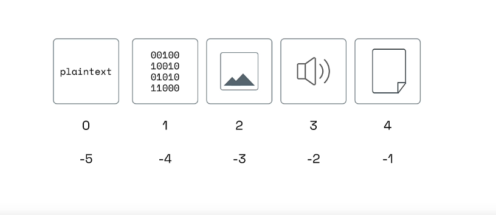

Redis list indexes start at `0`.

```text
Elements: plaintext  binary  image  audio  document
Positive:     0        1       2      3       4
Negative:    -5       -4      -3     -2      -1
```

Positive indexes count from the left:

```text
0 -> first element
1 -> second element
2 -> third element
```

Negative indexes count backward from the right:

```text
-1 -> last element
-2 -> second-to-last element
-3 -> third-to-last element
```

Negative indexes are especially useful when the total list length is unknown.

---

# 7. Core Redis List Commands

## LPUSH

```redis
LPUSH key element [element ...]
```

Adds one or more elements to the left side.

```redis
LPUSH products:recent:alice BOWTIE42
```

The returned integer is the list length after the push.

## RPUSH

```redis
RPUSH key element [element ...]
```

Adds one or more elements to the right side.

## LPOP

```redis
LPOP key [count]
```

Removes and returns one or more elements from the left side.

## RPOP

```redis
RPOP key [count]
```

Removes and returns one or more elements from the right side.

## LLEN

```redis
LLEN key
```

Returns the number of elements.

## LRANGE

```redis
LRANGE key start stop
```

Returns a range of elements. The stop index is inclusive.

```redis
LRANGE mylist 0 2
```

can return indexes `0`, `1`, and `2`, which is three elements.

## LINDEX

```redis
LINDEX key index
```

Returns one element without removing it.

---

# 8. Hands-On Lab: Build with Lists

## Lab Goal

In this lab, I will:

1. Build Alice’s recent-product list.
2. Confirm its length.
3. Pop products in FIFO order.
4. Build Bob’s product list.
5. Query ranges.
6. Use negative indexes.
7. Read the complete list.
8. Read the first and last items.

## Prerequisites

- Redis is running.
- Redis Insight is connected.
- Redis Insight CLI is open.

Verify the connection:

```redis
PING
```

Expected:

```text
PONG
```

---

# Part A: Alice’s Recent Products

## Step 1: Remove Old Practice Data

```redis
UNLINK products:recent:alice
```

This makes the lab repeatable.

Possible result:

```text
1 -> The key existed and was removed
0 -> The key did not exist
```

---

## Step 2: Push Product IDs

```redis
LPUSH products:recent:alice BOWTIE42
```

Expected length:

```text
1
```

```redis
LPUSH products:recent:alice BOLOTIE23
```

Expected length:

```text
2
```

```redis
LPUSH products:recent:alice ASCOT13
```

Expected length:

```text
3
```

Each `LPUSH` inserts at index `0`.

Final list:

```text
Index 0 -> ASCOT13
Index 1 -> BOLOTIE23
Index 2 -> BOWTIE42
```

The visible order is reversed because every new value was added to the left.

---

## Step 3: Check the Length

```redis
LLEN products:recent:alice
```

Expected:

```text
3
```

`LLEN` does not change the list.

---

## Step 4: View the Complete List

```redis
LRANGE products:recent:alice 0 -1
```

Expected:

```text
ASCOT13
BOLOTIE23
BOWTIE42
```

Here:

```text
0  = first element
-1 = last element
```

Therefore, `0 -1` means the entire list.

---

## Step 5: Pop Alice’s Products

```redis
RPOP products:recent:alice
```

Expected:

```text
BOWTIE42
```

```redis
RPOP products:recent:alice
```

Expected:

```text
BOLOTIE23
```

```redis
RPOP products:recent:alice
```

Expected:

```text
ASCOT13
```

The products leave in the same order in which they entered:

```text
BOWTIE42 -> BOLOTIE23 -> ASCOT13
```

This is FIFO queue behavior using:

```text
LPUSH + RPOP
```

---

## Step 6: Pop from an Empty List

```redis
RPOP products:recent:alice
```

Expected:

```text
(nil)
```

When the final element is popped, Redis removes the empty list key.

Confirm:

```redis
EXISTS products:recent:alice
```

Expected:

```text
0
```

---

# Part B: Bob’s Recent Products

## Step 7: Build Bob’s List

```redis
UNLINK products:recent:bob
```

Then run:

```redis
LPUSH products:recent:bob BOWTIE42RED
LPUSH products:recent:bob BOWTIE23GRN
LPUSH products:recent:bob BOWTIE13BLU
LPUSH products:recent:bob BOLOTIE52
LPUSH products:recent:bob ASCOT12
```

The returned lengths should be:

```text
1
2
3
4
5
```

Bob’s final list is:

```text
Index 0 -> ASCOT12
Index 1 -> BOLOTIE52
Index 2 -> BOWTIE13BLU
Index 3 -> BOWTIE23GRN
Index 4 -> BOWTIE42RED
```

Confirm the length:

```redis
LLEN products:recent:bob
```

Expected:

```text
5
```

---

# Part C: Query Ranges

## Step 8: First Three Elements

```redis
LRANGE products:recent:bob 0 2
```

Expected:

```text
ASCOT12
BOLOTIE52
BOWTIE13BLU
```

The stop index is inclusive.

```text
0, 1, 2 = three elements
```

---

## Step 9: Middle Three Elements

```redis
LRANGE products:recent:bob 1 3
```

Expected:

```text
BOLOTIE52
BOWTIE13BLU
BOWTIE23GRN
```

---

## Step 10: Last Three with Positive Indexes

```redis
LRANGE products:recent:bob 2 5
```

Expected:

```text
BOWTIE13BLU
BOWTIE23GRN
BOWTIE42RED
```

This list only has indexes `0` through `4`. The requested stop index `5` is outside the list.

Redis safely returns the existing values through the end.

A more exact command for this five-element list is:

```redis
LRANGE products:recent:bob 2 4
```

---

# Part D: Negative Indexes

## Step 11: Last Three Elements

```redis
LRANGE products:recent:bob -3 -1
```

Expected:

```text
BOWTIE13BLU
BOWTIE23GRN
BOWTIE42RED
```

This works regardless of the list’s total length.

```text
-3 = third item from the end
-1 = last item
```

---

## Step 12: Get the Entire List

```redis
LRANGE products:recent:bob 0 -1
```

Expected:

```text
ASCOT12
BOLOTIE52
BOWTIE13BLU
BOWTIE23GRN
BOWTIE42RED
```

`0 -1` is useful for small learning lists.

For a large production list, request bounded ranges instead of returning every element repeatedly.

---

# Part E: Read One Element

## Step 13: First Element

```redis
LINDEX products:recent:bob 0
```

Expected:

```text
ASCOT12
```

## Step 14: Last Element

```redis
LINDEX products:recent:bob -1
```

Expected:

```text
BOWTIE42RED
```

`LINDEX` reads an element without removing it.

An invalid index returns null:

```redis
LINDEX products:recent:bob 100
```

Expected:

```text
(nil)
```

---

# 9. View the List in Redis Insight

After creating Bob’s list:

1. Open Redis Insight’s Browser.
2. Refresh the key list.
3. Search for:

```text
products:recent:
```

4. Open:

```text
products:recent:bob
```

Redis Insight can show:

- Key name
- Redis type
- List length
- Element indexes
- Element values
- Memory information

The CLI helps me understand commands. The Browser helps me visualize the result.

---

# 10. Queue and Stack Comparison

## Queue

A queue processes the oldest element first.

```text
FIFO = First In, First Out
```

Valid patterns:

```text
LPUSH + RPOP
RPUSH + LPOP
```

Typical uses:

- Background jobs
- Email tasks
- Image-processing tasks
- Import jobs
- Simple work queues

## Stack

A stack processes the newest element first.

```text
LIFO = Last In, First Out
```

Valid patterns:

```text
LPUSH + LPOP
RPUSH + RPOP
```

Typical uses:

- Breadcrumb navigation
- Undo history
- Backtracking
- Recently visited pages

---

# 11. Practical Use Cases

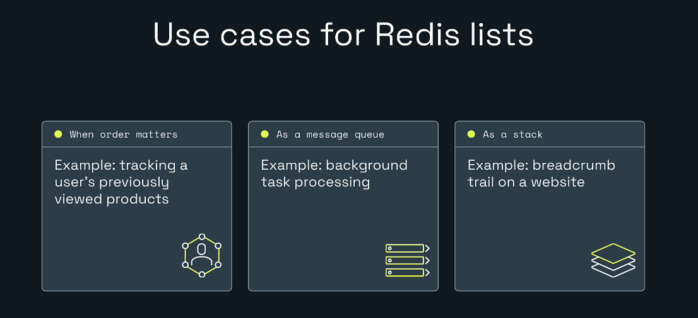

## Ordered history

Example:

```text
A user’s recently viewed products
```

```redis
LPUSH products:recent:alice product-105
LTRIM products:recent:alice 0 19
```

This keeps only the latest 20 items.

## Simple queue

Producer:

```redis
RPUSH jobs:email job-101
```

Consumer:

```redis
LPOP jobs:email
```

Blocking commands such as `BLPOP` or `BRPOP` can wait for work instead of repeatedly checking an empty list.

For advanced reliability, replay, consumer groups, and event processing, Redis Streams may be a better fit.

## Stack

```redis
LPUSH browser:history /home
LPUSH browser:history /products
LPOP browser:history
```

---

# 12. More List Operations

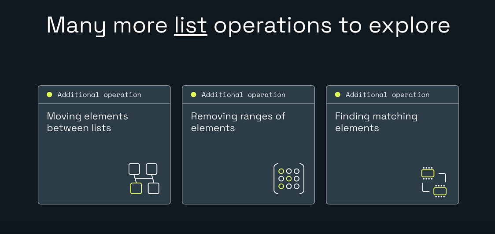

## Move an element between lists

```redis
LMOVE jobs:waiting jobs:processing RIGHT LEFT
```

## Remove matching elements

```redis
LREM products:recent:bob 0 BOWTIE23GRN
```

## Keep only a selected range

```redis
LTRIM products:recent:bob 0 19
```

## Change an element by index

```redis
LSET products:recent:bob 0 ASCOT99
```

## Insert around a matching value

```redis
LINSERT products:recent:bob BEFORE ASCOT12 NEWPRODUCT
```

## Find an element’s position

```redis
LPOS products:recent:bob BOWTIE13BLU
```

## Wait for an element

```redis
BLPOP jobs:email 30
BRPOP jobs:email 30
```

---

# 13. Performance Awareness

Operations at the ends of a Redis list are designed to be efficient:

```text
LPUSH
RPUSH
LPOP
RPOP
```

Commands that access indexes or ranges may need to walk through elements:

```text
LINDEX
LSET
LINSERT
LRANGE
```

Practical guidance:

- Use lists when most work happens at the ends.
- Keep range responses bounded.
- Trim history lists.
- Do not treat a huge list like a randomly indexed relational table.
- Use a sorted set when score-based ordering is the main requirement.

---

# 14. Common Problems

## LPUSH reversed my order

```redis
LPUSH mylist A
LPUSH mylist B
LPUSH mylist C
```

Result:

```text
[C, B, A]
```

Use `RPUSH` when values should be appended in the order written.

## LRANGE returned three items for 0 to 2

The stop index is inclusive.

```text
0, 1, 2 = three positions
```

## RPOP returned nil

The list may not exist or may be empty.

```redis
EXISTS mylist
LLEN mylist
```

## WRONGTYPE error

The key exists but stores another data type.

```redis
TYPE mylist
```

## The list disappeared

Redis removes the key automatically after the final item is popped.

## The history keeps growing

Trim it after inserting:

```redis
LPUSH products:recent:alice product-999
LTRIM products:recent:alice 0 19
```

---

# 15. Backend Developer Perspective

A Spring Boot service might store a user’s recently viewed products.

```text
User opens product 205
        |
Spring Boot service
        |
LPUSH products:recent:101 product:205
        |
LTRIM products:recent:101 0 19
        |
Redis keeps the latest 20 products
```

Conceptual Java example:

```java
public void addRecentProduct(String userId, String productId) {
    String key = "products:recent:" + userId;

    redisTemplate.opsForList().leftPush(key, productId);
    redisTemplate.opsForList().trim(key, 0, 19);
}
```

Read the recent products:

```java
public List<String> getRecentProducts(String userId) {
    String key = "products:recent:" + userId;
    return redisTemplate.opsForList().range(key, 0, 19);
}
```

Understanding the Redis commands first makes the Spring Boot code easier to understand.

---

# 16. Key Takeaways

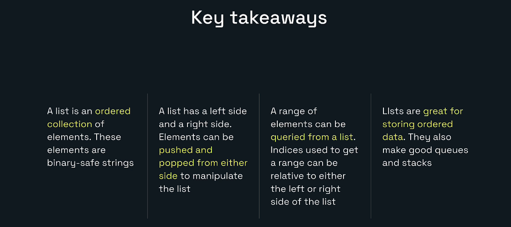

- A Redis list is an ordered collection of binary-safe strings.
- Duplicate values are allowed.
- The left side is the head.
- The right side is the tail.
- `LPUSH` and `RPUSH` add values.
- `LPOP` and `RPOP` remove and return values.
- `LLEN` returns the list size.
- `LRANGE` returns an inclusive range.
- `LINDEX` reads one item without removing it.
- Positive indexes count from the left.
- Negative indexes count from the right.
- Opposite-side push and pop operations produce FIFO behavior.
- Same-side push and pop operations produce LIFO behavior.
- Lists are useful for histories, queues, and stacks.
- Growing history lists should usually be bounded with `LTRIM`.
- Redis Streams may be more appropriate for advanced event-processing systems.

---

# 17. Completion Checklist

- [ ] I can define a Redis list.
- [ ] I understand the head and tail.
- [ ] I created Alice’s list with `LPUSH`.
- [ ] I checked its size with `LLEN`.
- [ ] I used `RPOP` to process values in FIFO order.
- [ ] I created Bob’s list.
- [ ] I queried the first three elements.
- [ ] I queried the middle three elements.
- [ ] I queried the last three elements.
- [ ] I used negative indexes.
- [ ] I read the entire list.
- [ ] I used `LINDEX`.
- [ ] I viewed a list in Redis Insight.
- [ ] I understand queue and stack patterns.
- [ ] I tried at least one additional list command.

---

# Included Practice Files

```text
lesson-05-lab-commands.txt
lesson-05-expected-results.md
```

The command file provides a complete Redis Insight CLI practice flow.

The expected-results guide shows the exact order of the list elements.

---

# Repository Structure

```text
redis-learning-journey-lesson-05/
|-- README.md
|-- lesson-05-lab-commands.txt
|-- lesson-05-expected-results.md
|-- MANIFEST.txt
`-- images/
    |-- 00-cover-build-with-lists.png
    |-- 01-learning-objectives.png
    |-- 02-redis-list-definition.png
    |-- 03-lists-in-programming-languages.png
    |-- 04-lpush-rpop-queue.png
    |-- 05-list-head-and-tail.png
    |-- 06-rpush-lpop-stack.png
    |-- 07-positive-and-negative-indexes.png
    |-- 08-list-use-cases.png
    |-- 09-more-list-operations.png
    `-- 10-key-takeaways.png
```

---

# Official References

- Redis lists: https://redis.io/docs/latest/develop/data-types/lists/
- Redis commands: https://redis.io/docs/latest/commands/
- `LPUSH`: https://redis.io/docs/latest/commands/lpush/
- `RPUSH`: https://redis.io/docs/latest/commands/rpush/
- `LPOP`: https://redis.io/docs/latest/commands/lpop/
- `RPOP`: https://redis.io/docs/latest/commands/rpop/
- `LLEN`: https://redis.io/docs/latest/commands/llen/
- `LRANGE`: https://redis.io/docs/latest/commands/lrange/
- `LINDEX`: https://redis.io/docs/latest/commands/lindex/
- `LTRIM`: https://redis.io/docs/latest/commands/ltrim/
- `LMOVE`: https://redis.io/docs/latest/commands/lmove/
- `BLPOP`: https://redis.io/docs/latest/commands/blpop/
- `BRPOP`: https://redis.io/docs/latest/commands/brpop/

---

# Next Lesson

## Lesson 6: Build with Redis Hashes

The next lesson can cover:

- Hash fields and values
- `HSET`
- `HGET`
- `HMGET`
- `HGETALL`
- `HDEL`
- `HEXISTS`
- `HINCRBY`
- User profiles and product details
- Hashes versus serialized JSON strings
- Redis hashes with Java and Spring Boot
