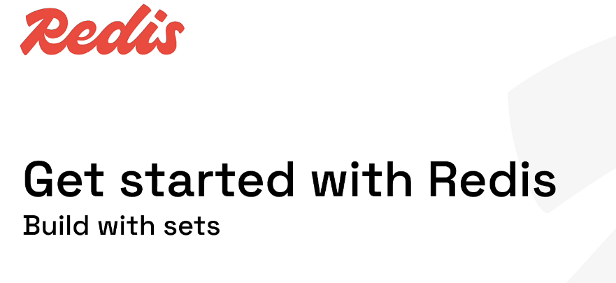
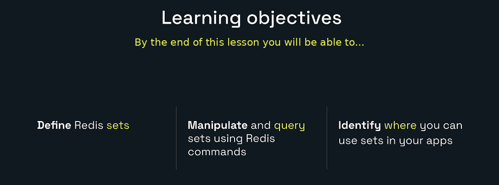
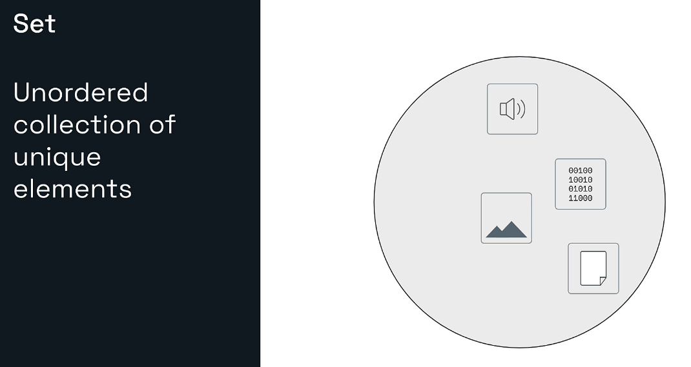
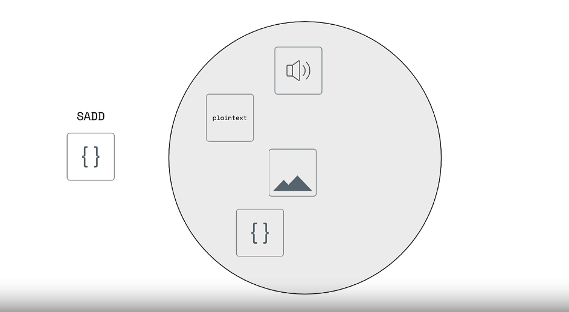
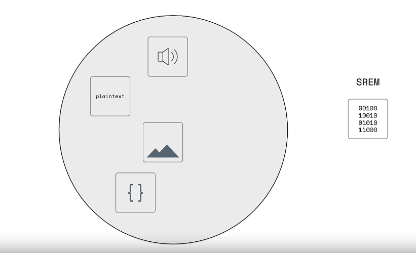
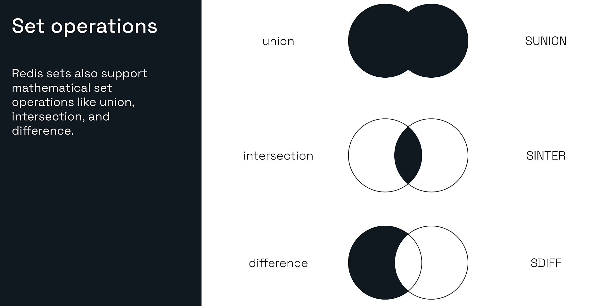
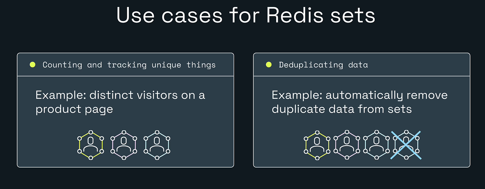
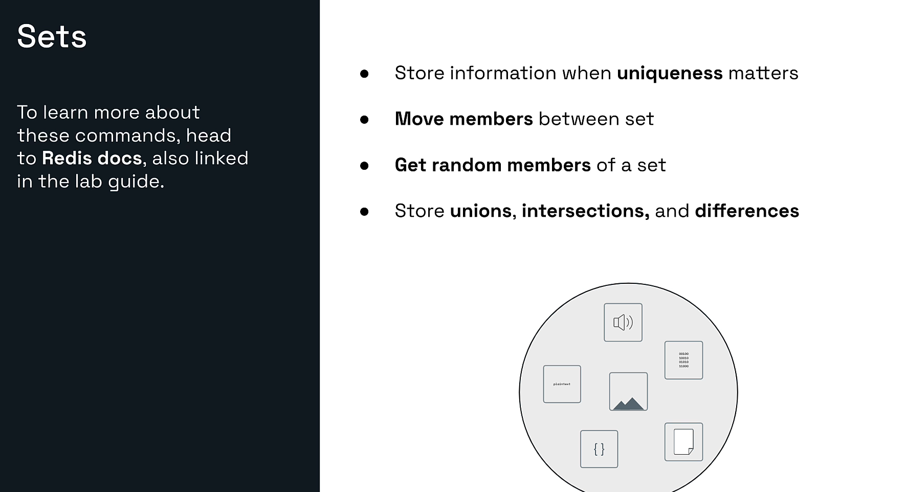
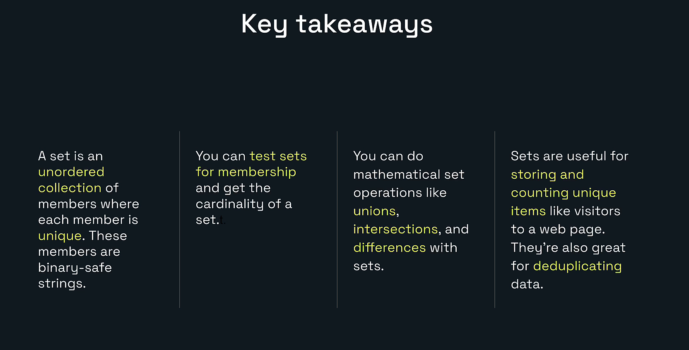

# Explore Redis for Developers



# My Redis Learning Journey — Lesson 6

## Build with Redis Sets

In Lesson 5, I learned how Redis lists maintain ordered elements and how they can behave as queues or stacks.

In this lesson, I am learning Redis sets.

A Redis set is useful when:

- Every member must be unique.
- The order of members does not matter.
- I need fast membership checks.
- I need to count unique values.
- I need unions, intersections, or differences.
- I want Redis to remove duplicates automatically.

The hands-on lab tracks users who viewed a product and explores the most important set commands.

---

## Learning Objectives



By the end of this lesson, I will be able to:

- Define a Redis set.
- Explain uniqueness and unordered storage.
- Add and remove set members.
- Read all members of a set.
- Count members using cardinality.
- Test whether a value belongs to a set.
- Use union, intersection, and difference operations.
- Identify practical places to use sets in backend applications.

---

# 1. What Is a Redis Set?



A Redis set is an **unordered collection of unique binary-safe string members**.

Example:

```text
product:views:bowtie42
    ├── alice
    ├── bob
    ├── chuck
    └── dave
```

Important properties:

- Members are unique.
- Duplicate additions are ignored.
- The set has no meaningful position or index.
- Members may be returned in any order.
- Membership can be checked efficiently.
- Mathematical set operations are supported.

A set is different from a list.

| Redis list | Redis set |
|---|---|
| Ordered | Unordered |
| Duplicates allowed | Members are unique |
| Access by index | No positional index |
| Useful for queues and histories | Useful for uniqueness and membership |

---

# 2. Why Are Sets Unordered?

A Redis set does not promise that members will be returned in the order they were added.

For example:

```redis
SADD colors red green blue
SMEMBERS colors
```

Redis might display:

```text
green
red
blue
```

or:

```text
blue
green
red
```

Both results are correct.

Do not use a set when the application needs:

- Stable insertion order
- First and last positions
- Index-based access
- Score-based ordering

Use a list for insertion order or a sorted set for score-based order.

---

# 3. Unique Members

Suppose a user visits the same product page multiple times.

```redis
SADD product:views:bowtie42 alice
SADD product:views:bowtie42 alice
SADD product:views:bowtie42 alice
```

The set still contains only:

```text
alice
```

Redis automatically prevents duplicate members.

This makes sets useful for tracking:

- Unique visitors
- User permissions
- Product tags
- Followers
- Completed task IDs
- Feature memberships
- Deduplicated event identifiers

---

# 4. Adding Members with SADD



The syntax is:

```redis
SADD key member [member ...]
```

Example:

```redis
SADD product:views:bowtie42 alice bob chuck dave
```

Expected result:

```text
4
```

The returned integer is the number of **new members actually added**.

It is not always the number of arguments supplied.

Example:

```redis
SADD product:views:bowtie42 alice bob
```

Expected:

```text
0
```

Both members already exist.

Example:

```redis
SADD product:views:bowtie42 eve alice
```

Expected:

```text
1
```

Only `eve` was new.

This return value is useful when tracking whether a distinct event occurred for the first time.

---

# 5. Reading Set Members with SMEMBERS

Use:

```redis
SMEMBERS product:views:bowtie42
```

Possible result:

```text
alice
bob
chuck
dave
```

The result contains all members, but the order is not guaranteed.

## Production caution

`SMEMBERS` returns the complete set.

That is fine for small sets and learning exercises. For a very large set, returning every member can consume significant memory and network bandwidth.

Use incremental iteration with `SSCAN` when an application must process a large set gradually.

Example:

```redis
SSCAN product:views:bowtie42 0 COUNT 100
```

`SSCAN` uses a cursor and may require multiple calls.

---

# 6. Counting Members with SCARD

The number of members in a set is called its **cardinality**.

Run:

```redis
SCARD product:views:bowtie42
```

Expected:

```text
4
```

`SCARD` is useful for:

- Counting unique product viewers
- Counting user roles
- Counting tags
- Counting completed IDs
- Counting members of a group

For extremely large approximate unique counts where exact member retrieval is not needed, Redis HyperLogLog may use less memory than a regular set.

---

# 7. Checking Membership

A common question is:

> Is this user already in the set?

Use:

```redis
SISMEMBER product:views:bowtie42 alice
```

Expected:

```text
1
```

`1` means the member exists.

```redis
SISMEMBER product:views:bowtie42 frank
```

Expected:

```text
0
```

`0` means it does not exist.

## Check multiple members

Use:

```redis
SMISMEMBER product:views:bowtie42 alice frank bob
```

Possible result:

```text
1
0
1
```

The results correspond to the members in the same request order.

This is useful for:

- Authorization checks
- Feature access
- Deduplication
- Subscription checks
- Friend or follower checks
- Determining whether work was already processed

---

# 8. Removing Members with SREM



The syntax is:

```redis
SREM key member [member ...]
```

Remove Chuck and Dave:

```redis
SREM product:views:bowtie42 chuck dave
```

Expected:

```text
2
```

Two existing members were removed.

Confirm:

```redis
SMEMBERS product:views:bowtie42
```

The set should now contain:

```text
alice
bob
```

The display order may be different.

Run the same removal again:

```redis
SREM product:views:bowtie42 chuck dave
```

Expected:

```text
0
```

Neither member exists anymore.

When the final member is removed, Redis deletes the empty set key.

---

# 9. Set Operations



Redis supports mathematical set operations.

Assume:

```text
users:java   = alice, bob, dave
users:spring = bob, chuck, dave
```

---

## Union

A union contains members that appear in either set.

```redis
SUNION users:java users:spring
```

Result:

```text
alice
bob
chuck
dave
```

The order is not guaranteed.

Use cases:

- Users interested in Java or Spring
- Combined permissions
- Combined product categories
- Combined audiences

---

## Intersection

An intersection contains members shared by both sets.

```redis
SINTER users:java users:spring
```

Result:

```text
bob
dave
```

Use cases:

- Users who know both Java and Spring
- Products with two required tags
- Users who belong to two groups
- Shared followers

---

## Difference

A difference contains members from the first set that are absent from the other set.

```redis
SDIFF users:java users:spring
```

Result:

```text
alice
```

The order of the set arguments matters.

```redis
SDIFF users:spring users:java
```

Result:

```text
chuck
```

Use cases:

- Users who have one permission but not another
- Customers not included in a campaign
- Unprocessed IDs
- Products missing a category

---

# 10. Storing Set-Operation Results

Redis can store operation results in another set.

## Store a union

```redis
SUNIONSTORE users:all users:java users:spring
```

## Store an intersection

```redis
SINTERSTORE users:backend users:java users:spring
```

## Store a difference

```redis
SDIFFSTORE users:java-only users:java users:spring
```

Then inspect:

```redis
SMEMBERS users:backend
```

Stored results are useful when the application will reuse the result repeatedly.

Remember that the destination key is replaced with the new result.

---

# 11. Practical Use Cases for Redis Sets



## Unique visitors

```redis
SADD product:views:bowtie42 user-101
SADD product:views:bowtie42 user-102
SCARD product:views:bowtie42
```

Repeated visits by the same user do not increase the cardinality.

## Deduplicating data

Suppose a service receives the same event more than once.

```redis
SADD events:processed event-98342
```

Return value:

```text
1 -> This event ID was new
0 -> The event ID already existed
```

The application can skip duplicate processing when the result is `0`.

## Permissions and roles

```redis
SADD user:101:roles ADMIN REPORT_VIEWER
SISMEMBER user:101:roles ADMIN
```

## Product tags

```redis
SADD product:42:tags java backend redis
```

## Followers

```redis
SADD user:101:followers user-202 user-303
```

## Recommendations

Intersections can identify shared interests.

```redis
SINTER user:101:interests user:202:interests
```

---

# 12. More Set Commands



Redis provides additional operations beyond the core lab.

## Move a member

```redis
SMOVE source-set destination-set member
```

Example:

```redis
SMOVE queue:waiting queue:processing job-101
```

This moves the member atomically when it exists in the source set.

## Return a random member

```redis
SRANDMEMBER product:views:bowtie42
```

This does not remove the member.

Multiple random members:

```redis
SRANDMEMBER product:views:bowtie42 2
```

## Remove a random member

```redis
SPOP product:views:bowtie42
```

This returns and removes a random member.

## Scan a large set

```redis
SSCAN product:views:bowtie42 0 COUNT 100
```

Use the returned cursor for subsequent calls until Redis returns cursor `0`.

## Check intersection cardinality

Redis can count an intersection without returning all members:

```redis
SINTERCARD 2 users:java users:spring
```

The first number specifies how many set keys follow.

---

# 13. Hands-On Lab: Build with Sets

## Lab Goal

In this lab, I will:

1. Create a set of product viewers.
2. Read its members.
3. Count unique members.
4. Test membership.
5. Remove members.
6. Confirm the remaining members.
7. Explore duplicate behavior.

## Prerequisites

- Redis is running.
- Redis Insight is connected.
- The Redis Insight CLI is open.

Check the connection:

```redis
PING
```

Expected:

```text
PONG
```

---

## Step 1: Remove Existing Practice Data

Run:

```redis
UNLINK product:views:bowtie42
```

This makes the exercise repeatable.

Possible result:

```text
1 -> The key existed and was removed
0 -> The key did not exist
```

---

## Step 2: Add Viewers

Run:

```redis
SADD product:views:bowtie42 alice bob chuck dave
```

Expected:

```text
4
```

Four new members were added.

The set contains:

```text
alice
bob
chuck
dave
```

Their storage order is not important.

---

## Step 3: Confirm the Members

Run:

```redis
SMEMBERS product:views:bowtie42
```

You should receive all four names.

Possible output:

```text
bob
alice
dave
chuck
```

Another order is also correct.

Never write application logic that depends on `SMEMBERS` order.

---

## Step 4: Count the Members

Run:

```redis
SCARD product:views:bowtie42
```

Expected:

```text
4
```

The cardinality matches the number of unique members.

---

## Step 5: Test Duplicate Behavior

Run:

```redis
SADD product:views:bowtie42 alice bob
```

Expected:

```text
0
```

No new members were added.

Confirm:

```redis
SCARD product:views:bowtie42
```

Expected:

```text
4
```

---

## Step 6: Check Membership

Run:

```redis
SISMEMBER product:views:bowtie42 alice
```

Expected:

```text
1
```

Run:

```redis
SISMEMBER product:views:bowtie42 frank
```

Expected:

```text
0
```

---

## Step 7: Remove Chuck and Dave

Run:

```redis
SREM product:views:bowtie42 chuck dave
```

Expected:

```text
2
```

Two existing members were removed.

---

## Step 8: Confirm the Remaining Members

Run:

```redis
SMEMBERS product:views:bowtie42
```

The set now contains:

```text
alice
bob
```

The order may differ.

Confirm the count:

```redis
SCARD product:views:bowtie42
```

Expected:

```text
2
```

---

## Step 9: Remove Missing Members Again

Run:

```redis
SREM product:views:bowtie42 chuck dave
```

Expected:

```text
0
```

Neither member exists.

---

# 14. View the Set in Redis Insight

After creating the set:

1. Open Redis Insight.
2. Open the Browser.
3. Refresh the key list.
4. Search for:

```text
product:views:
```

5. Select:

```text
product:views:bowtie42
```

Redis Insight should show information such as:

- Key name
- Data type: Set
- Number of members
- Member values
- Memory usage
- Controls for adding or removing members

The CLI teaches the Redis commands, while the Browser helps visualize the result.

---

# 15. Complete Lab Flow

```text
PING
  |
  └── PONG

SADD product:views:bowtie42 alice bob chuck dave
  |
  └── 4 new members

SMEMBERS product:views:bowtie42
  |
  └── alice, bob, chuck, dave in any order

SCARD product:views:bowtie42
  |
  └── 4

SADD product:views:bowtie42 alice bob
  |
  └── 0 because both already exist

SISMEMBER ... alice
  |
  └── 1

SISMEMBER ... frank
  |
  └── 0

SREM product:views:bowtie42 chuck dave
  |
  └── 2 removed

SMEMBERS product:views:bowtie42
  |
  └── alice and bob
```

---

# 16. Backend Developer Perspective

A Spring Boot application might use a Redis set to track unique viewers.

Conceptual flow:

```text
User 101 views product 42
        |
Spring Boot service
        |
SADD product:views:42 user:101
        |
Redis returns 1 or 0
        |
1 = first recorded view by that user
0 = user was already counted
```

A Java service can eventually use `RedisTemplate`:

```java
@Service
public class ProductViewService {

    private final StringRedisTemplate redisTemplate;

    public ProductViewService(StringRedisTemplate redisTemplate) {
        this.redisTemplate = redisTemplate;
    }

    public boolean recordUniqueViewer(String productId, String userId) {
        String key = "product:views:" + productId;

        Long added = redisTemplate.opsForSet()
                .add(key, userId);

        return added != null && added == 1;
    }

    public long countUniqueViewers(String productId) {
        String key = "product:views:" + productId;

        Long count = redisTemplate.opsForSet()
                .size(key);

        return count == null ? 0 : count;
    }

    public boolean hasViewed(String productId, String userId) {
        String key = "product:views:" + productId;

        Boolean member = redisTemplate.opsForSet()
                .isMember(key, userId);

        return Boolean.TRUE.equals(member);
    }
}
```

The Redis commands are easier to understand after practicing them directly in Redis Insight.

---

# 17. Sets Versus Other Redis Types

## Set versus list

Use a list when:

- Order matters.
- Duplicates are allowed.
- Queue or stack behavior is required.

Use a set when:

- Uniqueness matters.
- Order does not matter.
- Membership checks are common.
- Set operations are useful.

## Set versus sorted set

Use a set when all members have equal importance.

Use a sorted set when every member needs a score.

Example:

```text
Set       -> Users who liked a post
Sorted set -> Users ranked by game score
```

## Set versus HyperLogLog

Use a set when:

- Exact members must be stored.
- Membership must be tested.
- Exact counts are required.
- Set operations are needed.

Use HyperLogLog when:

- Only an approximate unique count is needed.
- Individual members do not need to be retrieved.
- Memory efficiency is more important than exact membership.

---

# 18. Common Problems

## SMEMBERS returns a different order

That is expected. Sets are unordered.

## SADD returned fewer members than I supplied

Some values already existed.

```redis
SADD users alice bob alice
```

returns:

```text
2
```

Only `alice` and `bob` were newly added once each.

## SREM returned 0

The requested members were not present.

## WRONGTYPE error

The key exists but is not a set.

Check:

```redis
TYPE product:views:bowtie42
```

## The set disappeared

Redis removes the key when the final member is removed.

## SMEMBERS is slow for a huge set

Use `SSCAN` to iterate incrementally.

## I need the most popular member

A regular set does not store scores or counts per member.

Use a sorted set when members must be ranked.

---

# 19. Key Takeaways



- A Redis set is an unordered collection.
- Each member is unique.
- Set members are binary-safe strings.
- `SADD` adds members and reports how many were new.
- Duplicate additions do not create duplicate data.
- `SMEMBERS` returns every member in no guaranteed order.
- `SCARD` returns the number of unique members.
- `SISMEMBER` tests one member.
- `SMISMEMBER` tests multiple members.
- `SREM` removes members and reports how many existed.
- `SUNION` combines sets.
- `SINTER` finds shared members.
- `SDIFF` finds members present only in the first set.
- Sets are useful for unique visitors, deduplication, tags, permissions, and relationships.
- Use `SSCAN` instead of `SMEMBERS` when incrementally processing very large sets.

---

# 20. Lesson Completion Checklist

- [ ] I can define a Redis set.
- [ ] I understand that sets are unordered.
- [ ] I understand that every member is unique.
- [ ] I created `product:views:bowtie42`.
- [ ] I added four users with `SADD`.
- [ ] I observed the integer returned by `SADD`.
- [ ] I read members with `SMEMBERS`.
- [ ] I counted members with `SCARD`.
- [ ] I tested membership with `SISMEMBER`.
- [ ] I removed Chuck and Dave with `SREM`.
- [ ] I confirmed that only Alice and Bob remained.
- [ ] I tested duplicate additions.
- [ ] I understand union, intersection, and difference.
- [ ] I viewed the set in Redis Insight.
- [ ] I completed at least one additional set exercise.

---

# Included Practice Files

The downloadable package includes:

```text
lesson-06-lab-commands.txt
lesson-06-expected-results.md
```

The commands file can be followed directly in Redis Insight.

The expected-results guide explains the correct responses and reminds me that set-member order is not guaranteed.

---

# Repository Structure

```text
redis-learning-journey-lesson-06/
|-- README.md
|-- lesson-06-lab-commands.txt
|-- lesson-06-expected-results.md
|-- MANIFEST.txt
`-- images/
    |-- 00-cover-build-with-sets.png
    |-- 01-learning-objectives.png
    |-- 02-redis-set-definition.png
    |-- 03-sadd-add-members.png
    |-- 04-srem-remove-members.png
    |-- 05-set-operations.png
    |-- 06-set-use-cases.png
    |-- 07-more-set-operations.png
    `-- 08-key-takeaways.png
```

---

# Official References

- Redis sets: https://redis.io/docs/latest/develop/data-types/sets/
- Redis command reference: https://redis.io/docs/latest/commands/
- `SADD`: https://redis.io/docs/latest/commands/sadd/
- `SMEMBERS`: https://redis.io/docs/latest/commands/smembers/
- `SCARD`: https://redis.io/docs/latest/commands/scard/
- `SISMEMBER`: https://redis.io/docs/latest/commands/sismember/
- `SMISMEMBER`: https://redis.io/docs/latest/commands/smismember/
- `SREM`: https://redis.io/docs/latest/commands/srem/
- `SUNION`: https://redis.io/docs/latest/commands/sunion/
- `SINTER`: https://redis.io/docs/latest/commands/sinter/
- `SDIFF`: https://redis.io/docs/latest/commands/sdiff/
- `SMOVE`: https://redis.io/docs/latest/commands/smove/
- `SRANDMEMBER`: https://redis.io/docs/latest/commands/srandmember/
- `SPOP`: https://redis.io/docs/latest/commands/spop/
- `SSCAN`: https://redis.io/docs/latest/commands/sscan/

---

# Next Lesson

## Lesson 7: Build with Redis Hashes

The next lesson can cover:

- What a Redis hash is
- Fields and values
- `HSET`
- `HGET`
- `HMGET`
- `HGETALL`
- `HEXISTS`
- `HDEL`
- `HINCRBY`
- Storing user profiles and product records
- Hashes with Java and Spring Boot
