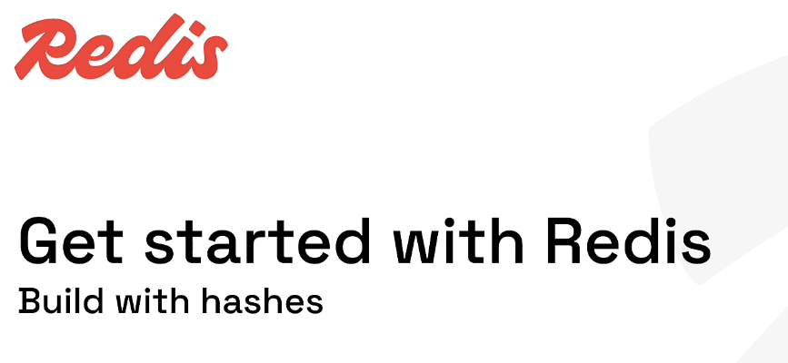
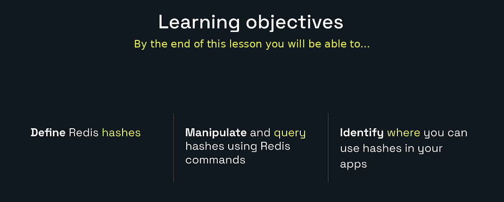
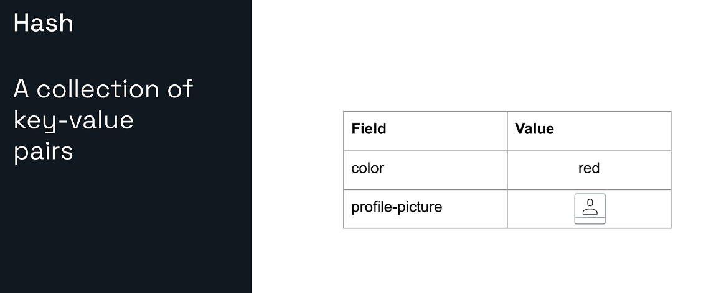
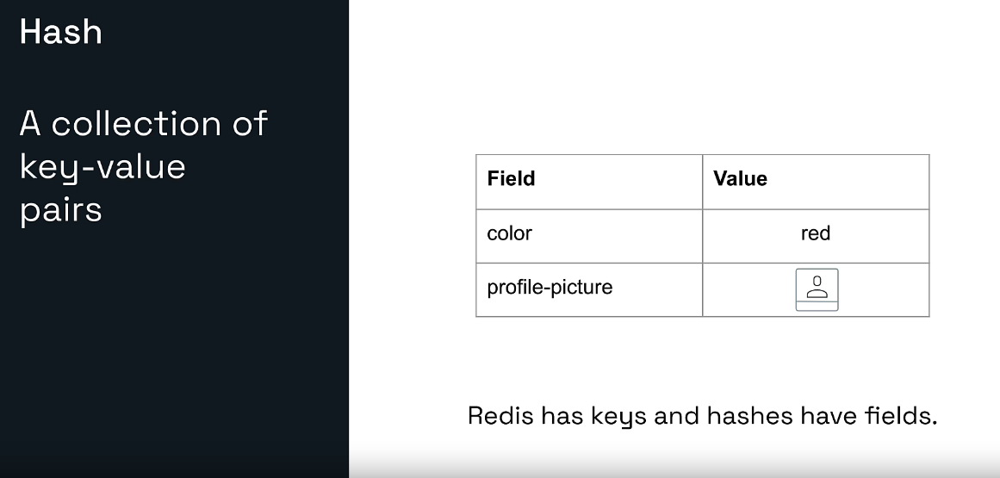
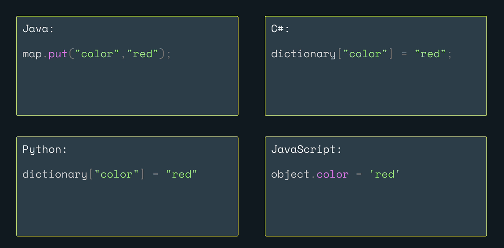
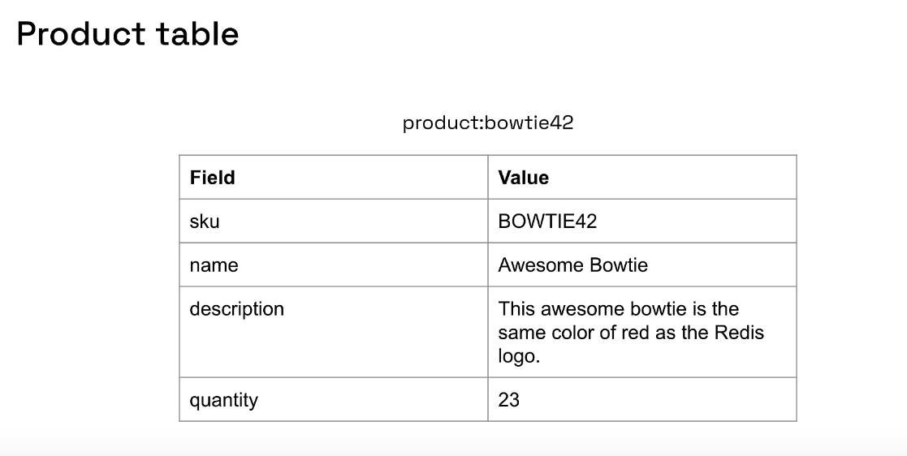
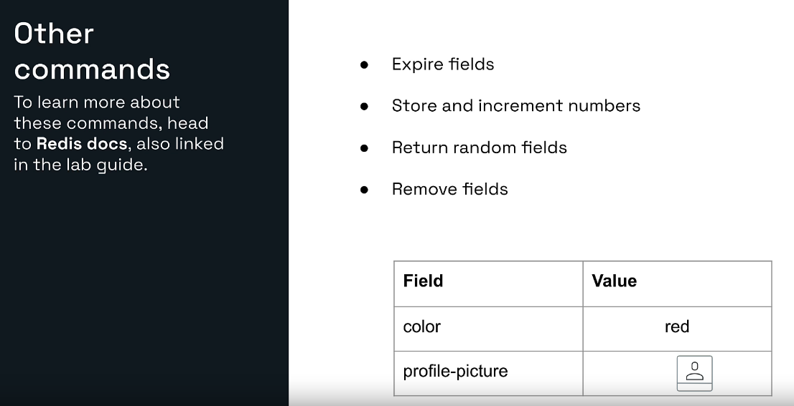
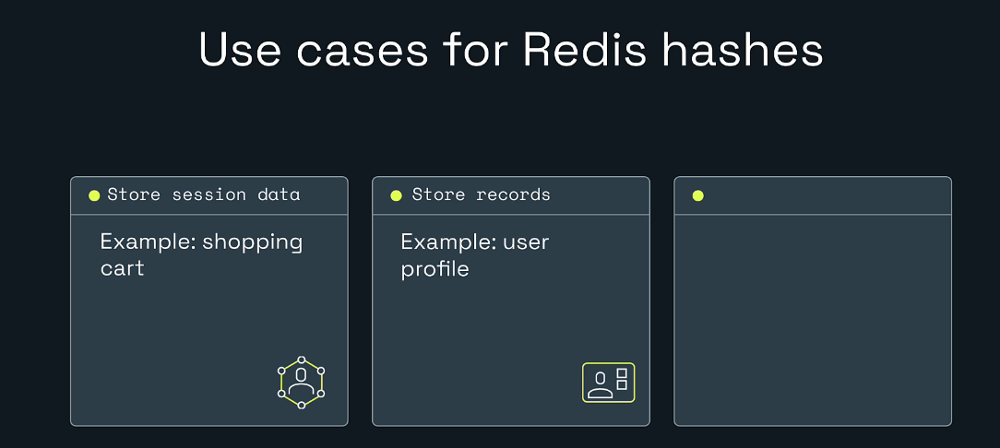
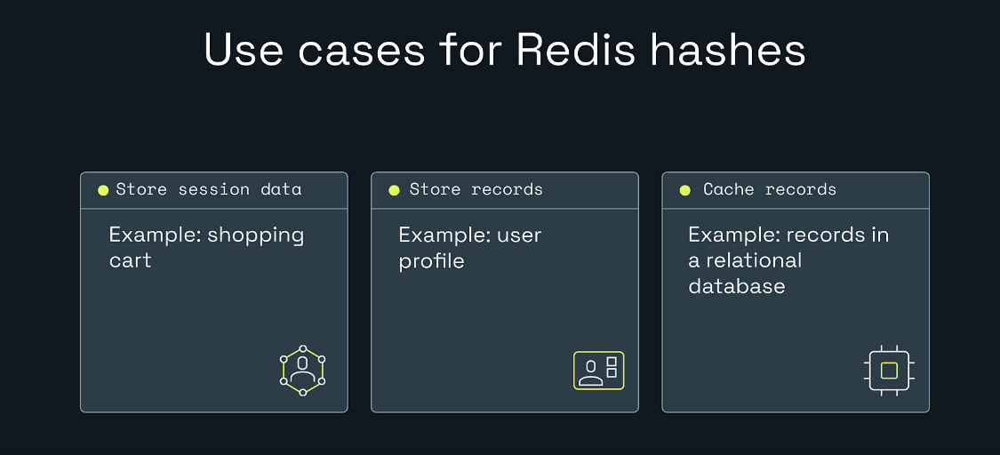
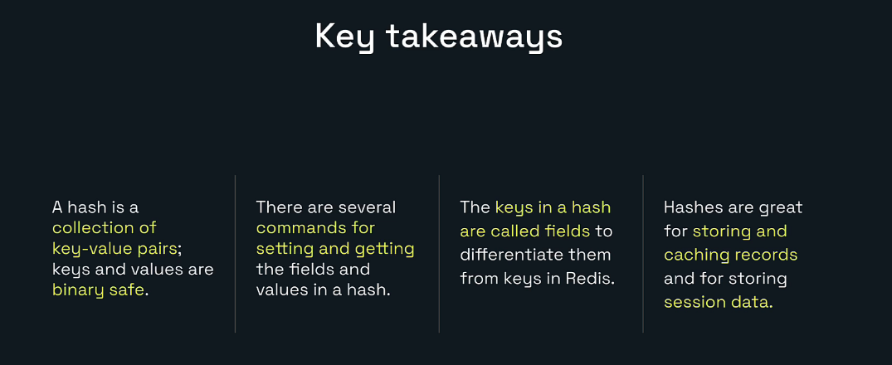

# Explore Redis for Developers



# My Redis Learning Journey — Lesson 7

## Build with Redis Hashes

In Lesson 6, I learned how Redis sets store unique, unordered members.

In this lesson, I am learning Redis hashes.

A Redis hash groups multiple related **field-value pairs** under one Redis key. It is useful for representing objects such as:

- Product records
- User profiles
- Shopping carts
- Sessions
- Application settings
- Cached database rows
- Counters grouped by entity

The hands-on lab builds a product record named:

```text
product:bowtie42
```

---

## Learning Objectives



By the end of this lesson, I will be able to:

- Define a Redis hash.
- Explain the difference between a Redis key and a hash field.
- Create and update hash fields.
- Read one, several, or all fields.
- Count and check fields.
- Remove fields.
- Increment numeric fields.
- Identify practical backend use cases for hashes.
- View and manage a hash in Redis Insight.

---

# 1. What Is a Redis Hash?



A Redis hash is a collection of field-value pairs stored under one Redis key.

Example:

```text
Redis key: product:bowtie42

Field        Value
-----        -----
sku          BOWTIE42
name         Awesome Bowtie
color        red
quantity     23
```

The complete object is found using the Redis key:

```text
product:bowtie42
```

Inside the object, each property has a field name:

```text
sku
name
color
quantity
```

Each field points to a value.

A simple way to remember it is:

```text
Redis key -> Finds the whole object
Hash field -> Finds one property inside the object
Field value -> Stores the property data
```

---

# 2. Redis Keys and Hash Fields Are Different



Redis itself stores top-level keys.

Example:

```text
product:bowtie42
```

The value stored at this key is a hash.

Inside the hash, Redis stores fields:

```text
name
color
quantity
```

Conceptually:

```text
product:bowtie42
    |
    +-- sku         -> BOWTIE42
    +-- name        -> Awesome Bowtie
    +-- color       -> red
    +-- quantity    -> 23
```

Do not confuse these two levels.

Incorrect mental model:

```text
Every field is a separate Redis key.
```

Correct mental model:

```text
One Redis key contains one hash.
The hash contains multiple fields.
```

This lets related properties stay together.

---

# 3. Hashes in Programming Languages



The field-value idea is familiar in many languages.

## Java

```java
Map<String, String> product = new HashMap<>();
product.put("color", "red");
```

## C#

```csharp
var product = new Dictionary<string, string>();
product["color"] = "red";
```

## Python

```python
product = {}
product["color"] = "red"
```

## JavaScript

```javascript
const product = {};
product.color = "red";
```

A Redis hash feels similar to a map or dictionary, but it runs in a separate Redis server.

```text
Java Map
    -> Lives inside one JVM process
    -> Disappears when the application stops unless persisted elsewhere

Redis Hash
    -> Lives inside Redis
    -> Can be shared by several application instances
    -> Supports atomic server-side commands
    -> Can have expiration at the Redis-key level
```

---

# 4. Hashes Are Made of Binary-Safe Strings

A Redis hash field and its value are binary-safe strings.

This means Redis can store values such as:

```text
Awesome Bowtie
23
red
user-101
{"small":"serialized-data"}
```

Even a numeric value such as `23` is stored in a form Redis can interpret for numeric commands.

For example:

```redis
HINCRBY product:bowtie42 quantity 1
```

Redis reads the existing field as an integer, performs the calculation, and stores the updated result.

---

# 5. Manipulating Hashes with Commands


The main commands in this lesson are:

| Command | Purpose |
|---|---|
| `HSET` | Create or update fields |
| `HGET` | Read one field |
| `HMGET` | Read several fields |
| `HGETALL` | Read all fields and values |
| `HLEN` | Count fields |
| `HEXISTS` | Check whether a field exists |
| `HKEYS` | Return all field names |
| `HVALS` | Return all values |
| `HDEL` | Remove fields |
| `HINCRBY` | Increment an integer field |
| `HINCRBYFLOAT` | Increment a decimal field |
| `HSETNX` | Set a field only when it is missing |
| `HSCAN` | Iterate through a large hash |
| `HRANDFIELD` | Return random fields |

---

# 6. The Product Record Used in This Lesson



The lab creates this product:

```text
Redis key: product:bowtie42
```

Fields:

| Field | Value |
|---|---|
| `sku` | `BOWTIE42` |
| `name` | `Awesome Bowtie` |
| `color` | `red` |
| `description` | `This awesome bowtie is the same color of red as the Redis logo.` |
| `quantity` | `23` |

This resembles one row in a database table or one object in Java.

---

# 7. HSET: Create or Update Fields

The syntax is:

```redis
HSET key field value [field value ...]
```

Create one field:

```redis
HSET product:bowtie42 name "Awesome Bowtie"
```

Expected result:

```text
1
```

The result means one new field was created.

Quotes are needed because the value contains a space:

```text
Awesome Bowtie
```

Without quotes, the CLI would treat the words as separate arguments.

## Add several fields

```redis
HSET product:bowtie42 \
  sku BOWTIE42 \
  name "Awesome Bowtie" \
  color red \
  description "This awesome bowtie is the same color of red as the Redis logo." \
  quantity 23
```

Expected result:

```text
4
```

Why not `5`?

The `name` field already existed. Redis updated it instead of creating a new field.

The return value from `HSET` is:

```text
Number of new fields created
```

It is not:

```text
Number of field-value pairs supplied
```

## Update an existing field

```redis
HSET product:bowtie42 color crimson
```

Expected:

```text
0
```

The update succeeded, but no new field was created.

---

# 8. HGET: Read One Field

The syntax is:

```redis
HGET key field
```

Example:

```redis
HGET product:bowtie42 name
```

Expected:

```text
"Awesome Bowtie"
```

Read the quantity:

```redis
HGET product:bowtie42 quantity
```

Expected:

```text
"23"
```

Read a missing field:

```redis
HGET product:bowtie42 price
```

Expected:

```text
(nil)
```

A null result can mean:

- The Redis key does not exist.
- The hash exists, but the requested field does not exist.

Use `EXISTS` and `HEXISTS` when the application needs to distinguish these situations.

---

# 9. HMGET: Read Several Fields

The syntax is:

```redis
HMGET key field [field ...]
```

Example:

```redis
HMGET product:bowtie42 sku name color quantity
```

Possible result:

```text
BOWTIE42
Awesome Bowtie
red
23
```

The results match the requested field order.

If one field is missing:

```redis
HMGET product:bowtie42 sku price quantity
```

Possible result:

```text
BOWTIE42
(nil)
23
```

`HMGET` is useful when the application needs selected fields rather than the entire object.

---

# 10. HGETALL: Read the Complete Hash

Run:

```redis
HGETALL product:bowtie42
```

The result contains every field and value.

Conceptually:

```text
sku
BOWTIE42
name
Awesome Bowtie
color
red
description
This awesome bowtie is the same color of red as the Redis logo.
quantity
23
```

The presentation order is not guaranteed.

Application logic should match fields by name instead of relying on display order.

## When should HGETALL be used?

Use it when:

- The hash is reasonably small.
- The application needs the complete object.
- The response size is acceptable.

For a very large hash, consider:

- Reading selected fields with `HMGET`.
- Iterating incrementally with `HSCAN`.

---

# 11. HLEN, HKEYS, and HVALS

## Count fields

```redis
HLEN product:bowtie42
```

Expected:

```text
5
```

## Return field names

```redis
HKEYS product:bowtie42
```

Possible fields:

```text
sku
name
color
description
quantity
```

## Return values

```redis
HVALS product:bowtie42
```

This returns all values without field names.

For normal application reads, `HMGET` or `HGETALL` is often easier to interpret than `HVALS`.

---

# 12. HEXISTS: Check a Field

Check an existing field:

```redis
HEXISTS product:bowtie42 sku
```

Expected:

```text
1
```

Check a missing field:

```redis
HEXISTS product:bowtie42 price
```

Expected:

```text
0
```

This is useful for:

- Optional properties
- Feature settings
- Partial updates
- Checking whether initialization is required
- Avoiding accidental replacement

---

# 13. Numeric Fields

Redis hashes can store numeric-looking values and update them atomically.

## Integer increment

```redis
HINCRBY product:bowtie42 quantity -1
```

If quantity was `23`, the result is:

```text
22
```

Increase it by ten:

```redis
HINCRBY product:bowtie42 quantity 10
```

Result:

```text
32
```

This can help with:

- Inventory changes
- Retry counts
- Likes or votes grouped inside an object
- Per-user counters
- Usage statistics

## Decimal increment

```redis
HSET product:bowtie42 price 24.99
HINCRBYFLOAT product:bowtie42 price 5.00
```

The updated value represents:

```text
29.99
```

Atomic commands avoid the unsafe pattern:

```text
Read old number
Calculate in the application
Write new number
```

when several application instances could update the same field at the same time.

---

# 14. HSETNX: Set Only When Missing

The syntax is:

```redis
HSETNX key field value
```

Example:

```redis
HSETNX product:bowtie42 createdBy lesson-07
```

Expected:

```text
1
```

Run again:

```redis
HSETNX product:bowtie42 createdBy another-value
```

Expected:

```text
0
```

The existing field is preserved.

This is useful for fields that should only be initialized once.

---

# 15. Remove Fields with HDEL

The syntax is:

```redis
HDEL key field [field ...]
```

Remove color:

```redis
HDEL product:bowtie42 color
```

Expected:

```text
1
```

Run it again:

```redis
HDEL product:bowtie42 color
```

Expected:

```text
0
```

The field no longer exists.

When the final field is removed, Redis removes the empty hash key.

---

# 16. Other Useful Hash Commands



## Random fields

```redis
HRANDFIELD product:bowtie42
```

Return two field names:

```redis
HRANDFIELD product:bowtie42 2
```

Return fields with values:

```redis
HRANDFIELD product:bowtie42 2 WITHVALUES
```

## Scan a large hash

```redis
HSCAN product:bowtie42 0 COUNT 10
```

`HSCAN` returns:

- A cursor
- A batch of field-value pairs

Continue using the returned cursor until it becomes `0`.

## Expiration

Redis keys can have expiration:

```redis
EXPIRE product:bowtie42 3600
TTL product:bowtie42
```

This expires the entire hash after approximately one hour.

Modern Redis versions also provide hash-field expiration capabilities. Availability and exact commands depend on the Redis version and deployment, so check the documentation for the server you are using before depending on field-level expiration.

---

# 17. Hashes and Indexing


A basic Redis hash is accessed by:

```text
Redis key + field name
```

Example:

```redis
HGET product:bowtie42 name
```

Redis does not automatically search all product hashes for:

```text
Every product where color = red
```

For application-wide searching and filtering, possible approaches include:

- Maintain secondary indexes manually.
- Use Redis Query Engine capabilities when available.
- Store searchable documents with an appropriate Redis data model.
- Use a relational or document database for complex reporting queries.

A hash is excellent for retrieving a known object by its key. It is not automatically a replacement for every database query pattern.


# 18. Practical Use Cases for Redis Hashes





## User profiles

```redis
HSET user:101:profile \
  name "Hero" \
  role "Backend Developer" \
  language Java \
  framework "Spring Boot"
```

Read one field:

```redis
HGET user:101:profile role
```

Read everything:

```redis
HGETALL user:101:profile
```

## Shopping-cart quantities

```redis
HSET cart:user:101 product:42 2 product:84 1
HINCRBY cart:user:101 product:42 1
```

Conceptually:

```text
cart:user:101
    product:42 -> 3
    product:84 -> 1
```

A hash is useful when each product ID maps to a quantity.

## Session data

```redis
HSET session:abc123 \
  userId 101 \
  role USER \
  device chrome \
  authenticated true
EXPIRE session:abc123 1800
```

The entire session expires after 30 minutes.

## Cached database records

A relational row:

```text
id: 42
sku: BOWTIE42
name: Awesome Bowtie
quantity: 23
```

can be cached as:

```redis
HSET cache:product:42 \
  sku BOWTIE42 \
  name "Awesome Bowtie" \
  quantity 23
EXPIRE cache:product:42 300
```

The database remains the permanent source of truth, while Redis provides faster temporary access.

## Application configuration

```redis
HSET app:config \
  maintenance false \
  maxUploadMb 20 \
  supportEmail support@example.com
```

Be careful with configuration ownership and security. Do not store secrets in an unprotected hash.

---

# 19. Hash Versus Separate String Keys

Suppose a product has five properties.

## Separate strings

```redis
SET product:bowtie42:sku BOWTIE42
SET product:bowtie42:name "Awesome Bowtie"
SET product:bowtie42:color red
SET product:bowtie42:quantity 23
SET product:bowtie42:description "..."
```

## One hash

```redis
HSET product:bowtie42 \
  sku BOWTIE42 \
  name "Awesome Bowtie" \
  color red \
  quantity 23 \
  description "..."
```

A hash keeps related fields together.

Choose separate keys when:

- Fields need completely independent expiration.
- Fields belong to separate ownership or access patterns.
- Each value is independently large.
- Independent key operations are central to the design.

Choose a hash when:

- Fields describe one logical object.
- The application often reads several fields together.
- One key-level expiration is appropriate.
- Field-level atomic updates are useful.

---

# 20. Hash Versus Serialized JSON String

Another option is to store an object as one JSON string.

```redis
SET product:bowtie42 '{"sku":"BOWTIE42","name":"Awesome Bowtie","quantity":23}'
```

## Hash advantages

- Read one field with `HGET`.
- Update one field with `HSET`.
- Increment one number with `HINCRBY`.
- Avoid rewriting the complete object for small field changes.

## JSON-string advantages

- Natural nested structure.
- Easy serialization from an application.
- One complete object is returned in one `GET`.
- Useful when the object is always read and written as one unit.

## Important distinction

A plain JSON string is not automatically field-addressable by basic string commands.

To change `quantity`, an application may need to:

1. Read the complete JSON string.
2. Parse it.
3. Modify one property.
4. Serialize it again.
5. Write the complete string.

A Redis hash can update the field directly:

```redis
HSET product:bowtie42 quantity 24
```

For deeply nested JSON documents and document queries, use Redis JSON capabilities when available instead of pretending a flat hash supports unlimited nesting.

---

# 21. Hands-On Lab: Build a Product Hash

## Lab Goal

In this lab, I will:

1. Create a product hash.
2. Add one field.
3. Add the complete product record.
4. Read one field.
5. Read selected fields.
6. Read every field and value.
7. Count and check fields.
8. Update numeric and text fields.
9. Remove a field.
10. View the hash in Redis Insight.

## Prerequisites

- Redis is running.
- Redis Insight is connected.
- The Redis Insight CLI is open.

Verify the connection:

```redis
PING
```

Expected:

```text
PONG
```

---

## Step 1: Remove Old Practice Data

```redis
UNLINK product:bowtie42
```

Possible result:

```text
1 -> The key existed and was removed
0 -> The key did not exist
```

---

## Step 2: Create the Name Field

```redis
HSET product:bowtie42 name "Awesome Bowtie"
```

Expected:

```text
1
```

Read it:

```redis
HGET product:bowtie42 name
```

Expected:

```text
"Awesome Bowtie"
```

---

## Step 3: Add the Complete Record

```redis
HSET product:bowtie42 \
  sku BOWTIE42 \
  name "Awesome Bowtie" \
  color red \
  description "This awesome bowtie is the same color of red as the Redis logo." \
  quantity 23
```

Expected:

```text
4
```

Explanation:

```text
sku         -> new
name        -> already existed
color       -> new
description -> new
quantity    -> new
```

Redis created four new fields and updated one existing field.

---

## Step 4: Get the Name

```redis
HGET product:bowtie42 name
```

Expected:

```text
"Awesome Bowtie"
```

---

## Step 5: Get Selected Fields

```redis
HMGET product:bowtie42 sku name color quantity
```

Expected values in the same requested order:

```text
BOWTIE42
Awesome Bowtie
red
23
```

---

## Step 6: Get the Complete Hash

```redis
HGETALL product:bowtie42
```

You should see every field and value.

The order may be different from the order used in `HSET`.

---

## Step 7: Count Fields

```redis
HLEN product:bowtie42
```

Expected:

```text
5
```

---

## Step 8: Check Fields

```redis
HEXISTS product:bowtie42 sku
```

Expected:

```text
1
```

```redis
HEXISTS product:bowtie42 price
```

Expected:

```text
0
```

---

## Step 9: Update the Color

```redis
HSET product:bowtie42 color crimson
```

Expected:

```text
0
```

`0` means no new field was created. It does not mean the update failed.

Confirm:

```redis
HGET product:bowtie42 color
```

Expected:

```text
"crimson"
```

---

## Step 10: Reduce Quantity

```redis
HINCRBY product:bowtie42 quantity -1
```

Expected:

```text
22
```

Confirm:

```redis
HGET product:bowtie42 quantity
```

Expected:

```text
"22"
```

---

## Step 11: Remove Color

```redis
HDEL product:bowtie42 color
```

Expected:

```text
1
```

Confirm:

```redis
HEXISTS product:bowtie42 color
```

Expected:

```text
0
```

Run the deletion again:

```redis
HDEL product:bowtie42 color
```

Expected:

```text
0
```

---

# 22. View the Hash in Redis Insight

1. Open Redis Insight.
2. Open the Browser.
3. Refresh the key list.
4. Search for:

```text
product:bowtie42
```

5. Select the key.

Redis Insight should identify the type as:

```text
Hash
```

The detail view should show:

- Redis key
- Field names
- Field values
- Number of fields
- Memory information
- Controls for adding, editing, or deleting fields

Use the CLI to understand commands and the Browser to visualize the object.

---

# 23. Complete Lab Flow

```text
HSET name
  |
  └── 1 new field

HSET sku, name, color, description, quantity
  |
  └── 4 new fields because name already existed

HGET name
  |
  └── Awesome Bowtie

HMGET sku name color quantity
  |
  └── Selected values

HGETALL
  |
  └── Complete product record

HLEN
  |
  └── 5 fields

HEXISTS sku
  |
  └── 1

HEXISTS price
  |
  └── 0

HSET color crimson
  |
  └── 0 new fields, existing value updated

HINCRBY quantity -1
  |
  └── 22

HDEL color
  |
  └── 1 removed field
```

---

# 24. Backend Developer Perspective

A Spring Boot application can use `StringRedisTemplate` to work with hashes.

```java
@Service
public class ProductCacheService {

    private static final String PREFIX = "product:";

    private final StringRedisTemplate redisTemplate;

    public ProductCacheService(StringRedisTemplate redisTemplate) {
        this.redisTemplate = redisTemplate;
    }

    public void saveProduct(
            String productId,
            String sku,
            String name,
            String color,
            int quantity) {

        String key = PREFIX + productId;

        Map<String, String> fields = new HashMap<>();
        fields.put("sku", sku);
        fields.put("name", name);
        fields.put("color", color);
        fields.put("quantity", String.valueOf(quantity));

        redisTemplate.opsForHash().putAll(key, fields);
    }

    public String getProductName(String productId) {
        Object value = redisTemplate.opsForHash()
                .get(PREFIX + productId, "name");

        return value == null ? null : value.toString();
    }

    public Map<Object, Object> getProduct(String productId) {
        return redisTemplate.opsForHash()
                .entries(PREFIX + productId);
    }

    public long reduceQuantity(String productId, long amount) {
        return redisTemplate.opsForHash()
                .increment(PREFIX + productId, "quantity", -amount);
    }

    public void removeField(String productId, String field) {
        redisTemplate.opsForHash()
                .delete(PREFIX + productId, field);
    }
}
```

Conceptual flow:

```text
Frontend
   |
Spring Boot Controller
   |
Product Service
   |
Redis Hash: product:bowtie42
   |
Return selected fields or complete product
```

A production application should also decide:

- Cache expiration
- Source of truth
- Serialization
- Error handling
- Fallback behavior
- Stale-data strategy
- Key naming
- Maximum record size

---

# 25. Caching a Database Record

Suppose PostgreSQL stores the permanent product.

```text
PostgreSQL
    |
    +-- id
    +-- sku
    +-- name
    +-- color
    +-- quantity
```

Redis can cache the frequently requested fields:

```redis
HSET cache:product:42 \
  sku BOWTIE42 \
  name "Awesome Bowtie" \
  color red \
  quantity 23

EXPIRE cache:product:42 300
```

Request flow:

```text
Check Redis hash
      |
      +-- Found -> Return quickly
      |
      +-- Missing -> Read database
                     |
                     +-- Store hash in Redis
                     |
                     +-- Return result
```

When the database record changes, the application should update or remove the cached hash.

---

# 26. Common Problems

## HSET returned 0

For existing fields, `0` means the value was updated but no new field was created.

## HGET returned nil

Check:

- Is the Redis key correct?
- Is the field name correct?
- Did the hash expire?
- Was the field deleted?
- Are you connected to the correct database?

Commands:

```redis
EXISTS product:bowtie42
TYPE product:bowtie42
HEXISTS product:bowtie42 name
```

## WRONGTYPE error

The Redis key exists but stores another data type.

```redis
TYPE product:bowtie42
```

Expected for this lesson:

```text
hash
```

## HINCRBY reports an integer error

The current field value is not a valid integer.

Example problem:

```redis
HSET product:bowtie42 quantity many
HINCRBY product:bowtie42 quantity 1
```

Use a valid numeric value.

## HGETALL returns fields in another order

Hash field order is not guaranteed. Match data by field names.

## The entire hash disappeared

Possible reasons:

- The last field was removed.
- The Redis key expired.
- The key was deleted.
- The database was cleared.
- You connected to another Redis instance.

## A field needs separate expiration

Basic key expiration applies to the whole hash. Modern Redis versions may support hash-field expiration, but compatibility must be checked. Another design is to use a separate Redis key when independent expiration is essential.

---

# 27. Hash Design Best Practices

Use meaningful keys:

```text
product:bowtie42
user:101:profile
session:abc123
cart:user:101
```

Use clear field names:

```text
sku
name
quantity
createdAt
updatedAt
```

Avoid:

```text
a
b
x1
thing
data
```

unless the meaning is formally documented and memory savings are important.

Keep the hash focused on one logical object.

Good:

```text
product:42 -> product properties
```

Confusing:

```text
product:42 -> product fields, random user fields, unrelated configuration
```

Other recommendations:

- Avoid storing extremely large fields without measuring memory.
- Use `HMGET` when only a few fields are needed.
- Use `HSCAN` for incremental processing of huge hashes.
- Apply expiration intentionally.
- Never assume hash display order.
- Keep the permanent database as the source of truth when Redis is used as a cache.

---

# 28. Key Takeaways



- A Redis hash stores field-value pairs under one Redis key.
- The top-level Redis key identifies the complete hash.
- Properties inside the hash are called fields.
- Fields and values are binary-safe strings.
- `HSET` creates and updates fields.
- `HSET` returns the number of newly created fields.
- `HGET` reads one field.
- `HMGET` reads selected fields.
- `HGETALL` reads the complete hash.
- `HLEN` counts fields.
- `HEXISTS` checks field membership.
- `HDEL` removes fields.
- `HINCRBY` and `HINCRBYFLOAT` update numeric fields atomically.
- Hashes work well for product records, profiles, sessions, carts, and cached rows.
- Hashes are accessed efficiently when the Redis key is known.
- Complex search across many hashes requires an indexing strategy or search capability.

---

# 29. Lesson Completion Checklist

- [ ] I can define a Redis hash.
- [ ] I understand Redis keys versus hash fields.
- [ ] I created `product:bowtie42`.
- [ ] I created a field using `HSET`.
- [ ] I understood why the second `HSET` returned `4`.
- [ ] I read one field with `HGET`.
- [ ] I read selected fields with `HMGET`.
- [ ] I read all fields with `HGETALL`.
- [ ] I counted fields with `HLEN`.
- [ ] I checked fields with `HEXISTS`.
- [ ] I updated a text field.
- [ ] I updated a number with `HINCRBY`.
- [ ] I removed a field with `HDEL`.
- [ ] I viewed the hash in Redis Insight.
- [ ] I understand hashes versus JSON strings.
- [ ] I understand when hashes are useful in Spring Boot.

---

# Included Practice Files

The downloadable package includes:

```text
lesson-07-lab-commands.txt
lesson-07-expected-results.md
```

The command file contains the complete lab plus additional practice.

The expected-results guide explains what Redis should return and why.

---

# Repository Structure

```text
redis-learning-journey-lesson-07/
|-- README.md
|-- lesson-07-lab-commands.txt
|-- lesson-07-expected-results.md
|-- MANIFEST.txt
`-- images/
    |-- 00-cover-build-with-hashes.png
    |-- 01-learning-objectives.png
    |-- 02-redis-hash-definition.png
    |-- 03-redis-keys-vs-hash-fields.png
    |-- 04-hashes-in-programming-languages.png
    |-- 05-manipulating-hashes-with-commands.png
    |-- 06-product-hash-record.png
    |-- 07-other-hash-commands.png
    |-- 08-hash-use-cases-introduction.png
    |-- 09-index-and-search.png
    |-- 10-hash-use-cases.png
    `-- 11-key-takeaways.png
```

---

# Official References

- Redis hashes: https://redis.io/docs/latest/develop/data-types/hashes/
- Redis command reference: https://redis.io/docs/latest/commands/
- `HSET`: https://redis.io/docs/latest/commands/hset/
- `HGET`: https://redis.io/docs/latest/commands/hget/
- `HMGET`: https://redis.io/docs/latest/commands/hmget/
- `HGETALL`: https://redis.io/docs/latest/commands/hgetall/
- `HLEN`: https://redis.io/docs/latest/commands/hlen/
- `HEXISTS`: https://redis.io/docs/latest/commands/hexists/
- `HDEL`: https://redis.io/docs/latest/commands/hdel/
- `HINCRBY`: https://redis.io/docs/latest/commands/hincrby/
- `HINCRBYFLOAT`: https://redis.io/docs/latest/commands/hincrbyfloat/
- `HSCAN`: https://redis.io/docs/latest/commands/hscan/
- `HRANDFIELD`: https://redis.io/docs/latest/commands/hrandfield/
- Redis Query Engine: https://redis.io/docs/latest/develop/ai/search-and-query/

---

# Next Lesson

## Lesson 8: Build with Redis Sorted Sets

The next lesson can cover:

- Members and scores
- `ZADD`
- `ZRANGE`
- `ZREVRANGE`
- `ZSCORE`
- `ZRANK`
- `ZREVRANK`
- `ZINCRBY`
- Leaderboards
- Priority queues
- Time-ordered feeds
- Sorted sets with Java and Spring Boot
