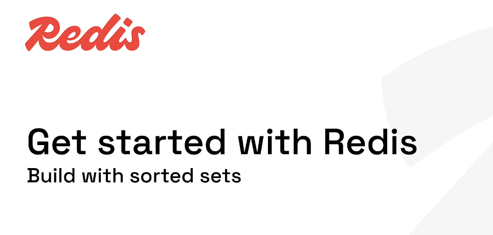
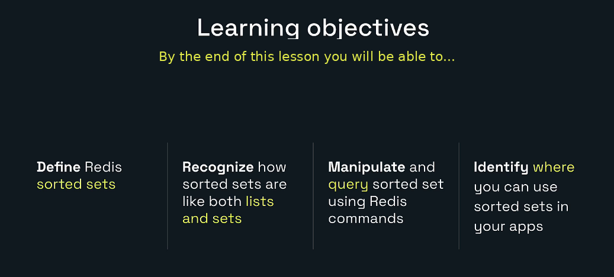
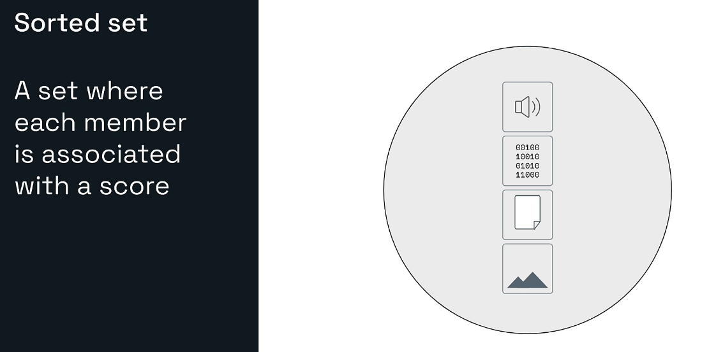
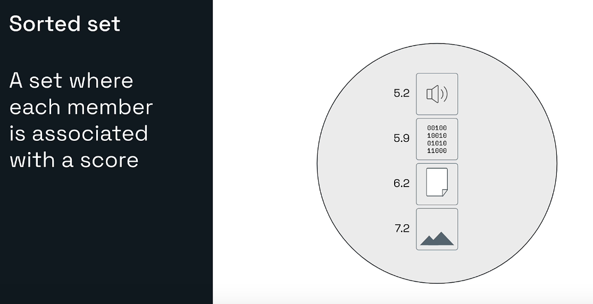
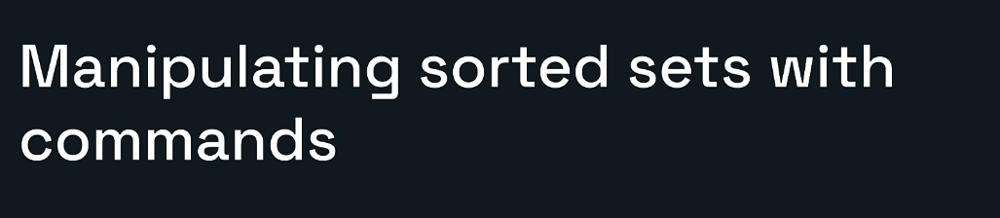
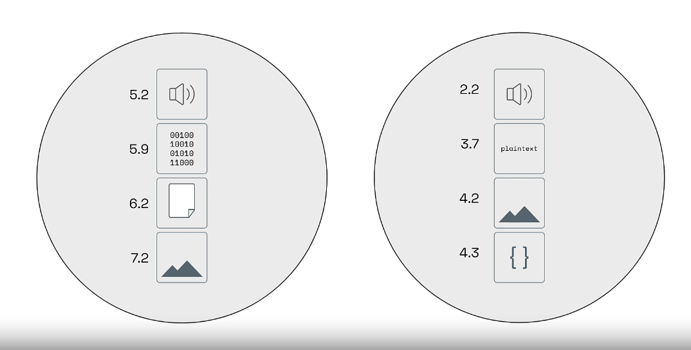
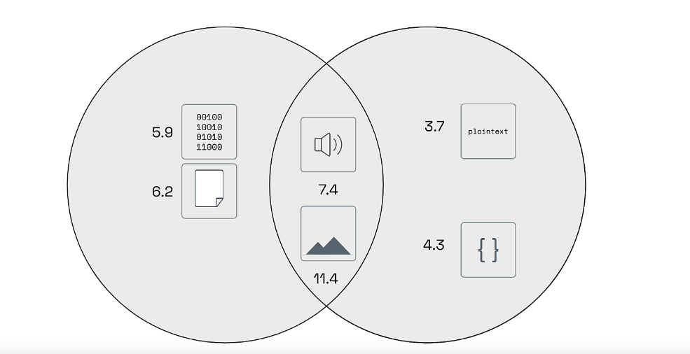
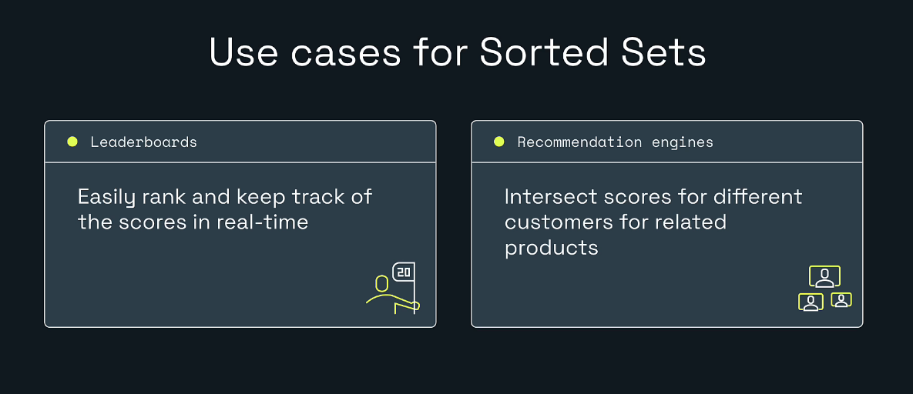
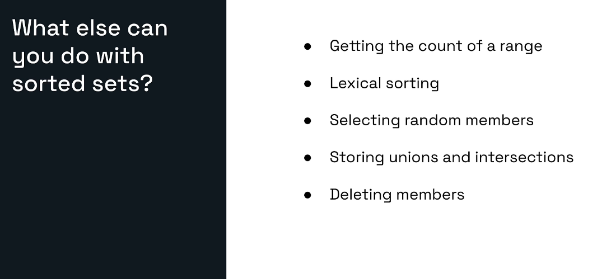
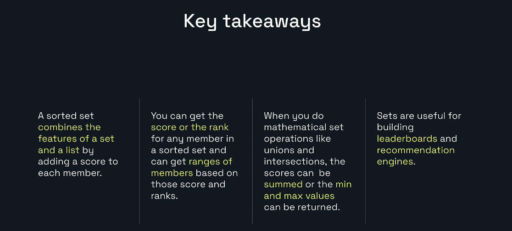

# Explore Redis for Developers



# My Redis Learning Journey — Lesson 8

## Build with Redis Sorted Sets

In Lesson 7, I learned how Redis hashes store multiple field-value pairs under a single Redis key.

In this lesson, I am learning Redis sorted sets.

A Redis sorted set is useful when I need both:

- **uniqueness** like a set
- **ordering** like a list

But the ordering is not based on insertion order.  
Instead, each member has a **score**, and Redis uses that score to keep the members sorted.

That makes sorted sets very useful for:

- leaderboards
- rankings
- recommendation engines
- trending lists
- scoring systems
- priority queues
- time-ordered or score-ordered data

---

## Learning Objectives



By the end of this lesson, I will be able to:

- Define a Redis sorted set.
- Explain how a sorted set combines ideas from sets and lists.
- Add members with scores using `ZADD`.
- Read scores using `ZSCORE`.
- Read ranks using `ZRANK`.
- Update a score and observe how the order changes.
- Query members by rank.
- Query members by score range.
- Understand practical backend use cases for sorted sets.
- View sorted sets in Redis Insight.

---

# 1. What Is a Redis Sorted Set?



A Redis sorted set is a collection of **unique members**, where every member has an associated **score**.

Simple mental model:

```text
member + score = sorted set entry
```

Example:

```text
BOWTIE42   -> 4.5
BOLOTIE23  -> 4.8
ASCOT13    -> 3.2
BONDTIE007 -> 4.9
```

Redis sorts the members by score from minimum to maximum.

So if the scores are:

```text
ASCOT13    -> 3.2
BOWTIE42   -> 4.5
BOLOTIE23  -> 4.8
BONDTIE007 -> 4.9
```

Then Redis will treat the order as:

```text
0 -> ASCOT13
1 -> BOWTIE42
2 -> BOLOTIE23
3 -> BONDTIE007
```

---

# 2. A Sorted Set Is Like a Set and a List

The slide says sorted sets are like both lists and sets.

That is true because:

## Like a set

- Members are unique.
- The same member cannot appear twice.

## Like a list

- Members have an order.
- I can get ranges.
- I can talk about rank or position.

## But different from both

A list is ordered by insertion position.  
A set has uniqueness but no ordering.  
A sorted set has uniqueness **and** ordering based on score.

So:

```text
List        -> ordered by position
Set         -> unique, unordered
Sorted set  -> unique, ordered by score
```

---

# 3. Sorted Sets with Scores



Each member has a score.

Example:

```text
speaker   -> 5.2
binary    -> 5.9
doc       -> 6.2
image     -> 7.2
```

Redis uses those numbers to keep the sorted set ordered.

Important points:

- Scores can be integers or decimal values.
- The member itself is unique.
- If I add the same member again with another score, Redis updates the score.
- Low-to-high ordering is the default for rank operations.

---

# 4. Main Commands in This Lesson



| Command | Purpose |
|---|---|
| `ZADD` | Add or update members with scores |
| `ZSCORE` | Get the score of a member |
| `ZRANK` | Get rank from min to max |
| `ZREVRANK` | Get rank from max to min |
| `ZRANGE` | Get members by rank or score |
| `ZCARD` | Count total members |
| `ZCOUNT` | Count members inside a score range |
| `ZINCRBY` | Increase or decrease a member score |
| `ZREM` | Remove one or more members |
| `ZUNION` / `ZUNIONSTORE` | Union of sorted sets |
| `ZINTER` / `ZINTERSTORE` | Intersection of sorted sets |

---

# 5. The Dataset Used in This Lesson

We will create a sorted set called:

```text
product:rank
```

This sorted set stores products and their average customer rating.

Example:

```text
BOWTIE42   -> 4.5
BOLOTIE23  -> 4.8
ASCOT13    -> 3.2
BONDTIE007 -> 4.9
```

This is a very practical backend pattern.

The Redis key tells me what the collection is:

```text
product:rank
```

Each member is a product ID, and each score is the ranking value.

---

# 6. ZADD: Add Members with Scores

The syntax is:

```redis
ZADD key score member [score member ...]
```

Important rule:

```text
score first, then member
```

## Add one product

```redis
ZADD product:rank 4.5 BOWTIE42
```

Expected:

```text
1
```

That means one new member was added.

## Add more products

```redis
ZADD product:rank 4.8 BOLOTIE23 3.2 ASCOT13 4.9 BONDTIE007
```

Expected:

```text
3
```

That means three new members were added.

### Important note

`ZADD` returns:

```text
number of new members added
```

It does **not** return:

```text
number of score-member pairs supplied
```

---

# 7. Members Are Unique

If a member already exists and I use `ZADD` again, Redis updates the score.

Example:

```redis
ZADD product:rank 2.0 BOWTIE42
```

Expected:

```text
0
```

Redis did not add a new member.  
It updated the score of an existing member.

That uniqueness property is why sorted sets are still a kind of set.

---

# 8. Get the Score with ZSCORE

The syntax is:

```redis
ZSCORE key member
```

Example:

```redis
ZSCORE product:rank BOWTIE42
```

Expected:

```text
4.5
```

After the score update:

```redis
ZADD product:rank 2.0 BOWTIE42
ZSCORE product:rank BOWTIE42
```

Expected:

```text
2.0
```

This is useful when my application needs the current score for:

- a player
- a product
- a user
- a job
- a recommendation

---

# 9. Get the Rank with ZRANK

The syntax is:

```redis
ZRANK key member
```

This returns the zero-based rank from **minimum score to maximum score**.

Suppose the members are:

```text
ASCOT13     3.2
BOWTIE42    4.5
BOLOTIE23   4.8
BONDTIE007  4.9
```

Then:

```redis
ZRANK product:rank BOWTIE42
```

Expected:

```text
1
```

Why?

Because `BOWTIE42` is the second member in min-to-max order, and rank starts at `0`.

### After updating the score

If I run:

```redis
ZADD product:rank 2.0 BOWTIE42
ZRANK product:rank BOWTIE42
```

Expected:

```text
0
```

Now it has the smallest score, so its rank becomes `0`.

---

# 10. ZREVRANK: Rank from High to Low

Sometimes the highest score is most important.

Example: leaderboard.

Use:

```redis
ZREVRANK product:rank BONDTIE007
```

This gives the rank counting from highest to lowest.

So:

```text
Highest score -> rank 0
Second highest -> rank 1
```

This is especially useful for:

- scoreboards
- gaming leaderboards
- best-rated products
- trending articles

---

# 11. Get Ranges by Rank with ZRANGE

Use:

```redis
ZRANGE product:rank 0 -1 WITHSCORES
```

This returns all members ordered from lowest score to highest score, along with their scores.

After the update where `BOWTIE42` became `2.0`, the result should conceptually be:

```text
BOWTIE42    2.0
ASCOT13     3.2
BOLOTIE23   4.8
BONDTIE007  4.9
```

## Why `0 -1`?

- `0` means start at the first member.
- `-1` means go to the last member.

This is a common Redis pattern for “give me everything.”

## First two by rank

```redis
ZRANGE product:rank 0 1 WITHSCORES
```

This gives the first two members in ascending order.

## Highest two by rank

```redis
ZREVRANGE product:rank 0 1 WITHSCORES
```

This gives the top two members in descending order.

---

# 12. Get Ranges by Score with ZRANGE ... BYSCORE

Use:

```redis
ZRANGE product:rank 4 5 BYSCORE WITHSCORES
```

This returns members whose score is between `4` and `5`.

Based on the lesson example, the expected products are:

```text
BOLOTIE23   4.8
BONDTIE007  4.9
```

This is extremely useful because many real backend filters are score-based.

Examples:

- products rated 4 stars or higher
- users with score above a threshold
- tasks with priority above some limit
- songs with popularity in a target range

---

# 13. Count Members

## Total members

```redis
ZCARD product:rank
```

Expected:

```text
4
```

after the first four unique members exist.

## Count in a score range

```redis
ZCOUNT product:rank 4 5
```

This returns how many members have scores between `4` and `5`.

This is helpful when I need totals without retrieving every member.

---

# 14. Increment a Score

Use:

```redis
ZINCRBY product:rank 0.3 BOLOTIE23
```

If `BOLOTIE23` was `4.8`, the new score becomes:

```text
5.1
```

This is great for use cases where scores change over time.

Examples:

- adding points
- increasing popularity
- boosting recommendation score
- promoting trending items

Like other Redis numeric operations, this is atomic.

---

# 15. Remove a Member

Use:

```redis
ZREM product:rank ASCOT13
```

Expected:

```text
1
```

That means one member was removed.

If I run it again:

```redis
ZREM product:rank ASCOT13
```

Expected:

```text
0
```

because the member is already gone.

---

# 16. Mathematical Operations on Sorted Sets

These slides show that sorted sets support union and intersection behavior too.

## Union example



## Intersection example



Redis supports operations such as:

- `ZUNION`
- `ZUNIONSTORE`
- `ZINTER`
- `ZINTERSTORE`

When sorted sets are combined, scores can be combined too.

Depending on the command and options, the resulting score can use operations such as:

- sum
- min
- max

This is useful for things like:

- recommendation overlap
- weighted ranking
- multi-source scoring
- combining trends from different feeds

---

# 17. Practical Use Cases



## Leaderboards

Sorted sets are a perfect fit for leaderboards.

Example:

```text
user:101 -> 2400
user:102 -> 1960
user:103 -> 2550
```

Redis can instantly show:

- top players
- a specific player’s rank
- score updates in real time

## Recommendation engines

Sorted sets can help with ranking recommended content.

Example ideas:

- related products
- recommended articles
- prioritized search results
- weighted relevance scores

Because each item has a numeric score, the app can sort and filter efficiently.

---

# 18. What Else Can Sorted Sets Do?



Redis sorted sets can also help with:

- getting the count of a range
- lexical sorting
- selecting random members
- storing unions and intersections
- deleting members

Sorted sets are a very rich Redis data type.

The deeper I go, the more they feel like a toolkit for score-based ranking problems.

---

# 19. Hands-On Lab Guide

## Goal

In this lab, I will:

1. Create a product ranking sorted set.
2. Add products with scores.
3. Read one score.
4. Read one rank.
5. Update a score.
6. Confirm the rank changes.
7. Read a complete range by rank.
8. Read a filtered range by score.

## Prerequisites

- Redis is running.
- Redis Insight is connected.
- Redis Insight CLI is open.

Verify the connection:

```redis
PING
```

Expected:

```text
PONG
```

---

## Step 1: Remove old practice data

```redis
UNLINK product:rank
```

Possible result:

```text
1 -> key existed and was removed
0 -> key did not exist
```

---

## Step 2: Add one product

```redis
ZADD product:rank 4.5 BOWTIE42
```

Expected:

```text
1
```

---

## Step 3: Add more products

```redis
ZADD product:rank 4.8 BOLOTIE23 3.2 ASCOT13 4.9 BONDTIE007
```

Expected:

```text
3
```

Now the set contains:

```text
ASCOT13     3.2
BOWTIE42    4.5
BOLOTIE23   4.8
BONDTIE007  4.9
```

---

## Step 4: Get the score

```redis
ZSCORE product:rank BOWTIE42
```

Expected:

```text
4.5
```

---

## Step 5: Get the rank

```redis
ZRANK product:rank BOWTIE42
```

Expected:

```text
1
```

Remember:

- rank is zero-based
- rank goes from lowest score to highest score

---

## Step 6: Update the score

```redis
ZADD product:rank 2.0 BOWTIE42
```

Expected:

```text
0
```

This updates the score of an existing member.

Confirm the new score:

```redis
ZSCORE product:rank BOWTIE42
```

Expected:

```text
2.0
```

Confirm the new rank:

```redis
ZRANK product:rank BOWTIE42
```

Expected:

```text
0
```

---

## Step 7: Get all products by rank

```redis
ZRANGE product:rank 0 -1 WITHSCORES
```

Expected conceptually:

```text
BOWTIE42    2.0
ASCOT13     3.2
BOLOTIE23   4.8
BONDTIE007  4.9
```

---

## Step 8: Get products by score range

```redis
ZRANGE product:rank 4 5 BYSCORE WITHSCORES
```

Expected:

```text
BOLOTIE23   4.8
BONDTIE007  4.9
```

These are the only two products with scores from 4 to 5.

---

# 20. Lab Flow Diagram

```text
ZADD 4.5 BOWTIE42
   |
   └── one member added

ZADD 4.8 BOLOTIE23 3.2 ASCOT13 4.9 BONDTIE007
   |
   └── three members added

ZSCORE BOWTIE42
   |
   └── 4.5

ZRANK BOWTIE42
   |
   └── 1

ZADD 2.0 BOWTIE42
   |
   └── existing member score updated

ZSCORE BOWTIE42
   |
   └── 2.0

ZRANK BOWTIE42
   |
   └── 0

ZRANGE 0 -1 WITHSCORES
   |
   └── all products from smallest score to largest

ZRANGE 4 5 BYSCORE WITHSCORES
   |
   └── products rated 4 to 5
```

---

# 21. Redis Insight View

In Redis Insight:

1. Open the Browser.
2. Refresh the key list.
3. Search for:

```text
product:rank
```

4. Select the key.

Redis Insight should identify the key type as:

```text
zset
```

or:

```text
sorted set
```

Depending on the UI version, I should be able to view:

- members
- scores
- order
- size
- editing controls

This helps connect the CLI commands to a more visual understanding.

---

# 22. Backend Developer Perspective

If I am working in Java Spring Boot, sorted sets are very useful for ranking features.

Examples:

- best-selling products
- user reputation points
- recommendation scores
- trending content
- job priority ordering

### Example with `StringRedisTemplate`

```java
@Service
public class ProductRankingService {

    private static final String PRODUCT_RANK_KEY = "product:rank";

    private final StringRedisTemplate redisTemplate;

    public ProductRankingService(StringRedisTemplate redisTemplate) {
        this.redisTemplate = redisTemplate;
    }

    public void addOrUpdateProductRank(String productId, double score) {
        redisTemplate.opsForZSet().add(PRODUCT_RANK_KEY, productId, score);
    }

    public Double getScore(String productId) {
        return redisTemplate.opsForZSet().score(PRODUCT_RANK_KEY, productId);
    }

    public Long getRank(String productId) {
        return redisTemplate.opsForZSet().rank(PRODUCT_RANK_KEY, productId);
    }

    public Set<ZSetOperations.TypedTuple<String>> getAllWithScores() {
        return redisTemplate.opsForZSet().rangeWithScores(PRODUCT_RANK_KEY, 0, -1);
    }

    public Set<ZSetOperations.TypedTuple<String>> getProductsRatedFourAndAbove() {
        return redisTemplate.opsForZSet().rangeByScoreWithScores(PRODUCT_RANK_KEY, 4.0, 5.0);
    }
}
```

Conceptual flow:

```text
Frontend
   |
Spring Boot Controller
   |
ProductRankingService
   |
Redis Sorted Set: product:rank
   |
Return rank, score, or ranges
```

---

# 23. Common Problems

## I entered member before score

Wrong:

```redis
ZADD product:rank BOWTIE42 4.5
```

Correct:

```redis
ZADD product:rank 4.5 BOWTIE42
```

Always remember:

```text
score first, member second
```

## ZADD returned 0

That usually means the member already existed and Redis updated its score.

## ZSCORE returned nil

Possible reasons:

- the member does not exist
- the Redis key does not exist
- you are in the wrong Redis database
- the key was deleted or expired

## Rank looks confusing

Remember:

```text
ZRANK     -> smallest score to biggest score
ZREVRANK  -> biggest score to smallest score
```

## ZRANGE does not look like insertion order

That is expected.

Sorted sets are not ordered by insertion order.  
They are ordered by score.

## Two members have the same score

Redis still keeps both members if the members are different.  
Members must be unique; scores do not have to be unique.

---

# 24. Best Practices

Use clear key names:

```text
product:rank
leaderboard:game:daily
user:reputation
article:trending
```

Use sorted sets when:

- I need uniqueness
- I need score-based ordering
- I need ranks
- I need ranges by score
- I need leaderboard-like features

Do not use a sorted set if:

- score-based ordering is not needed
- I only need plain uniqueness -> use a set
- I only need insertion order -> use a list
- I only need field-value records -> use a hash

Keep score meaning consistent.

For example, one sorted set should not mix:

```text
4.5 -> customer rating
999 -> inventory count
1700000000 -> timestamp
```

unless that is the deliberate design.

---

# 25. Key Takeaways



- A sorted set is a set where each unique member has a score.
- Redis orders members by score.
- A sorted set combines ideas from sets and lists.
- `ZADD` adds or updates members.
- `ZSCORE` returns a member’s score.
- `ZRANK` returns rank from low score to high score.
- `ZREVRANK` returns rank from high score to low score.
- `ZRANGE` can return members by rank or by score.
- Sorted sets are excellent for leaderboards and recommendation engines.

---

# 26. Lesson Completion Checklist

- [ ] I can define a Redis sorted set.
- [ ] I understand that members are unique.
- [ ] I understand that ordering is based on score.
- [ ] I used `ZADD`.
- [ ] I read a score using `ZSCORE`.
- [ ] I read a rank using `ZRANK`.
- [ ] I updated a score and saw the rank change.
- [ ] I used `ZRANGE` by rank.
- [ ] I used `ZRANGE` with `BYSCORE`.
- [ ] I understand sorted set use cases.
- [ ] I viewed the sorted set in Redis Insight.

---

# Included Practice Files

This package also includes:

```text
lesson-08-lab-commands.txt
lesson-08-expected-results.md
```

The command file contains the complete practice sequence.

The expected-results guide explains what each step should return and why.

---

# Repository Structure

```text
redis-learning-journey-lesson-08/
|-- README.md
|-- lesson-08-lab-commands.txt
|-- lesson-08-expected-results.md
|-- MANIFEST.txt
`-- images/
    |-- 00-cover-build-with-sorted-sets.png
    |-- 01-learning-objectives.png
    |-- 02-sorted-set-definition.png
    |-- 03-sorted-set-with-scores.png
    |-- 04-manipulating-sorted-sets-with-commands.png
    |-- 05-sorted-set-union-example.png
    |-- 06-sorted-set-intersection-example.png
    |-- 07-use-cases-for-sorted-sets.png
    |-- 08-what-else-can-you-do.png
    `-- 09-key-takeaways.png
```

---

# Official References

- Redis sorted sets: https://redis.io/docs/latest/develop/data-types/sorted-sets/
- Redis command reference: https://redis.io/docs/latest/commands/
- `ZADD`: https://redis.io/docs/latest/commands/zadd/
- `ZSCORE`: https://redis.io/docs/latest/commands/zscore/
- `ZRANK`: https://redis.io/docs/latest/commands/zrank/
- `ZREVRANK`: https://redis.io/docs/latest/commands/zrevrank/
- `ZRANGE`: https://redis.io/docs/latest/commands/zrange/
- `ZCARD`: https://redis.io/docs/latest/commands/zcard/
- `ZCOUNT`: https://redis.io/docs/latest/commands/zcount/
- `ZINCRBY`: https://redis.io/docs/latest/commands/zincrby/
- `ZREM`: https://redis.io/docs/latest/commands/zrem/
- `ZUNION`: https://redis.io/docs/latest/commands/zunion/
- `ZINTER`: https://redis.io/docs/latest/commands/zinter/

---

# Next Lesson

## Lesson 9: Build with Redis Streams

Possible next topics:

- stream basics
- `XADD`
- `XRANGE`
- `XREAD`
- consumer groups
- `XGROUP`
- `XREADGROUP`
- event-driven architecture
- Redis streams with Java Spring Boot
