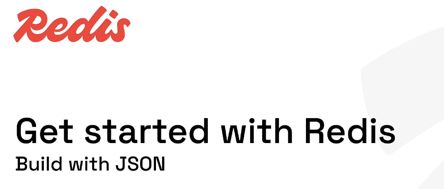
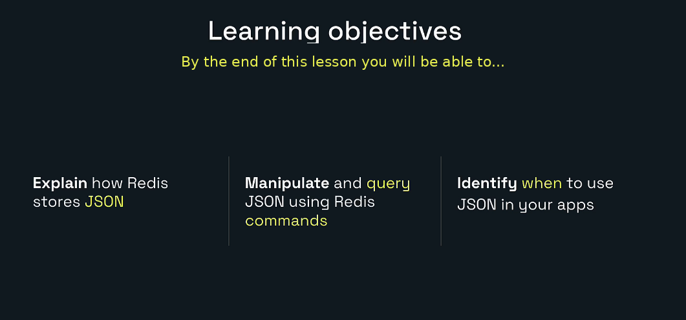
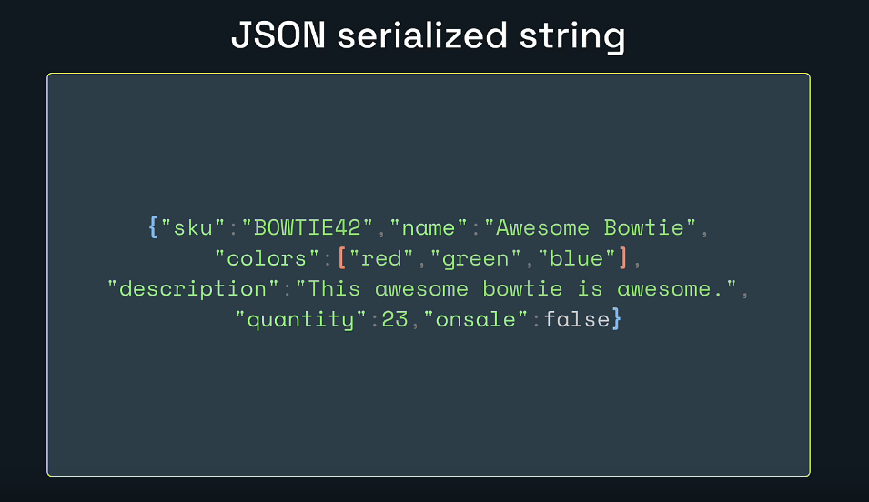
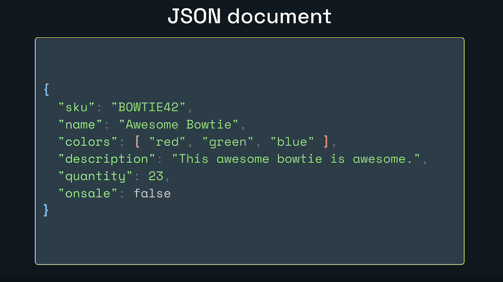
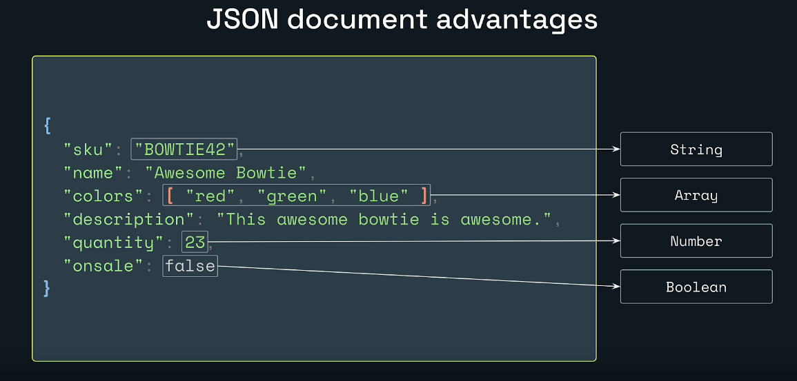
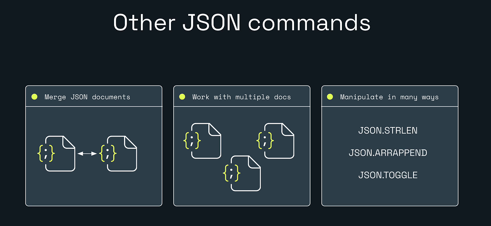
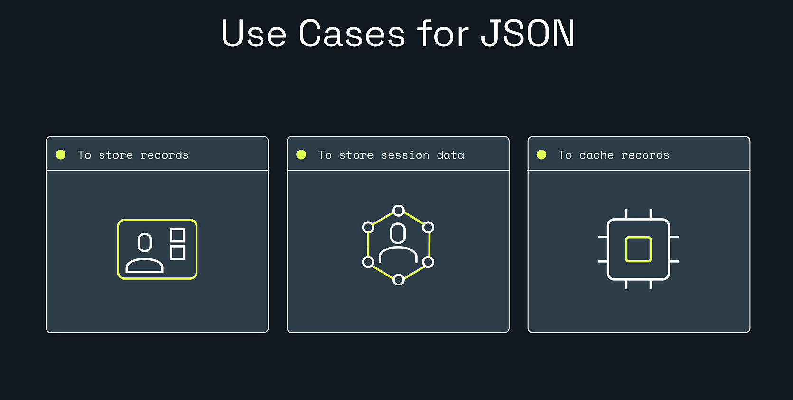
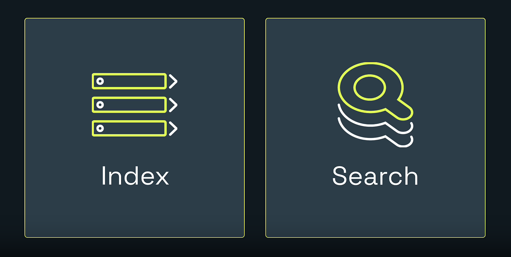
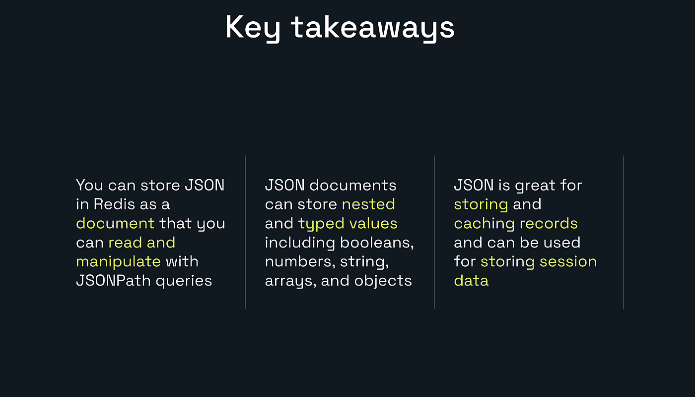

# Explore Redis for Developers



# My Redis Learning Journey — Lesson 9

## Build with Redis JSON

In Lesson 8, I learned how Redis sorted sets store unique members with scores and maintain score-based ordering.

In this lesson, I am learning how Redis stores and manipulates structured JSON documents.

Redis JSON is useful when an application needs:

- Nested objects
- Arrays
- Strings, numbers, booleans, and null values
- Partial document reads
- Partial document updates
- JSONPath queries
- Searchable document records
- Cached API or database objects

The hands-on lab creates and updates this Redis JSON document:

```text
product:bowtie42
```

---

## Learning Objectives



By the end of this lesson, I will be able to:

- Explain how Redis stores JSON.
- Distinguish a serialized JSON string from a Redis JSON document.
- Create a document with `JSON.SET`.
- Read a complete document with `JSON.GET`.
- Select nested values using JSONPath.
- Update strings, numbers, arrays, and booleans.
- Delete a property using `JSON.DEL`.
- Identify when JSON is a good fit for backend applications.
- View and edit JSON documents in Redis Insight.

---

# 1. What Is JSON?

JSON means:

```text
JavaScript Object Notation
```

JSON is a structured data format commonly used by:

- REST APIs
- Web applications
- Mobile applications
- Configuration files
- Microservices
- Event messages
- Document databases

A JSON object contains properties:

```json
{
  "name": "Awesome Bowtie",
  "quantity": 23,
  "onsale": false
}
```

Each property has:

```text
property name -> value
```

JSON supports these common value types:

```text
String
Number
Boolean
Null
Array
Object
```

---

# 2. Serialized JSON String Versus Redis JSON Document

## Serialized JSON string



An application can store JSON text inside a normal Redis string:

```redis
SET product:bowtie42 '{"sku":"BOWTIE42","quantity":23}'
```

Redis treats the entire value as bytes.

To update only `quantity`, the application normally has to:

1. Read the complete string.
2. Parse the JSON.
3. Change the property.
4. Serialize it again.
5. Replace the complete string.

Conceptually:

```text
Redis string
    |
    +-- One complete serialized text value
```

## Redis JSON document



With Redis JSON:

```redis
JSON.SET product:bowtie42 $ '{"sku":"BOWTIE42","quantity":23}'
```

Redis stores the document in a structured form and understands the JSON types.

The application can update one path directly:

```redis
JSON.SET product:bowtie42 $.quantity 24
```

Conceptually:

```text
Redis JSON document
    |
    +-- sku      -> string
    +-- quantity -> number
```

---

# 3. Why Use a Redis JSON Document?



Redis JSON preserves JSON types.

Example document:

```json
{
  "sku": "BOWTIE42",
  "name": "Awesome Bowtie",
  "colors": ["red", "green", "blue"],
  "quantity": 23,
  "onsale": false
}
```

Redis understands:

| Property | JSON type |
|---|---|
| `sku` | String |
| `name` | String |
| `colors` | Array |
| `quantity` | Number |
| `onsale` | Boolean |

This allows typed operations such as:

```redis
JSON.NUMINCRBY
JSON.ARRAPPEND
JSON.TOGGLE
JSON.STRLEN
```

---

# 4. Redis JSON Requires JSON Command Support

Before beginning the lab, verify that the Redis database supports JSON commands.

Run:

```redis
COMMAND INFO JSON.SET
```

When JSON is available, Redis returns command information.

If the command is unknown:

```text
ERR unknown command 'JSON.SET'
```

the Redis server or service does not expose Redis JSON.

Use a current Redis deployment that supports the JSON data type, such as an appropriate Redis Open Source or Redis Cloud database.

---

# 5. JSONPath

Redis JSON uses JSONPath expressions to select parts of a document.

The root document is:

```text
$
```

Examples:

| JSONPath | Meaning |
|---|---|
| `$` | Complete root document |
| `$.name` | Root-level `name` property |
| `$.quantity` | Root-level quantity |
| `$.colors` | Complete colors array |
| `$.colors[0]` | First color |
| `$.inventory.warehouse` | Nested warehouse property |
| `$.*` | Every root-level value |
| `$..price` | Price properties recursively |

A JSONPath expression can match more than one value. Therefore, `$`-based command results commonly use arrays.

---

# 6. The Document Used in This Lab

The product record is:

```json
{
  "sku": "BOWTIE42",
  "name": "Awesome Bowtie",
  "colors": ["red", "green", "blue"],
  "description": "This awesome bowtie is awesome.",
  "quantity": 23,
  "onsale": false
}
```

The Redis key is:

```text
product:bowtie42
```

This key identifies the complete document.

---

# 7. Create a JSON Document with JSON.SET

The syntax is:

```redis
JSON.SET key path value
```

Create the document:

```redis
JSON.SET product:bowtie42 $ '{ "sku": "BOWTIE42", "name": "Awesome Bowtie", "colors": [ "red", "green", "blue" ], "description": "This awesome bowtie is awesome.", "quantity": 23, "onsale": false }'
```

Expected:

```text
OK
```

The value after `$` must be valid JSON.

Important JSON rules:

- Property names use double quotes.
- JSON strings use double quotes.
- Numbers do not use quotes.
- Booleans are lowercase `true` or `false`.
- Arrays use square brackets.
- Objects use curly braces.

---

# 8. Read the Complete Document with JSON.GET

Run:

```redis
JSON.GET product:bowtie42
```

Redis returns the complete document in serialized JSON form.

The client may display escaped quotes:

```text
{\"sku\":\"BOWTIE42\", ...}
```

That does not mean the data is incorrect. It means the JSON document is being shown as a serialized response.

Read explicitly from the root path:

```redis
JSON.GET product:bowtie42 $
```

With a `$` JSONPath, the response conceptually contains the root match inside an array.

---

# 9. Pretty-Print JSON

In `redis-cli`, formatting options can make the document easier to read:

```redis
JSON.GET product:bowtie42 INDENT "  " NEWLINE "\n" SPACE " " $
```

A formatted response is useful during learning and debugging.

Application code usually does not request extra whitespace because compact JSON uses fewer bytes.

---

# 10. Read One Property

Get quantity:

```redis
JSON.GET product:bowtie42 $.quantity
```

Expected JSONPath-style response:

```json
[23]
```

Get name:

```redis
JSON.GET product:bowtie42 $.name
```

Expected:

```json
["Awesome Bowtie"]
```

Get colors:

```redis
JSON.GET product:bowtie42 $.colors
```

Expected conceptually:

```json
[["red", "green", "blue"]]
```

The outer array contains JSONPath matches.  
The matched value itself is also an array.

---

# 11. Read Root-Level Values with a Wildcard

Run:

```redis
JSON.GET product:bowtie42 $.*
```

This selects all root-level property values.

The result conceptually includes:

```json
[
  "BOWTIE42",
  "Awesome Bowtie",
  ["red", "green", "blue"],
  "This awesome bowtie is awesome.",
  23,
  false
]
```

Do not rely on a wildcard when the application needs a clearly named response contract. Reading explicit paths is usually easier to maintain.

---

# 12. Inspect JSON Types

Use:

```redis
JSON.TYPE product:bowtie42 $
```

The root type is:

```text
object
```

Check quantity:

```redis
JSON.TYPE product:bowtie42 $.quantity
```

Expected type:

```text
integer
```

or another numeric type representation depending on the stored number and client.

Check colors:

```redis
JSON.TYPE product:bowtie42 $.colors
```

Expected:

```text
array
```

Check `onsale`:

```redis
JSON.TYPE product:bowtie42 $.onsale
```

Expected:

```text
boolean
```

---

# 13. Update a Boolean

Put the product on sale:

```redis
JSON.SET product:bowtie42 $.onsale true
```

Expected:

```text
OK
```

Read it:

```redis
JSON.GET product:bowtie42 $.onsale
```

Expected:

```json
[true]
```

This is a JSON boolean.

It is not the string:

```json
["true"]
```

---

# 14. Add a Number

Add a price:

```redis
JSON.SET product:bowtie42 $.price 9.99
```

Expected:

```text
OK
```

Read it:

```redis
JSON.GET product:bowtie42 $.price
```

Expected:

```json
[9.99]
```

The parent object exists, so Redis can create the new root-level property.

---

# 15. Update a String and Understand Nested Quotes

Rename the product:

```redis
JSON.SET product:bowtie42 $.name '"Striped Bowtie"'
```

Expected:

```text
OK
```

Why are there nested quotes?

The Redis command needs one argument that contains a valid JSON string.

The JSON value itself must be:

```json
"Striped Bowtie"
```

The outer single quotes help the CLI keep the inner double quotes together:

```text
'"Striped Bowtie"'
```

Numbers and booleans do not need inner double quotes:

```redis
JSON.SET product:bowtie42 $.price 9.99
JSON.SET product:bowtie42 $.onsale true
```

---

# 16. Delete a Property with JSON.DEL

Remove the colors field:

```redis
JSON.DEL product:bowtie42 $.colors
```

Expected:

```text
1
```

One matching path was deleted.

Run it again:

```redis
JSON.DEL product:bowtie42 $.colors
```

Expected:

```text
0
```

The path no longer exists.

Deleting the root path deletes the complete Redis key:

```redis
JSON.DEL product:bowtie42 $
```

Use root deletion carefully.

---

# 17. Additional JSON Commands



## Increment a number

```redis
JSON.NUMINCRBY product:bowtie42 $.quantity 2
```

If the quantity was `23`, it becomes `25`.

## Get a string length

```redis
JSON.STRLEN product:bowtie42 $.name
```

## Append to an array

Before deleting colors:

```redis
JSON.ARRAPPEND product:bowtie42 $.colors '"yellow"'
```

The string being appended must be valid JSON, so it includes nested quotes.

## Get array length

```redis
JSON.ARRLEN product:bowtie42 $.colors
```

## Toggle a boolean

```redis
JSON.TOGGLE product:bowtie42 $.onsale
```

## Work with multiple documents

```redis
JSON.MSET product:bowtie43 $ '{"sku":"BOWTIE43","quantity":10}' product:bowtie44 $ '{"sku":"BOWTIE44","quantity":8}'
```

Read one path from multiple documents:

```redis
JSON.MGET product:bowtie42 product:bowtie43 product:bowtie44 $.quantity
```

---

# 18. Add Nested Data

Redis JSON supports nested objects.

Add inventory data:

```redis
JSON.SET product:bowtie42 $.inventory '{ "warehouse": "OH-1", "available": true }'
```

Read the nested object:

```redis
JSON.GET product:bowtie42 $.inventory
```

Read one nested property:

```redis
JSON.GET product:bowtie42 $.inventory.warehouse
```

Expected:

```json
["OH-1"]
```

This is an important difference from a flat Redis hash.

A Redis hash works best for flat field-value records.  
Redis JSON supports nested arrays and objects directly.

---

# 19. Use Cases for Redis JSON



## Store records

Example:

```text
Product
Customer
Order
Device
Application setting
```

## Store session data

A session can contain nested preferences or state:

```json
{
  "userId": 101,
  "roles": ["USER", "REPORT_VIEWER"],
  "preferences": {
    "theme": "light",
    "language": "en"
  }
}
```

## Cache records

Redis JSON can cache structured data returned by:

- PostgreSQL
- MySQL
- REST APIs
- Other microservices

Example:

```redis
JSON.SET cache:product:42 $ '{ ... }'
EXPIRE cache:product:42 300
```

---

# 20. Index and Search JSON Documents



Knowing a key lets me retrieve a document quickly:

```redis
JSON.GET product:bowtie42 $
```

But an application may need queries such as:

```text
Find every product where price is below 20
Find products containing "bowtie"
Find products where onsale is true
```

Redis Search can index JSON document paths and query their contents.

Without an index, Redis does not automatically provide efficient application-wide search across every JSON document.

A common design is:

```text
JSON document -> stores structured record
Search index  -> enables queries across many records
```

---

# 21. Hands-On Lab

## Lab Goal

In this lab, I will:

1. Create a JSON product document.
2. Read the complete document.
3. Read individual paths.
4. Read root-level values with a wildcard.
5. Update a boolean.
6. Add a number.
7. Rename a string.
8. Remove an array property.
9. Confirm the result in Redis Insight.

## Prerequisites

- Redis is running.
- Redis JSON commands are supported.
- Redis Insight is connected.
- Redis Insight CLI is open.

---

## Step 1: Verify Redis

```redis
PING
```

Expected:

```text
PONG
```

Verify JSON:

```redis
COMMAND INFO JSON.SET
```

---

## Step 2: Remove Existing Lab Data

```redis
UNLINK product:bowtie42
```

Possible result:

```text
1 -> key existed
0 -> key did not exist
```

---

## Step 3: Create the Product Document

```redis
JSON.SET product:bowtie42 $ '{ "sku": "BOWTIE42", "name": "Awesome Bowtie", "colors": [ "red", "green", "blue" ], "description": "This awesome bowtie is awesome.", "quantity": 23, "onsale": false }'
```

Expected:

```text
OK
```

---

## Step 4: Get the Complete Document

```redis
JSON.GET product:bowtie42
```

The full product document should be returned.

---

## Step 5: Get Quantity

```redis
JSON.GET product:bowtie42 $.quantity
```

Expected:

```json
[23]
```

---

## Step 6: Get Root-Level Values

```redis
JSON.GET product:bowtie42 $.*
```

This returns an array containing multiple values.

---

## Step 7: Put the Product on Sale

```redis
JSON.SET product:bowtie42 $.onsale true
```

Expected:

```text
OK
```

Confirm:

```redis
JSON.GET product:bowtie42 $.onsale
```

Expected:

```json
[true]
```

---

## Step 8: Add a Price

```redis
JSON.SET product:bowtie42 $.price 9.99
```

Expected:

```text
OK
```

---

## Step 9: Rename the Product

```redis
JSON.SET product:bowtie42 $.name '"Striped Bowtie"'
```

Expected:

```text
OK
```

Confirm:

```redis
JSON.GET product:bowtie42 $.name
```

Expected:

```json
["Striped Bowtie"]
```

---

## Step 10: Remove Colors

```redis
JSON.DEL product:bowtie42 $.colors
```

Expected:

```text
1
```

---

## Step 11: Inspect the Final Document

```redis
JSON.GET product:bowtie42 $
```

The final document should conceptually contain:

```json
{
  "sku": "BOWTIE42",
  "name": "Striped Bowtie",
  "description": "This awesome bowtie is awesome.",
  "quantity": 23,
  "onsale": true,
  "price": 9.99
}
```

The `colors` property should be absent.

---

# 22. View JSON in Redis Insight

1. Open Redis Insight.
2. Open the Browser.
3. Refresh the key list.
4. Search for:

```text
product:bowtie42
```

5. Select the key.

Redis Insight should show:

- Key name
- Data type: JSON
- Nested document structure
- Arrays and objects
- Typed values
- Editing controls
- Memory information

Confirm:

```text
name    -> Striped Bowtie
onsale  -> true
price   -> 9.99
colors  -> removed
```

---

# 23. Lab Flow

```text
JSON.SET root document
        |
        +-- sku: string
        +-- name: string
        +-- colors: array
        +-- description: string
        +-- quantity: number
        +-- onsale: boolean

JSON.GET $
        |
        +-- complete document

JSON.GET $.quantity
        |
        +-- [23]

JSON.SET $.onsale true
        |
        +-- boolean updated

JSON.SET $.price 9.99
        |
        +-- number added

JSON.SET $.name '"Striped Bowtie"'
        |
        +-- string updated

JSON.DEL $.colors
        |
        +-- array property removed
```

---

# 24. JSON Versus Hash

## Use a Redis hash when:

- The record is mostly flat.
- Fields are simple strings or numbers.
- Nested arrays and objects are unnecessary.
- Hash operations naturally match the data.

Example:

```text
user:101
    name -> Hero
    role -> Developer
```

## Use Redis JSON when:

- The document contains nested objects.
- The document contains arrays.
- Typed booleans and null values matter.
- JSONPath updates are useful.
- The same shape is exchanged through APIs.
- Search indexes should target nested document paths.

Example:

```json
{
  "name": "Hero",
  "roles": ["USER", "ADMIN"],
  "preferences": {
    "theme": "light"
  }
}
```

---

# 25. JSON Versus a Normal Redis String

## Normal string

```redis
SET product:42 '{"name":"Bowtie","quantity":23}'
```

Advantages:

- Simple.
- Works with basic Redis string commands.
- Good when the complete object is always replaced.

Limitations:

- Redis does not address internal properties with `GET`.
- Partial changes normally require application-side parsing.

## Redis JSON

```redis
JSON.SET product:42 $ '{"name":"Bowtie","quantity":23}'
JSON.SET product:42 $.quantity 24
```

Advantages:

- Partial reads and updates.
- Nested document support.
- Typed JSON operations.
- JSONPath.
- Search integration.

---

# 26. Java Backend Example with Jedis

A Java application can use Jedis to store JSON documents.

Example product class:

```java
public record Product(
        String sku,
        String name,
        List<String> colors,
        String description,
        int quantity,
        boolean onsale,
        Double price) {
}
```

Example service:

```java
import redis.clients.jedis.RedisClient;
import redis.clients.jedis.json.Path2;

public class ProductJsonService {

    private static final Path2 ROOT = new Path2("$");

    private final RedisClient redis;

    public ProductJsonService(RedisClient redis) {
        this.redis = redis;
    }

    public void save(String productId, Product product) {
        String key = "product:" + productId;
        redis.jsonSet(key, ROOT, product);
    }

    public Object get(String productId) {
        return redis.jsonGet("product:" + productId, ROOT);
    }

    public Object getQuantity(String productId) {
        return redis.jsonGet(
                "product:" + productId,
                new Path2("$.quantity"));
    }
}
```

A Spring Boot application can expose the `RedisClient` as a bean and inject it into a service.

The exact client version and configuration should match the application’s dependency management and deployment environment.

---

# 27. Cache-Aside Example

Suppose PostgreSQL is the permanent source of truth.

```text
Request product 42
      |
Check Redis JSON
      |
      +-- Found -> Return document
      |
      +-- Missing
              |
              +-- Read PostgreSQL
              +-- Store Redis JSON
              +-- Set TTL
              +-- Return result
```

Example Redis commands:

```redis
JSON.SET cache:product:42 $ '{ ... }'
EXPIRE cache:product:42 300
```

When the database record changes:

- update the JSON cache, or
- delete it so the next request reloads fresh data.

---

# 28. Common Problems

## Unknown command `JSON.SET`

The Redis deployment does not support JSON commands.

Verify:

```redis
COMMAND INFO JSON.SET
```

## Invalid JSON

Wrong:

```redis
JSON.SET product:42 $ '{ name: "Bowtie" }'
```

Correct:

```redis
JSON.SET product:42 $ '{ "name": "Bowtie" }'
```

JSON property names require double quotes.

## String update fails

Wrong:

```redis
JSON.SET product:bowtie42 $.name Striped Bowtie
```

Correct:

```redis
JSON.SET product:bowtie42 $.name '"Striped Bowtie"'
```

The value must be valid JSON.

## JSON.GET returns arrays

`$`-based JSONPath expressions can match multiple values. Redis therefore commonly returns top-level arrays.

## A new deeply nested path cannot be created

The immediate parent object must exist.

For example, this may fail when `inventory` does not exist:

```redis
JSON.SET product:bowtie42 $.inventory.warehouse '"OH-1"'
```

Create the parent first:

```redis
JSON.SET product:bowtie42 $.inventory '{}'
JSON.SET product:bowtie42 $.inventory.warehouse '"OH-1"'
```

or set the full nested object in one command.

## Client quoting is different

Redis Insight CLI, Bash, PowerShell, and Java string literals have different quoting rules.

The commands in this lesson are written for a Redis CLI-style interface.

---

# 29. Design Best Practices

Use clear keys:

```text
product:bowtie42
user:101:profile
session:abc123
cache:order:908
```

Keep documents focused on one logical record.

Avoid placing unrelated data inside one huge document.

Use explicit JSONPath expressions in application code.

Apply key expiration intentionally:

```redis
EXPIRE cache:product:42 300
```

Do not assume Redis JSON replaces the permanent database in every architecture.

Measure:

- document size
- update frequency
- memory usage
- read paths
- indexing needs
- cache consistency

Use search indexes only for queries that the application actually needs.

---

# 30. Key Takeaways



- Redis can store JSON as a structured document.
- Redis JSON supports nested objects and arrays.
- JSON values retain types such as strings, numbers, booleans, arrays, and objects.
- `JSON.SET` creates and updates JSON paths.
- `JSON.GET` reads complete documents or selected paths.
- JSONPath expressions commonly return arrays.
- `JSON.DEL` removes matching paths.
- JSON commands can manipulate strings, numbers, arrays, and booleans.
- JSON works well for records, session data, and cached documents.
- Redis Search can index JSON paths for application-wide queries.

---

# 31. Lesson Completion Checklist

- [ ] I understand serialized JSON strings versus Redis JSON documents.
- [ ] I verified that `JSON.SET` is supported.
- [ ] I created `product:bowtie42`.
- [ ] I read the complete document.
- [ ] I queried `$.quantity`.
- [ ] I used `$.*`.
- [ ] I updated a boolean.
- [ ] I added a number.
- [ ] I updated a string with correct quoting.
- [ ] I removed the colors array.
- [ ] I viewed the document in Redis Insight.
- [ ] I understand JSON versus hashes.
- [ ] I understand when indexing and search are needed.

---

# Included Practice Files

The package includes:

```text
lesson-09-lab-commands.txt
lesson-09-expected-results.md
```

The command file contains the main lab and additional practice.

The expected-results guide explains output arrays, typed values, deletion counts, and client-formatting differences.

---

# Repository Structure

```text
redis-learning-journey-lesson-09/
|-- README.md
|-- lesson-09-lab-commands.txt
|-- lesson-09-expected-results.md
|-- MANIFEST.txt
`-- images/
    |-- 00-cover-build-with-json.png
    |-- 01-learning-objectives.png
    |-- 02-json-serialized-string.png
    |-- 03-json-document.png
    |-- 04-json-document-advantages.png
    |-- 05-other-json-commands.png
    |-- 06-json-use-cases.png
    |-- 07-json-index-and-search.png
    `-- 08-key-takeaways.png
```

---

# Official References

- Redis JSON overview: https://redis.io/docs/latest/develop/data-types/json/
- JSONPath: https://redis.io/docs/latest/develop/data-types/json/path/
- JSON command reference: https://redis.io/docs/latest/commands/?group=json
- `JSON.SET`: https://redis.io/docs/latest/commands/json.set/
- `JSON.GET`: https://redis.io/docs/latest/commands/json.get/
- `JSON.DEL`: https://redis.io/docs/latest/commands/json.del/
- `JSON.TYPE`: https://redis.io/docs/latest/commands/json.type/
- `JSON.ARRAPPEND`: https://redis.io/docs/latest/commands/json.arrappend/
- `JSON.NUMINCRBY`: https://redis.io/docs/latest/commands/json.numincrby/
- `JSON.TOGGLE`: https://redis.io/docs/latest/commands/json.toggle/
- Index and search JSON: https://redis.io/docs/latest/develop/data-types/json/indexing_json/
- Jedis JSON examples: https://redis.io/docs/latest/develop/clients/jedis/queryjson/

---

# Next Lesson

## Lesson 10: Build with Redis Streams

The next lesson can cover:

- Event streams
- `XADD`
- Entry IDs
- `XRANGE`
- `XREAD`
- Consumer groups
- `XGROUP`
- `XREADGROUP`
- Pending entries
- Event-driven microservices
- Redis Streams with Java and Spring Boot
