# Explore Redis for Developers

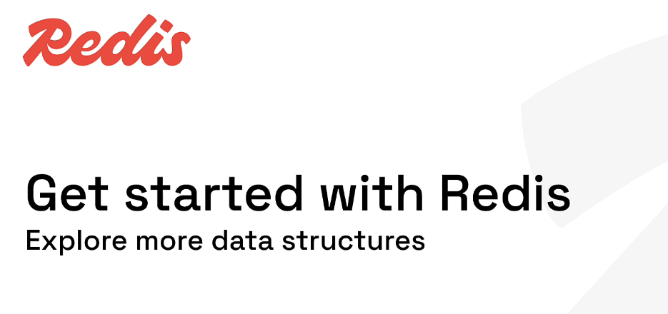

# My Redis Learning Journey — Lesson 10

## Explore More Redis Data Structures

In the previous lessons, I learned the Redis structures that appear most often in backend applications:

- Strings
- Lists
- Sets
- Hashes
- Sorted sets
- JSON

Redis also includes specialized structures for problems such as:

- Approximate unique counting
- Memory-efficient membership checks
- Event-stream processing
- Location-based searches
- Semantic and vector searches
- Compact activity flags
- Packed counters
- Timestamped measurements
- Frequency and percentile estimation

This lesson provides a guided overview of those structures and helps me decide when each one is useful.

---

## Learning Objectives

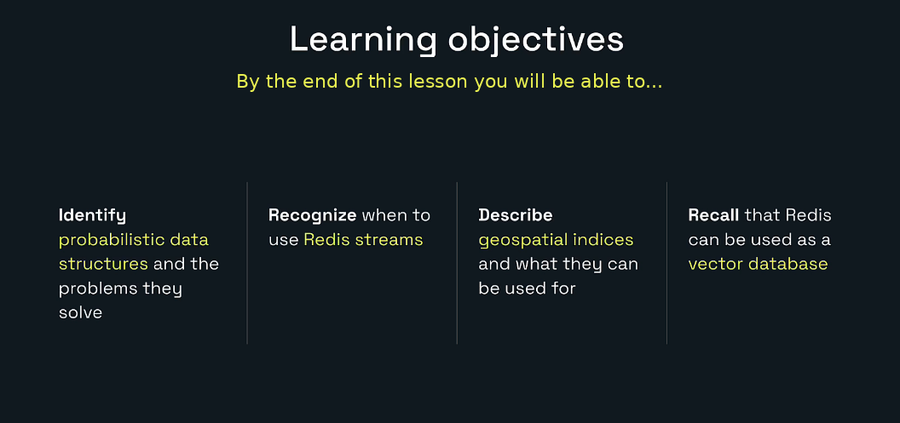

By the end of this lesson, I will be able to:

- Identify probabilistic data structures and the problems they solve.
- Explain how HyperLogLog estimates unique counts.
- Explain Bloom-filter membership answers.
- Recognize when Redis Streams fit an event-driven application.
- Store and search named locations using geospatial commands.
- Explain how Redis stores and searches vector embeddings.
- Use bitmaps and bitfields for compact binary data.
- Recognize other structures such as TimeSeries, Cuckoo filters, Count-Min Sketch, Top-K, and t-digest.
- Select an appropriate Redis structure for a backend use case.

---

# 1. Redis Has More Than Basic Key-Value Storage

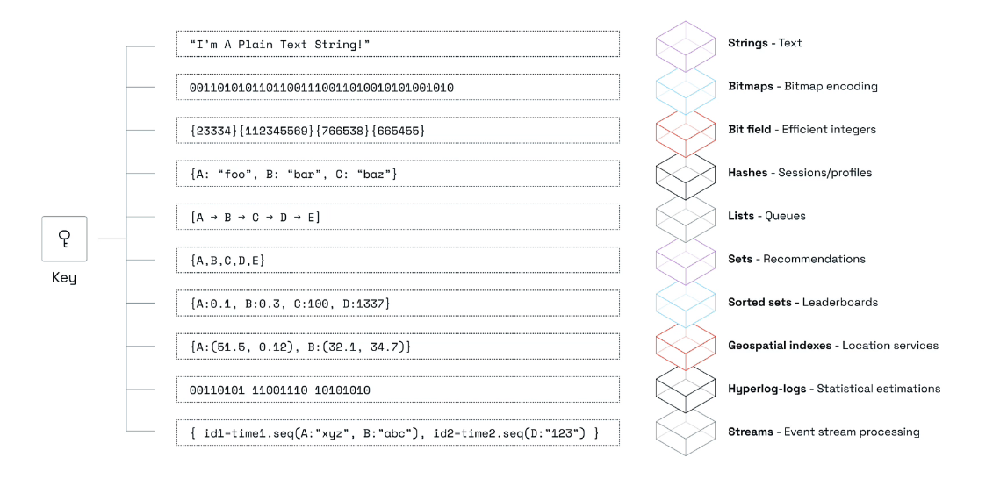

A Redis key can point to many kinds of values.

| Structure | Typical purpose |
|---|---|
| String | Text, binary data, cache values, counters |
| Bitmap | Compact yes/no flags |
| Bitfield | Packed integer fields |
| Hash | Profiles, records, sessions |
| List | Queues, stacks, ordered histories |
| Set | Unique values and membership |
| Sorted set | Rankings and leaderboards |
| Geospatial index | Nearby-location searches |
| HyperLogLog | Approximate unique counts |
| Stream | Chronological event processing |
| JSON | Nested structured documents |
| Time series | Timestamped numeric measurements |
| Vector field | Semantic similarity search |

The correct structure depends on the question the application needs Redis to answer.

Examples:

```text
What is the cached product?               -> String, Hash, or JSON
What were the latest 20 products viewed?  -> List
Has this user already completed the task? -> Set
Who are the top 10 players?               -> Sorted set
How many unique visitors arrived?         -> HyperLogLog
Which stores are within 10 km?             -> Geospatial index
What happened after event ID X?           -> Stream
Which document is semantically similar?   -> Vector search
```

---

# 2. Specialized Structures May Require Capability Checks

Some structures are available only when the selected Redis deployment exposes their commands.

Before running a mini-lab, check support:

```redis
COMMAND INFO JSON.SET
COMMAND INFO BF.ADD
COMMAND INFO TS.ADD
COMMAND INFO FT.CREATE
```

If the command is unavailable, Redis may return:

```text
(nil)
```

or an unknown-command error.

This does not mean the concept is wrong. It means the current Redis server or database configuration does not provide that command.

The downloadable command file includes support checks before advanced sections.

---

# 3. Probabilistic Data Structures

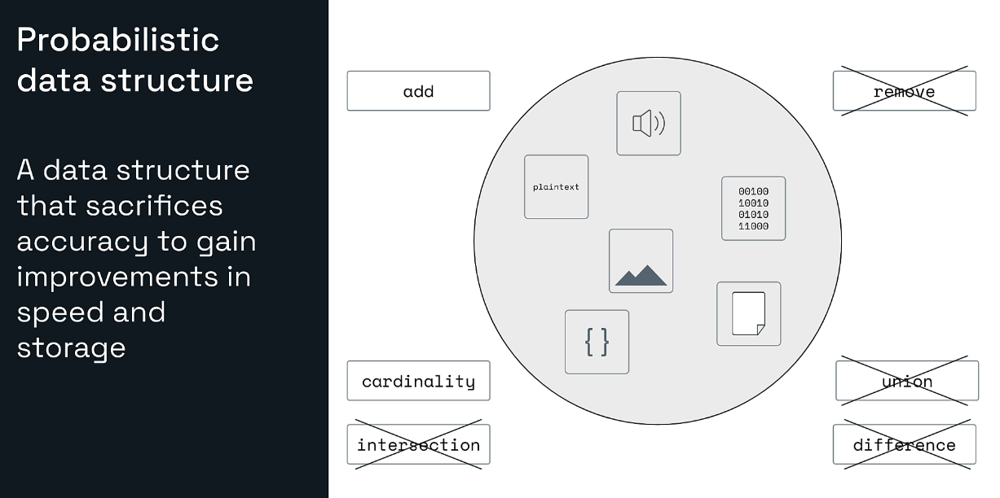

A probabilistic data structure trades a small amount of precision for improvements in:

- Memory usage
- Processing speed
- Scalability

A normal exact set may support:

- Add
- Remove
- Exact membership
- Exact cardinality
- Union
- Intersection
- Difference
- Retrieving the original members

A specialized probabilistic structure usually solves one narrower problem with much less memory.

Examples:

| Structure | Main question |
|---|---|
| Bloom filter | Was this item probably seen before? |
| Cuckoo filter | Was this item probably seen, with deletion support? |
| HyperLogLog | Approximately how many unique items were seen? |
| Count-Min Sketch | Approximately how frequently did an item occur? |
| Top-K | Which items occur most frequently? |
| t-digest | What are the approximate percentiles? |

## Why accept approximation?

Suppose a website receives hundreds of millions of visitor IDs.

An exact set stores every unique ID.

A HyperLogLog does not store every ID for later retrieval. It keeps a compact statistical representation and estimates the total.

The trade-off is useful when:

```text
Exact member list is not required
A small error is acceptable
Memory savings are important
```

---

# 4. HyperLogLog

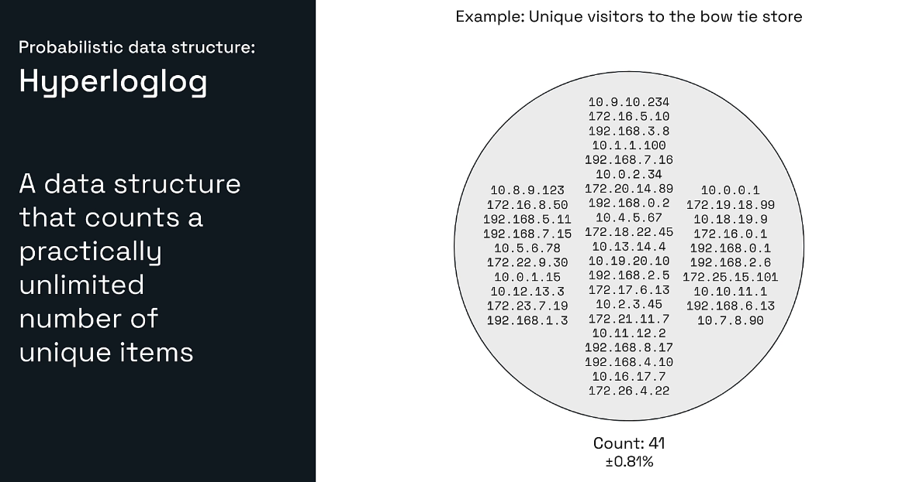

HyperLogLog estimates the cardinality of a collection.

Cardinality means:

```text
Number of distinct items
```

Example visitors:

```text
alice
bob
chuck
alice
bob
```

Exact number of events:

```text
5
```

Unique visitors:

```text
3
```

A HyperLogLog answers approximately:

```text
How many unique visitors were observed?
```

It does not answer:

```text
Which visitors were observed?
```

## Core commands

| Command | Purpose |
|---|---|
| `PFADD` | Add observed elements |
| `PFCOUNT` | Estimate unique count |
| `PFMERGE` | Merge several HyperLogLogs |

## Mini-lab

```redis
UNLINK visitors:day1 visitors:day2 visitors:all

PFADD visitors:day1 alice bob chuck alice bob
PFCOUNT visitors:day1

PFADD visitors:day2 bob dave emma
PFCOUNT visitors:day2

PFMERGE visitors:all visitors:day1 visitors:day2
PFCOUNT visitors:all
```

Expected approximate counts:

```text
day 1 -> 3
day 2 -> 3
all   -> 5
```

## Important PFADD behavior

`PFADD` does not return the number of values supplied.

It returns:

```text
1 -> The internal HyperLogLog representation changed
0 -> It did not change
```

## Memory and accuracy

Redis HyperLogLog uses a small bounded amount of memory and has a standard error rate around 0.81%.

That makes it useful for:

- Unique website visitors
- Distinct API clients
- Unique search terms
- Distinct devices
- Unique products viewed
- Unique event identifiers

## HyperLogLog versus Set

Use a set when:

- Exact count is required.
- Membership checks are required.
- Original members must be retrieved.
- Set operations are needed.

Use HyperLogLog when:

- Only an approximate unique count is required.
- The population can become very large.
- Memory efficiency matters more than exactness.

---

# 5. Bloom Filters

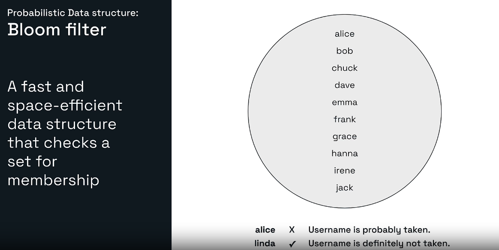

A Bloom filter provides memory-efficient probabilistic membership testing.

It answers:

```text
Was this item probably added before?
```

The answer has an important meaning:

```text
0 -> Definitely not present
1 -> Probably present
```

## False positive

A false positive means:

```text
Bloom filter says "probably present"
but the item was never added
```

## No false negative for successfully added items

When a Bloom filter says:

```text
Definitely not present
```

the item was not successfully added to that filter.

This one-sided uncertainty makes Bloom filters useful as a first check.

## Example use case: username availability

Stored usernames:

```text
alice
bob
chuck
dave
```

Check:

```text
alice -> probably taken
linda -> definitely not taken
```

When the filter says “probably taken,” the application should confirm against the authoritative database before rejecting the username.

## Core commands

| Command | Purpose |
|---|---|
| `BF.RESERVE` | Create a filter with error rate and capacity |
| `BF.ADD` | Add one item |
| `BF.MADD` | Add several items |
| `BF.EXISTS` | Check one item |
| `BF.MEXISTS` | Check several items |

## Mini-lab

```redis
COMMAND INFO BF.RESERVE
UNLINK usernames:bloom

BF.RESERVE usernames:bloom 0.01 1000

BF.ADD usernames:bloom alice
BF.ADD usernames:bloom bob
BF.ADD usernames:bloom alice

BF.EXISTS usernames:bloom alice
BF.EXISTS usernames:bloom linda

BF.MEXISTS usernames:bloom alice bob linda
```

The reserve command uses:

```text
0.01 -> Desired false-positive probability
1000 -> Expected capacity
```

## Backend pattern

```text
Incoming item
     |
Bloom filter
     |
     +-- definitely absent -> skip expensive lookup
     |
     +-- probably present  -> verify in database
```

Useful examples:

- Avoiding unnecessary database reads
- Duplicate URL checks
- Previously processed IDs
- Username or email pre-checks
- Cache penetration protection
- Web-crawler deduplication

## Bloom filter limitation

A standard Bloom filter does not support normal item deletion because clearing shared bits could make other existing items appear absent.

Use a Cuckoo filter when probabilistic membership and deletion are both required.

---

# 6. Other Probabilistic Structures

Redis supports several additional probabilistic structures.

## Cuckoo filter

Main purpose:

```text
Probabilistic membership with deletion support
```

Commands include:

```redis
CF.RESERVE
CF.ADD
CF.EXISTS
CF.DEL
```

Mini-example:

```redis
CF.RESERVE processed:events:cf 1000
CF.ADD processed:events:cf event-101
CF.EXISTS processed:events:cf event-101
CF.DEL processed:events:cf event-101
```

## Count-Min Sketch

Main purpose:

```text
Estimate item frequencies
```

Example questions:

- How many times was “redis” searched?
- Approximately how often did event X occur?
- Which API endpoint receives the most traffic?

Commands include:

```redis
CMS.INITBYPROB
CMS.INCRBY
CMS.QUERY
```

Example:

```redis
CMS.INITBYPROB events:frequency 0.001 0.01
CMS.INCRBY events:frequency click 10 purchase 2 search 5
CMS.QUERY events:frequency click purchase search
```

Count-Min Sketch can over-count because of collisions.

## Top-K

Main purpose:

```text
Find the most frequently occurring items
```

Example:

```redis
TOPK.RESERVE trending:terms 3
TOPK.ADD trending:terms redis kafka redis spring redis kafka rabbitmq
TOPK.LIST trending:terms WITHCOUNT
```

Useful for:

- Trending searches
- Frequent products
- Popular error codes
- Heavy hitters in event streams

## t-digest

Main purpose:

```text
Estimate percentiles in a numeric distribution
```

Example:

```redis
TDIGEST.CREATE api:latency
TDIGEST.ADD api:latency 10 12 15 18 20 25 30 40 80 120
TDIGEST.QUANTILE api:latency 0.5 0.95
```

Useful for:

- Median latency
- 95th-percentile response time
- Delivery-duration percentiles
- Transaction-value percentiles

---

# 7. Redis Streams

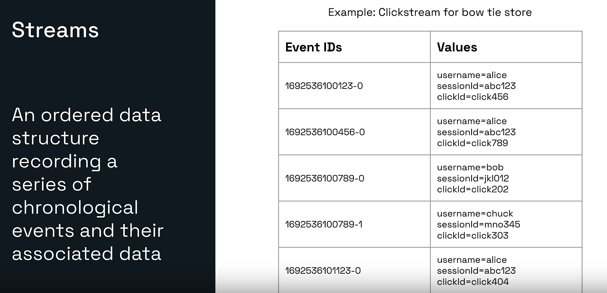

A Redis Stream is an ordered structure that records chronological events and their associated field-value data.

Example click event:

```text
Entry ID: 1692536100123-0

username  -> alice
sessionId -> abc123
clickId   -> click456
```

Each event has:

- A stream key
- A unique entry ID
- One or more field-value pairs

## Why not use a normal list?

A list is useful for basic queue behavior.

A stream adds features such as:

- Entry IDs
- Range reads
- Blocking reads
- Consumer groups
- Pending-entry tracking
- Acknowledgements
- Consumer recovery patterns
- Trimming strategies

## Core commands

| Command | Purpose |
|---|---|
| `XADD` | Append an event |
| `XLEN` | Count events |
| `XRANGE` | Read oldest to newest |
| `XREVRANGE` | Read newest to oldest |
| `XREAD` | Read events without consumer-group state |
| `XGROUP` | Manage consumer groups |
| `XREADGROUP` | Read through a consumer group |
| `XACK` | Acknowledge processed entries |
| `XPENDING` | Inspect pending entries |
| `XAUTOCLAIM` | Claim abandoned pending work |
| `XTRIM` | Limit stream length |

## Mini-lab

```redis
UNLINK clickstream:bowtie

XADD clickstream:bowtie * username alice sessionId abc123 clickId click456
XADD clickstream:bowtie * username alice sessionId abc123 clickId click789
XADD clickstream:bowtie * username bob sessionId jkl012 clickId click202

XLEN clickstream:bowtie
XRANGE clickstream:bowtie - +
XREVRANGE clickstream:bowtie + - COUNT 2
```

`*` asks Redis to generate the entry ID.

An ID looks like:

```text
milliseconds-sequence
```

Example:

```text
1721680000000-0
```

## XREAD versus XREADGROUP

`XREAD` is useful for:

- Reading a stream like a live log
- Debugging
- A dashboard that tails events
- Consumers that do not require group delivery state

`XREADGROUP` is useful when:

- Several workers share work.
- Delivery state must be tracked.
- Processed entries must be acknowledged.
- Pending work should be recovered after failures.

A group flow is:

```text
Producer
   |
 XADD
   |
Stream
   |
XREADGROUP
   |
Consumer processes event
   |
 XACK
```

## Stream growth

Streams can grow without limit unless the application trims them.

A producer can approximately cap a stream:

```redis
XADD clickstream:bowtie MAXLEN ~ 1000 * username alice clickId click999
```

`~` allows approximate trimming, which is generally more efficient than exact trimming.

## Practical use cases

- Clickstream events
- Audit history
- Order events
- Notification pipelines
- IoT readings
- Background work
- Microservice integration
- Fraud signals
- Application activity feeds

## Streams versus Kafka

Redis Streams can be excellent for low-latency event workflows already centered on Redis.

Kafka is usually chosen when the system needs a dedicated distributed event-log platform with large-scale retention, partitioning, replay, and ecosystem tooling.

The right choice depends on:

- Event volume
- Retention period
- Consumer model
- Operational environment
- Replay requirements
- Partitioning requirements
- Existing infrastructure

---

# 8. Geospatial Indexes

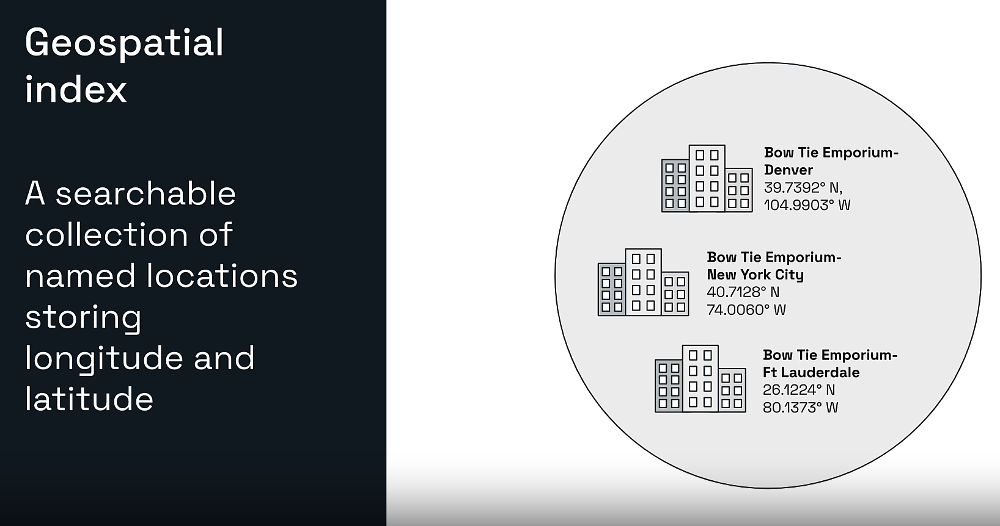

A Redis geospatial index stores named locations using:

- Longitude
- Latitude
- Member name

Example stores:

```text
Denver
New York City
Fort Lauderdale
```

## Important coordinate order

Redis commands use:

```text
longitude first
latitude second
```

Example:

```redis
GEOADD bowtie:stores -104.9903 39.7392 denver
```

## Core commands

| Command | Purpose |
|---|---|
| `GEOADD` | Add locations |
| `GEOPOS` | Read coordinates |
| `GEODIST` | Calculate distance |
| `GEOSEARCH` | Search in a circle or box |
| `GEOSEARCHSTORE` | Store search results |
| `GEOHASH` | Return geohash strings |

## Mini-lab

```redis
UNLINK bowtie:stores

GEOADD bowtie:stores -104.9903 39.7392 denver
GEOADD bowtie:stores -74.0060 40.7128 new-york-city
GEOADD bowtie:stores -80.1373 26.1224 ft-lauderdale
```

Get positions:

```redis
GEOPOS bowtie:stores denver new-york-city ft-lauderdale
```

Calculate distance:

```redis
GEODIST bowtie:stores new-york-city ft-lauderdale KM
```

Search within 2,000 km of New York:

```redis
GEOSEARCH bowtie:stores \
  FROMLONLAT -74.0060 40.7128 \
  BYRADIUS 2000 KM \
  ASC WITHDIST WITHCOORD
```

The search should include:

```text
new-york-city
ft-lauderdale
```

and exclude Denver.

## How Redis stores geospatial data

Redis geospatial items are stored using a sorted-set representation internally.

Applications should use the geospatial commands instead of manipulating the underlying score directly.

## Use cases

- Nearby stores
- Driver and delivery matching
- Service-area searches
- Restaurant discovery
- Location-aware notifications
- Asset tracking
- Distance calculation

## Geospatial data type versus Redis Search geo fields

The geospatial data type is useful for relatively direct radius and box searches.

Redis Search geospatial capabilities provide richer querying when location filters must be combined with document fields and other search conditions.


# 9. Storing Vectors in Redis

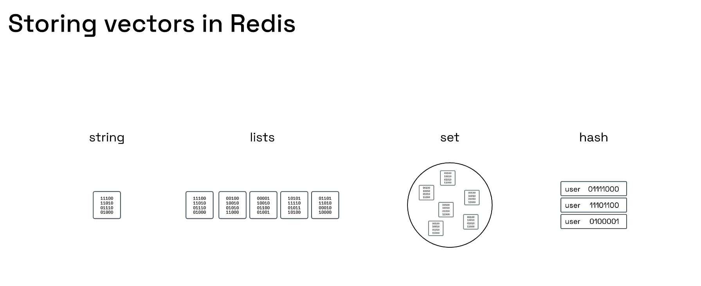

A vector is an ordered list of numbers.

Example:

```text
[0.12, -0.08, 0.74, 0.31]
```

In AI applications, an embedding model converts text, images, audio, or other content into vectors.

Conceptually:

```text
"blue silk bow tie"
        |
Embedding model
        |
[0.12, -0.08, 0.74, 0.31, ...]
```

Items with semantically similar meaning tend to have vectors that are closer together according to a distance metric.

## Where vectors are stored

Redis can store vectors and their metadata in:

- Hash documents
- JSON documents

A secondary vector index is then created over the vector field.

The current Redis vector-search documentation describes index options including:

- `FLAT`
- `HNSW`
- `SVS-VAMANA`

Availability can vary by Redis version and deployment.

## FLAT

FLAT compares the query vector against indexed vectors directly.

Advantages:

- Exact nearest-neighbor results
- Straightforward behavior
- Useful for smaller datasets

Trade-off:

- Search work grows with the number of vectors

## HNSW

HNSW is an approximate graph-based index.

Advantages:

- Fast approximate nearest-neighbor searches
- Good for larger datasets
- Common general-purpose vector index

Trade-off:

- Uses additional memory
- Search can be approximate
- Requires tuning

## SVS-VAMANA

SVS-VAMANA is another vector-index option available in supported current Redis deployments.

Use the current Redis documentation and deployment compatibility information before selecting it.

---

# 10. Vector Use Cases

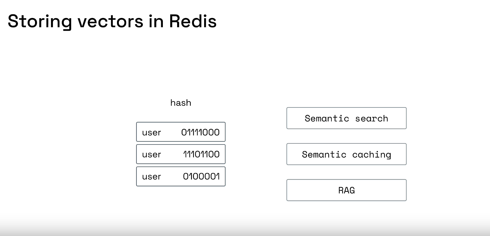

## Semantic search

Traditional keyword search looks for matching terms.

Semantic search looks for similar meaning.

User query:

```text
Blue bow tie less than $50
```

Relevant product:

```text
Cobalt blue
90% silk/polyester blend
Blue silk blend bow tie
$30.00
```

The product may be relevant even when the text does not exactly repeat every query word.

## Semantic caching

A normal cache uses an exact key:

```text
"What is Redis?"
```

A semantic cache can recognize that these questions are similar:

```text
"What is Redis?"
"Explain Redis"
"Tell me what Redis does"
```

The application can reuse an existing response when semantic similarity is high enough.

## Retrieval-Augmented Generation

RAG commonly follows this flow:

```text
User question
      |
Create query embedding
      |
Vector search
      |
Retrieve relevant documents
      |
Send context to an LLM
      |
Generate grounded response
```

Redis can provide the low-latency retrieval layer.

## Recommendation systems

Vectors can represent:

- Product descriptions
- User preferences
- Articles
- Images
- Songs
- Support tickets

Nearest-neighbor search can retrieve similar items.

---

# 11. Vector Search

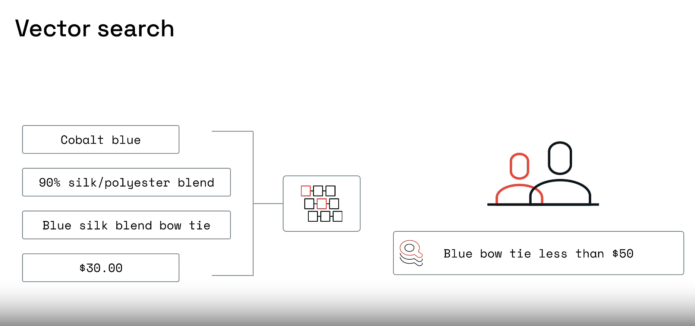

Vector search requires more than storing numeric bytes.

The normal workflow is:

1. Choose an embedding model.
2. Determine the vector dimension.
3. Convert records into embeddings.
4. Store vectors and metadata.
5. Create a vector index.
6. Embed the user query.
7. Search for nearest neighbors.
8. Optionally combine vector similarity with filters.

## Example index outline

The exact schema must match the embedding model and Redis deployment.

```redis
FT.CREATE idx:products ON HASH PREFIX 1 product: SCHEMA \
  description TEXT \
  price NUMERIC \
  embedding VECTOR HNSW 6 \
    TYPE FLOAT32 \
    DIM 4 \
    DISTANCE_METRIC COSINE
```

This example uses dimension `4` only for illustration.

Real embedding models often produce much larger vectors.

## Store a document

Conceptually:

```redis
HSET product:42 \
  description "Blue silk blend bow tie" \
  price 30 \
  embedding <FLOAT32_BINARY_BLOB>
```

The vector is usually passed as binary data by a programming-language client.

It is not practical to type a real vector blob manually in Redis Insight CLI.

## K-nearest-neighbor query outline

```redis
FT.SEARCH idx:products \
  "*=>[KNN 3 @embedding $query_vector AS vector_distance]" \
  PARAMS 2 query_vector <FLOAT32_BINARY_BLOB> \
  SORTBY vector_distance \
  RETURN 3 description price vector_distance \
  DIALECT 2
```

## Metadata filters

A hybrid query can combine semantic similarity with conditions such as:

```text
price below $50
category is bowtie
inventory is available
brand is selected
```

This is one of the major benefits of using Redis Query Engine with vector fields.

## Distance metrics

Common vector distance metrics include:

- Cosine
- Euclidean/L2
- Inner product

The metric must match the way the embedding model and application interpret similarity.

---

# 12. Bitmaps

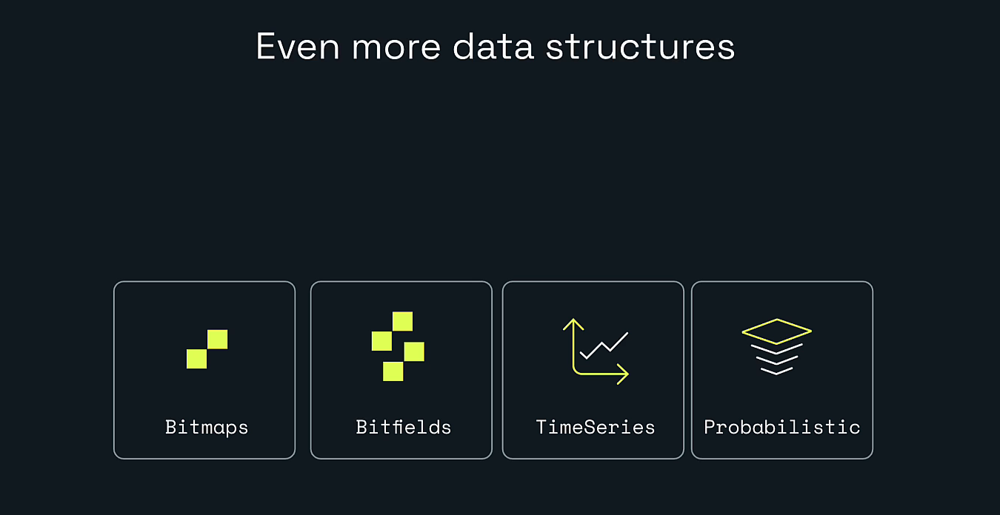

A Redis bitmap is not a separate top-level Redis type.

It is a set of bit operations applied to a Redis string.

Each bit can store:

```text
0 or 1
```

That makes bitmaps extremely compact for yes/no states.

## Example: daily active users

Suppose the user ID is used as the bit offset.

```redis
SETBIT active:users:2026-07-22 101 1
SETBIT active:users:2026-07-22 205 1
SETBIT active:users:2026-07-22 999 1
```

This means users `101`, `205`, and `999` were active.

Check one user:

```redis
GETBIT active:users:2026-07-22 101
```

Expected:

```text
1
```

Check another:

```redis
GETBIT active:users:2026-07-22 500
```

Expected:

```text
0
```

Count active users:

```redis
BITCOUNT active:users:2026-07-22
```

Expected:

```text
3
```

## Combine days

```redis
SETBIT active:users:2026-07-23 205 1
SETBIT active:users:2026-07-23 500 1

BITOP OR active:users:two-days \
  active:users:2026-07-22 \
  active:users:2026-07-23
```

Count users active on at least one day:

```redis
BITCOUNT active:users:two-days
```

Expected:

```text
4
```

The active IDs are:

```text
101, 205, 500, 999
```

## Common bitmap commands

| Command | Purpose |
|---|---|
| `SETBIT` | Set or clear one bit |
| `GETBIT` | Read one bit |
| `BITCOUNT` | Count set bits |
| `BITOP` | AND, OR, XOR, or NOT |
| `BITPOS` | Find the first matching bit |

## Use cases

- Daily active users
- Feature-enabled flags
- Attendance
- Completion tracking
- Fraud-rule flags
- Compact cohort analysis

## Bitmap caution

Using a very large offset causes Redis to allocate the string up to that location.

The ID space and maximum offset should be understood before choosing this design.

---

# 13. Bitfields

Bitfields also operate on Redis strings, but they treat parts of the string as packed integers.

Redis bitfields support:

- Reading integers
- Writing integers
- Incrementing integers
- Signed and unsigned encodings
- Overflow behavior

## Example packed metrics

Store two unsigned 16-bit values:

```text
Field 0 -> product price
Field 1 -> owner count
```

Commands:

```redis
BITFIELD bike:1:metrics \
  SET u16 #0 1000 \
  SET u16 #1 0
```

Read:

```redis
BITFIELD_RO bike:1:metrics \
  GET u16 #0 \
  GET u16 #1
```

Expected:

```text
1000
0
```

Increment owners:

```redis
BITFIELD bike:1:metrics \
  INCRBY u16 #1 1 \
  GET u16 #1
```

Expected new owner count:

```text
1
```

## Overflow modes

`BITFIELD` supports:

```text
WRAP
SAT
FAIL
```

### WRAP

Wrap around when the value exceeds the range.

### SAT

Saturate at the minimum or maximum.

### FAIL

Do not apply the operation when overflow would occur.

Example:

```redis
BITFIELD bike:1:metrics \
  OVERFLOW SAT \
  INCRBY u16 #0 70000
```

An unsigned 16-bit value cannot exceed:

```text
65535
```

With `SAT`, the value stops there.

## Use cases

- Packed counters
- Small numeric state fields
- Game state
- Device state
- Compact telemetry
- Memory-sensitive numeric flags

Use normal strings, hashes, or TimeSeries when maintainability matters more than packing every bit.

---

# 14. Redis Time Series

Time-series data contains numeric values associated with timestamps.

Examples:

- CPU utilization
- Temperature
- Stock price
- API latency
- Request count
- Sensor measurements

A sample contains:

```text
timestamp + numeric value
```

## Core commands

| Command | Purpose |
|---|---|
| `TS.CREATE` | Create a time-series key |
| `TS.ADD` | Add one sample |
| `TS.MADD` | Add several samples |
| `TS.GET` | Read the latest sample |
| `TS.RANGE` | Read a time range |
| `TS.REVRANGE` | Read a range in reverse |
| `TS.MRANGE` | Query several series by labels |
| `TS.INFO` | Inspect metadata |

## Mini-lab

```redis
COMMAND INFO TS.ADD
UNLINK temperature:store-1

TS.ADD temperature:store-1 1000 21.5
TS.ADD temperature:store-1 2000 22.1
TS.ADD temperature:store-1 3000 23.0

TS.GET temperature:store-1
TS.RANGE temperature:store-1 - +
```

Expected latest sample:

```text
3000
23.0
```

## TimeSeries capabilities

Redis TimeSeries can support features such as:

- Retention periods
- Labels
- Multi-series queries
- Aggregations
- Compaction/downsampling
- Duplicate-timestamp policies

## Use cases

- Monitoring
- IoT
- Financial measurements
- Application telemetry
- Operational dashboards
- Real-time analytics

---

# 15. Choosing the Right Structure

| Problem | Good starting structure |
|---|---|
| Exact cached response | String |
| Flat object | Hash |
| Nested object | JSON |
| Ordered history | List |
| Unique members | Set |
| Score-based rank | Sorted set |
| Approximate distinct count | HyperLogLog |
| Probabilistic membership | Bloom filter |
| Membership plus deletion | Cuckoo filter |
| Estimated frequency | Count-Min Sketch |
| Most frequent items | Top-K |
| Percentiles | t-digest |
| Event log and consumer groups | Stream |
| Nearby-location search | Geospatial index |
| Semantic similarity | Vector index |
| Compact boolean flags | Bitmap |
| Packed small integers | Bitfield |
| Timestamped measurements | TimeSeries |

## Ask these questions

Before selecting a structure, ask:

1. Must the answer be exact?
2. Must members be retrievable?
3. Does order matter?
4. Is the order based on insertion, score, or time?
5. Is membership the main operation?
6. Is the data nested?
7. Is the query geographic?
8. Is semantic similarity required?
9. Is memory more important than precision?
10. Does the workload require consumer acknowledgements?

---

# 16. Spring Boot and Java Perspective

A Java backend typically accesses these structures through a Redis client.

Examples include:

- Spring Data Redis
- Lettuce
- Jedis

Not every advanced structure has the same abstraction in every client version.

When the high-level API does not expose a command, options include:

- Using the client’s command-specific module API
- Sending a low-level Redis command
- Upgrading the client library
- Using another officially supported Redis client

## HyperLogLog with StringRedisTemplate

Conceptually:

```java
@Service
public class UniqueVisitorService {

    private final StringRedisTemplate redisTemplate;

    public UniqueVisitorService(StringRedisTemplate redisTemplate) {
        this.redisTemplate = redisTemplate;
    }

    public void recordVisitor(String day, String userId) {
        String key = "visitors:" + day;
        redisTemplate.opsForHyperLogLog().add(key, userId);
    }

    public long estimateUniqueVisitors(String day) {
        Long count = redisTemplate.opsForHyperLogLog()
                .size("visitors:" + day);

        return count == null ? 0 : count;
    }
}
```

## Stream producer concept

```java
Map<String, String> event = Map.of(
        "username", "alice",
        "sessionId", "abc123",
        "clickId", "click456"
);

redisTemplate.opsForStream()
        .add("clickstream:bowtie", event);
```

## Geospatial concept

```java
Point point = new Point(-74.0060, 40.7128);

redisTemplate.opsForGeo()
        .add("bowtie:stores", point, "new-york-city");
```

## Bitmap concept

```java
redisTemplate.opsForValue()
        .setBit("active:users:2026-07-22", 101, true);
```

The application must document what each bit offset means.

---

# 17. Event-Driven Microservices Example

Redis Streams can connect microservices.

```text
Order Service
     |
     | XADD order:events
     v
Redis Stream
     |
     +-- Inventory consumer group
     +-- Notification consumer group
     +-- Analytics consumer group
```

Each consumer group tracks its own delivery state.

A worker flow:

```text
XREADGROUP
     |
Process event
     |
Business operation succeeds?
     |
     +-- Yes -> XACK
     |
     +-- No  -> leave pending, retry or reclaim
```

Production concerns include:

- Idempotency
- Pending-entry recovery
- Dead-letter strategy
- Stream trimming
- Monitoring
- Backpressure
- Ordering expectations
- Consumer naming
- Failure handling

---

# 18. Probabilistic Structures in a Backend System

## Cache penetration protection

```text
Request product 999999
        |
Bloom filter
        |
Definitely absent?
        |
        +-- Yes -> return not found without database call
        |
        +-- No -> query database
```

## Unique dashboard metrics

```text
API request user IDs
        |
PFADD
        |
PFCOUNT
        |
Approximate unique-user metric
```

## Heavy-hitter detection

```text
Search terms
    |
Top-K
    |
Most frequent searches
```

## Frequency estimation

```text
Event stream
    |
Count-Min Sketch
    |
Approximate frequency by event type
```

## Latency percentiles

```text
API latency samples
    |
t-digest
    |
P50, P95, P99 estimates
```

---

# 19. Vector Search in a Java AI Application

A simplified semantic-search flow is:

```text
Product descriptions
        |
Embedding model
        |
FLOAT32 vectors
        |
Store hash or JSON documents
        |
Create vector index
        |
User query
        |
Embedding model
        |
KNN search
        |
Return similar products
```

The embedding dimension must be consistent.

For example:

```text
Index DIM = 768
Stored vector length = 768
Query vector length = 768
```

A mismatch causes an error or invalid search behavior.

## RAG flow in a Spring Boot service

```text
POST /ask
   |
Create embedding
   |
Search Redis vectors
   |
Retrieve top documents
   |
Build prompt with context
   |
Call language model
   |
Return answer
```

Important production concerns:

- Embedding-model version
- Vector dimension
- Distance metric
- Index algorithm
- Metadata filters
- Document chunking
- Re-indexing strategy
- Similarity threshold
- Tenant isolation
- Prompt-injection protection
- Evaluation and monitoring

---

# 20. Mini-Lab Guide

The downloadable file:

```text
lesson-10-lab-commands.txt
```

contains independent sections for:

1. HyperLogLog
2. Bloom filter
3. Streams
4. Geospatial indexes
5. Bitmaps
6. Bitfields
7. Cuckoo filter
8. Count-Min Sketch
9. Top-K
10. t-digest
11. TimeSeries
12. Vector-search support checks

## Recommended approach

Do not run the complete file blindly.

Instead:

1. Open Redis Insight CLI.
2. Run `PING`.
3. Choose one section.
4. Run its `COMMAND INFO` check.
5. Complete that mini-lab.
6. Inspect the resulting key in Redis Insight.
7. Clean up before moving to the next structure.

---

# 21. Common Problems

## Unknown command

Example:

```text
ERR unknown command 'BF.ADD'
```

The deployment does not expose that structure.

Check:

```redis
COMMAND INFO BF.ADD
```

## HyperLogLog count is not exact

That is expected. HyperLogLog is approximate.

Use a set for exact cardinality.

## Bloom filter says an unknown item exists

That may be a false positive.

Confirm against the source-of-truth database.

## Stream IDs are different from the guide

`XADD ... *` generates IDs at runtime.

Different IDs are expected.

## Stream consumer cannot acknowledge an entry

`XACK` works only with entries delivered through the relevant consumer group.

`XREAD` does not create consumer-group pending state.

## GEOADD location appears wrong

Check the coordinate order:

```text
longitude first
latitude second
```

## Vector query fails

Check:

- Search commands are supported.
- Index exists.
- Field name matches.
- Binary vector type matches.
- Dimension matches.
- Distance metric is correct.
- Query uses the required dialect.
- Client sends a binary blob, not a text list.

## BITCOUNT is larger than expected

Another part of the application may have set additional offsets.

Use a fresh test key.

## BITFIELD value wrapped unexpectedly

Set an explicit overflow mode:

```text
WRAP
SAT
FAIL
```

## TimeSeries command is unavailable

Check:

```redis
COMMAND INFO TS.ADD
```

Use a Redis deployment that supports TimeSeries commands.

---

# 22. Performance and Safety Notes

## Avoid unbounded streams

Use trimming and retention policies.

## Avoid huge unbounded responses

Commands that return all data can be expensive:

```text
XRANGE - +
SMEMBERS on a huge set
HGETALL on a huge hash
TS.RANGE - + on a huge series
```

Use bounded ranges, cursors, or time windows.

## Understand approximation

Probabilistic results are not bugs.

Document:

- Error rate
- Capacity
- Confidence
- Expected false positives
- Whether over-counting is possible

## Treat vectors as infrastructure

Vector indexes consume memory and require tuning.

Measure:

- Number of vectors
- Dimensions
- Recall
- Latency
- Memory
- Ingestion rate
- Filter selectivity

## Do not use geospatial results as a legal surveying system

Redis geospatial indexes are ideal for application location search, but high-stakes geographic calculations may require specialized GIS systems and coordinate handling.

---

# 23. Key Takeaways

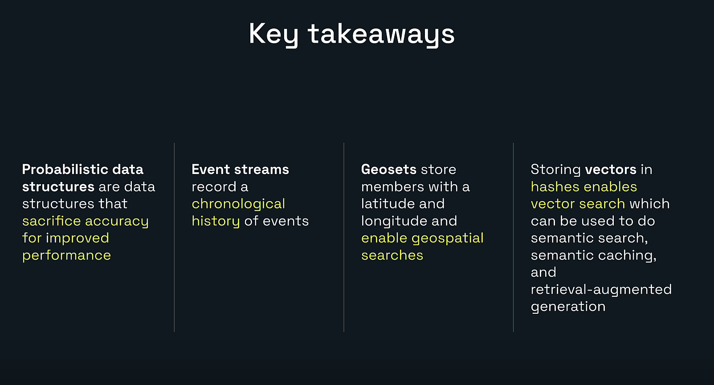

- Probabilistic structures sacrifice some accuracy for performance and memory efficiency.
- HyperLogLog estimates unique counts.
- Bloom filters perform probabilistic membership checks.
- Cuckoo filters add deletion support.
- Count-Min Sketch estimates frequency.
- Top-K identifies frequent items.
- t-digest estimates percentiles.
- Streams record chronological events and support consumer groups.
- Geospatial indexes store named longitude and latitude coordinates.
- Vector indexes enable semantic search, semantic caching, recommendations, and RAG.
- Bitmaps store compact yes/no states.
- Bitfields store packed integers.
- TimeSeries stores timestamped numeric samples.
- Choosing the correct structure depends on the exact question the application must answer.

---

# 24. Lesson Completion Checklist

- [ ] I can explain a probabilistic data structure.
- [ ] I understand approximate versus exact answers.
- [ ] I used `PFADD` and `PFCOUNT`.
- [ ] I understand Bloom-filter false positives.
- [ ] I added events using `XADD`.
- [ ] I read events using `XRANGE`.
- [ ] I understand `XREAD` versus `XREADGROUP`.
- [ ] I added locations using `GEOADD`.
- [ ] I searched locations using `GEOSEARCH`.
- [ ] I used bitmap commands.
- [ ] I used bitfield commands.
- [ ] I understand TimeSeries samples.
- [ ] I can explain the vector-search workflow.
- [ ] I understand hashes/JSON plus a vector index.
- [ ] I can choose an advanced structure for a backend problem.

---

# Included Files

```text
lesson-10-lab-commands.txt
lesson-10-expected-results.md
```

The lab file contains runnable mini-labs and command-support checks.

The expected-results guide explains approximate answers, generated stream IDs, coordinate behavior, packed integer results, and vector placeholders.

---

# Repository Structure

```text
redis-learning-journey-lesson-10/
|-- README.md
|-- lesson-10-lab-commands.txt
|-- lesson-10-expected-results.md
|-- MANIFEST.txt
`-- images/
    |-- 00-cover-explore-more-data-structures.png
    |-- 01-learning-objectives.png
    |-- 02-redis-data-structures-overview.png
    |-- 03-probabilistic-data-structure.png
    |-- 04-hyperloglog.png
    |-- 05-bloom-filter.png
    |-- 06-redis-streams.png
    |-- 07-geospatial-index.png
    |-- 08-storing-vectors-options.png
    |-- 09-vector-use-cases.png
    |-- 10-vector-search.png
    |-- 11-even-more-data-structures.png
    `-- 12-key-takeaways.png
```

---

# Official References

## Probabilistic structures

- Overview: https://redis.io/docs/latest/develop/data-types/probabilistic/
- Bloom filter: https://redis.io/docs/latest/develop/data-types/probabilistic/bloom-filter/
- HyperLogLog: https://redis.io/docs/latest/develop/data-types/probabilistic/hyperloglogs/
- Cuckoo filter: https://redis.io/docs/latest/develop/data-types/probabilistic/cuckoo-filter/
- Count-Min Sketch: https://redis.io/docs/latest/develop/data-types/probabilistic/count-min-sketch/
- Top-K: https://redis.io/docs/latest/develop/data-types/probabilistic/top-k/
- t-digest: https://redis.io/docs/latest/develop/data-types/probabilistic/t-digest/

## Streams

- Redis Streams: https://redis.io/docs/latest/develop/data-types/streams/

## Geospatial

- Redis geospatial indexes: https://redis.io/docs/latest/develop/data-types/geospatial/

## Vectors

- Vector-search concepts: https://redis.io/docs/latest/develop/ai/search-and-query/vectors/
- Vector-database quick start: https://redis.io/docs/latest/develop/get-started/vector-database/

## Bitmaps and bitfields

- Bitmaps: https://redis.io/docs/latest/develop/data-types/strings/bitmaps/
- Bitfields: https://redis.io/docs/latest/develop/data-types/strings/bitfields/

## TimeSeries

- Redis TimeSeries: https://redis.io/docs/latest/develop/data-types/timeseries/

---

# Next Lesson

## Lesson 11: Connect Redis with Java and Spring Boot

The next lesson can bring the learning journey into a real backend application:

- Spring Boot project setup
- Lettuce and Jedis
- `RedisTemplate`
- `StringRedisTemplate`
- Cache configuration
- Strings, hashes, lists, sets, and sorted sets from Java
- Redis Streams in microservices
- JSON and vector clients
- Connection pooling
- Serialization
- Error handling
- Testing with Testcontainers
