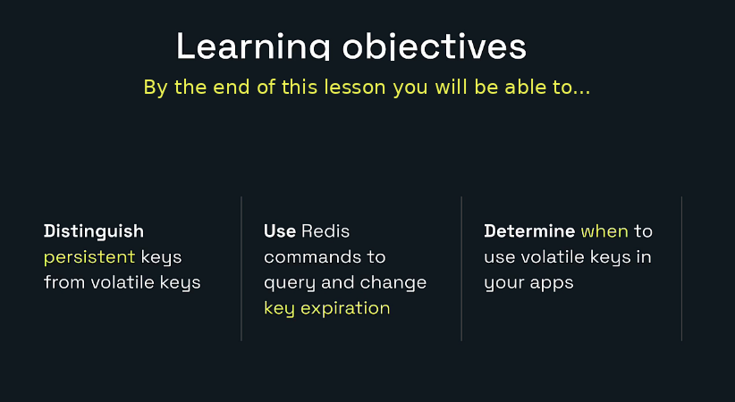
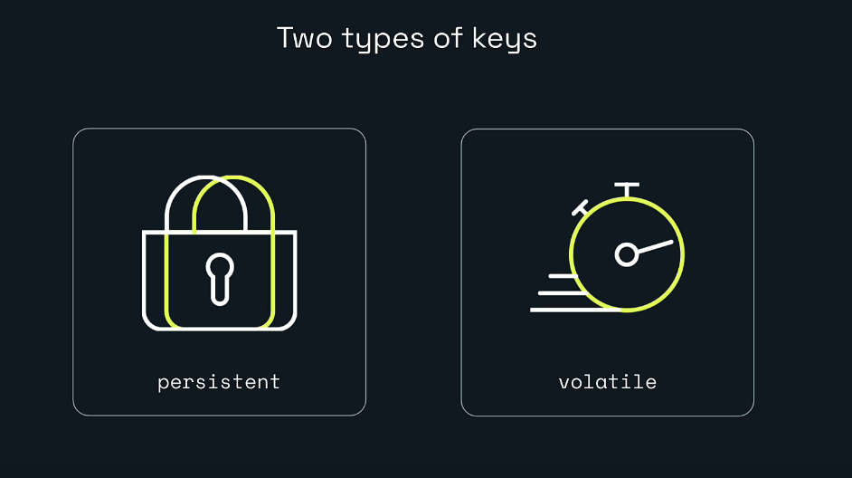
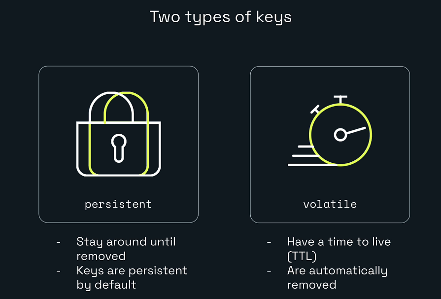
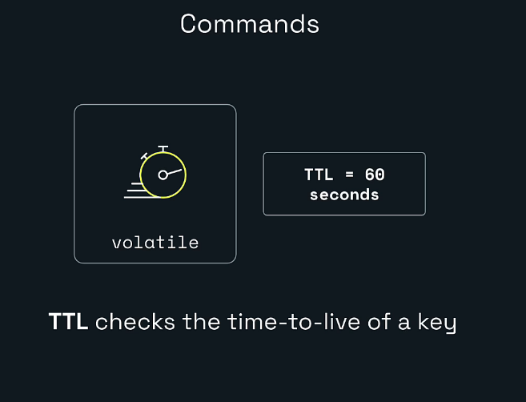
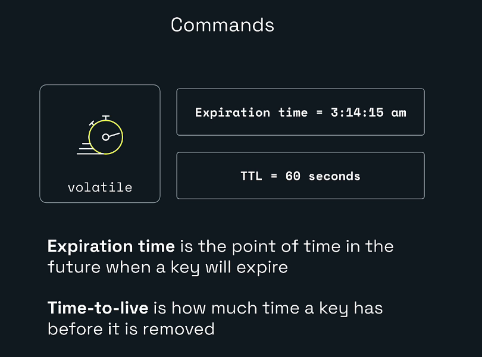
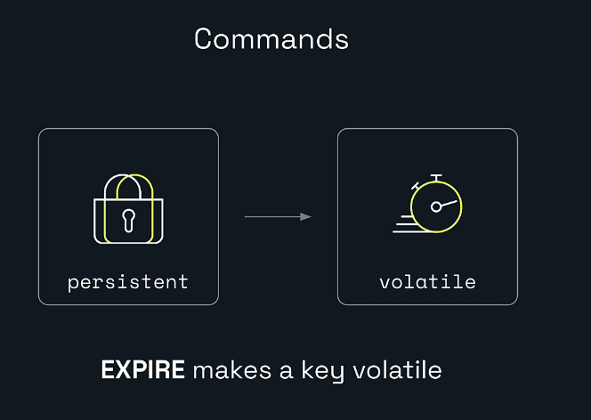
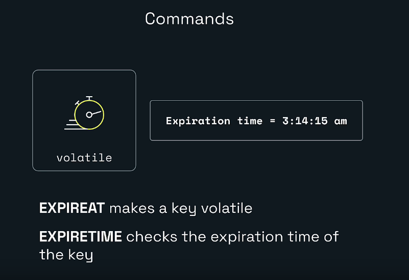
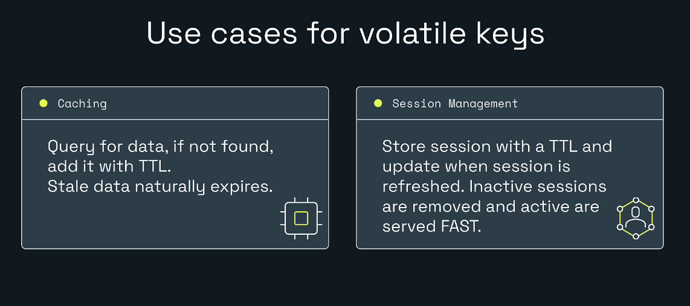
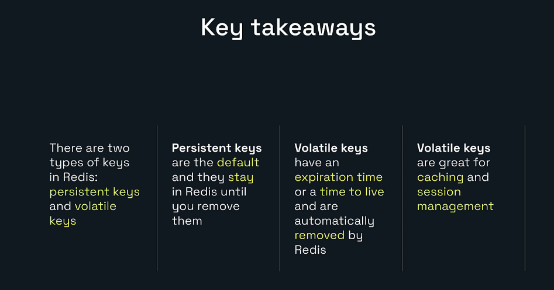

# Explore Redis for Developers


# My Redis Learning Journey — Lesson 11

## Use Redis Key Expiration

Redis can store data that stays until someone deletes it, or data that automatically disappears after a period of time.

That automatic removal is called **key expiration**.

Key expiration is one of the most useful Redis features for backend developers because many kinds of application data should not live forever:

- Cached API responses become stale.
- User sessions end after inactivity.
- Password-reset tokens should stop working.
- Verification codes should expire.
- Temporary locks should be released.
- Rate-limit windows should reset.
- Short-lived workflow data should be cleaned automatically.

In this lesson, I am learning how to make Redis keys expire safely and how to inspect, extend, remove, and preserve their expiration.

---

## Learning Objectives



By the end of this lesson, I will be able to:

- Distinguish persistent keys from volatile keys.
- Explain expiration time and time to live.
- Set expiration with `EXPIRE`.
- Inspect remaining time with `TTL`.
- Understand `TTL` return values `-1` and `-2`.
- Set absolute expiration with `EXPIREAT`.
- Query absolute expiration with `EXPIRETIME`.
- Remove expiration using `PERSIST`.
- Create a key and TTL atomically using `SET`.
- Preserve a TTL when replacing a value.
- Use expiration in caching and session-management designs.
- Apply expiration from a Java Spring Boot service.

---

# 1. Key Expiration Works with Redis Keys

Every Redis object is stored under a key.

Examples:

```text
product:42
session:abc123
cache:user:101
password-reset:token-789
```

Expiration belongs to the Redis key.

It works regardless of whether the value is a:

- String
- List
- Set
- Hash
- Sorted set
- JSON document
- Stream
- Geospatial index
- Another supported Redis value

Example:

```redis
HSET user:101 name Hero role Developer
EXPIRE user:101 300
```

The entire hash key expires after approximately five minutes.

Key expiration normally removes the complete key and its complete value.

---

# 2. Two Types of Keys



For this lesson, Redis keys can be viewed in two groups:

```text
Persistent keys
Volatile keys
```

The word **volatile** here means that the key has an expiration.

It does not mean Redis immediately deletes it or that the value is unreliable.

---

# 3. Persistent Keys



A persistent key has no expiration.

Example:

```redis
SET bowtie:pattern striped
```

By default, this key remains in Redis until something removes it.

Possible removal causes include:

- `DEL`
- `UNLINK`
- A command replacing or deleting the key
- Database clearing
- Administrative actions
- Memory eviction, depending on server configuration
- Application cleanup

Check the TTL:

```redis
TTL bowtie:pattern
```

Expected:

```text
-1
```

`-1` means:

```text
The key exists, but it has no expiration.
```

## Persistent does not mean permanent storage

A persistent key has no TTL, but Redis operational settings still matter.

For example, a server configured with a memory-eviction policy may remove keys when memory is exhausted.

Expiration and eviction are related to data lifecycle, but they are different mechanisms.

---

# 4. Volatile Keys

A volatile key has an expiration.

Example:

```redis
SET bowtie:color red
EXPIRE bowtie:color 60
```

The key now has a time to live of approximately 60 seconds.

After that period, Redis treats it as expired and removes it.

Check:

```redis
TTL bowtie:color
```

Possible result:

```text
57
```

The exact number depends on how quickly the command was executed.

---

# 5. Time to Live



Time to live is usually abbreviated as:

```text
TTL
```

TTL answers:

```text
How much longer can this key live?
```

Example:

```redis
TTL bowtie:color
```

Possible response:

```text
42
```

This means approximately 42 seconds remain.

## TTL return values

| Result | Meaning |
|---:|---|
| `0` or greater | Remaining time in seconds |
| `-1` | Key exists but has no expiration |
| `-2` | Key does not exist |

These special values are important in application logic.

---

# 6. Expiration Time Versus TTL



These terms sound similar but mean different things.

## Expiration time

The exact point in the future when the key expires.

Example:

```text
January 1, 2112 at 05:00:00 UTC
```

Redis represents an absolute time using a Unix timestamp.

## Time to live

The remaining duration before that expiration point.

Example:

```text
60 seconds remaining
```

Simple comparison:

```text
Expiration time -> When will it expire?
TTL             -> How much time is left?
```

---

# 7. EXPIRE: Make a Key Volatile



Syntax:

```redis
EXPIRE key seconds
```

Example:

```redis
SET bowtie:color red
EXPIRE bowtie:color 60
```

Expected:

```text
OK
1
```

`EXPIRE` returns:

```text
1 -> expiration was successfully set
0 -> expiration was not set
```

A `0` result may occur because:

- The key does not exist.
- A conditional expiration option rejected the change.

## Updating an existing TTL

Running `EXPIRE` again replaces the current expiration:

```redis
EXPIRE bowtie:color 120
```

The key now has approximately 120 seconds remaining.

---

# 8. Complete Basic Lab

## Step 1: Create the key

```redis
SET bowtie:color red
```

Expected:

```text
OK
```

## Step 2: Add a 60-second expiration

```redis
EXPIRE bowtie:color 60
```

Expected:

```text
1
```

## Step 3: Check TTL

```redis
TTL bowtie:color
```

Expected:

```text
A value between 0 and 60
```

## Step 4: Read before expiration

```redis
GET bowtie:color
```

Expected:

```text
"red"
```

## Step 5: Wait for expiration

After the TTL reaches zero:

```redis
GET bowtie:color
```

Expected:

```text
(nil)
```

Then:

```redis
TTL bowtie:color
```

Expected:

```text
-2
```

The key no longer exists.

---

# 9. Persistent Key Lab

Create a key without expiration:

```redis
SET bowtie:pattern striped
```

Check:

```redis
TTL bowtie:pattern
```

Expected:

```text
-1
```

This means:

```text
bowtie:pattern exists
bowtie:pattern has no expiration
```

Now check a missing key:

```redis
TTL bowtie:missing
```

Expected:

```text
-2
```

This means:

```text
bowtie:missing does not exist
```

---

# 10. EXPIREAT: Set an Absolute Expiration



Syntax:

```redis
EXPIREAT key unix-time-seconds
```

Example from the lab:

```redis
EXPIREAT bowtie:pattern 4481067600
```

`4481067600` represents:

```text
2112-01-01 05:00:00 UTC
```

Expected:

```text
1
```

Use `EXPIREAT` when the requirement is tied to a specific clock time.

Examples:

- Sale ends at midnight.
- Token expires at a known timestamp.
- Scheduled data is removed at a fixed date.
- Daily cache is invalidated at a specific time.

Use `EXPIRE` when the requirement is a duration:

```text
Expire 30 minutes from now.
```

Use `EXPIREAT` when the requirement is an instant:

```text
Expire at midnight UTC.
```

---

# 11. EXPIRETIME: Read the Absolute Expiration

Syntax:

```redis
EXPIRETIME key
```

Example:

```redis
EXPIRETIME bowtie:pattern
```

Expected:

```text
4481067600
```

Return values:

| Result | Meaning |
|---:|---|
| Positive Unix timestamp | Absolute expiration time |
| `-1` | Key exists without expiration |
| `-2` | Key does not exist |

`EXPIRETIME` uses seconds.

For millisecond precision, Redis provides:

```redis
PEXPIRETIME
```

---

# 12. Millisecond Expiration

Redis supports expiration commands in seconds and milliseconds.

| Seconds | Milliseconds |
|---|---|
| `EXPIRE` | `PEXPIRE` |
| `TTL` | `PTTL` |
| `EXPIREAT` | `PEXPIREAT` |
| `EXPIRETIME` | `PEXPIRETIME` |

Example:

```redis
PEXPIRE session:abc123 30000
PTTL session:abc123
```

This sets a TTL of approximately:

```text
30,000 milliseconds
```

Milliseconds are useful for:

- Short distributed locks
- Rapid test scenarios
- Fine-grained throttling
- Sub-second temporary state

---

# 13. PERSIST: Remove Expiration

A volatile key can become persistent again.

Syntax:

```redis
PERSIST key
```

Example:

```redis
PERSIST bowtie:pattern
```

Expected:

```text
1
```

The TTL is removed.

Confirm:

```redis
TTL bowtie:pattern
```

Expected:

```text
-1
```

`PERSIST` returns:

```text
1 -> expiration was removed
0 -> key does not exist or has no expiration
```

---

# 14. Set Value and Expiration Atomically

This two-command pattern works:

```redis
SET session:abc123 user-101
EXPIRE session:abc123 60
```

But another client could observe the key between those commands, or the application could fail before `EXPIRE` is sent.

A safer pattern creates the value and expiration in one command:

```redis
SET session:abc123 user-101 EX 60
```

Expected:

```text
OK
```

## SET expiration options

| Option | Meaning |
|---|---|
| `EX seconds` | Relative seconds |
| `PX milliseconds` | Relative milliseconds |
| `EXAT timestamp` | Absolute seconds |
| `PXAT timestamp` | Absolute milliseconds |
| `KEEPTTL` | Preserve an existing TTL |

Examples:

```redis
SET cache:product:42 value EX 300
SET short:key value PX 5000
SET event:key value EXAT 4481067600
```

---

# 15. Replacing a Value Can Remove the TTL

This behavior is easy to miss.

Create a key with expiration:

```redis
SET lesson:replace first EX 120
TTL lesson:replace
```

Replace it normally:

```redis
SET lesson:replace second
```

Now:

```redis
TTL lesson:replace
```

Expected:

```text
-1
```

The normal `SET` replaced the value and removed the old TTL.

## Preserve the TTL with KEEPTTL

```redis
EXPIRE lesson:replace 120
SET lesson:replace third KEEPTTL
TTL lesson:replace
```

The TTL remains positive.

This is important for:

- Session refresh logic
- Cached values
- Temporary tokens
- Expiring state that must be updated without becoming permanent

---

# 16. Commands That Usually Preserve an Existing TTL

Commands that update the existing value without replacing the complete key normally preserve the key expiration.

Examples:

```redis
INCR counter:views
HSET user:101 role Developer
LPUSH queue:jobs job-102
SADD processed:ids id-100
ZADD leaderboard 100 alice
```

Example:

```redis
SET counter:views 1 EX 120
INCR counter:views
TTL counter:views
```

The TTL should remain positive.

## Replacement versus mutation

A useful mental model:

```text
Mutation of existing value -> TTL usually remains
Replacement of whole key   -> TTL may be removed
```

Always verify the command’s documentation for important production flows.

---

# 17. Conditional EXPIRE Options

Modern Redis supports conditional expiration options:

```redis
EXPIRE key seconds NX
EXPIRE key seconds XX
EXPIRE key seconds GT
EXPIRE key seconds LT
```

These options are mutually exclusive.

## NX

Set expiration only when the key currently has no expiration.

```redis
EXPIRE lesson:conditional 60 NX
```

Useful when:

```text
Set the first TTL, but do not overwrite an existing one.
```

## XX

Set expiration only when the key already has an expiration.

```redis
EXPIRE lesson:conditional 120 XX
```

Useful when:

```text
Only update keys that are already volatile.
```

## GT

Set expiration only when the new expiration is greater than the current one.

```redis
EXPIRE lesson:conditional 180 GT
```

Useful when extending a session but never shortening it.

## LT

Set expiration only when the new expiration is less than the current one.

```redis
EXPIRE lesson:conditional 30 LT
```

Useful when reducing a deadline but never extending it.

---

# 18. GETEX: Read and Update Expiration

`GETEX` works with string values.

It reads the value and changes the expiration atomically.

Example:

```redis
SET token:reset abc-def
GETEX token:reset EX 60
```

The response is:

```text
"abc-def"
```

The key now has approximately 60 seconds remaining.

Make it persistent while reading:

```redis
GETEX token:reset PERSIST
```

Now:

```redis
TTL token:reset
```

Expected:

```text
-1
```

Useful for:

- Sliding sessions
- Reading and extending a token
- Reading and converting temporary data to persistent data
- Atomic read-and-expiration workflows

---

# 19. Expiration Use Cases



## Caching

Flow:

```text
Request data
     |
Check Redis
     |
     +-- Found -> return cached data
     |
     +-- Missing -> load database
                   store cache with TTL
                   return data
```

Example:

```redis
SET cache:product:42 '{"id":42,"name":"Bowtie"}' EX 300
```

After five minutes, stale data naturally disappears.

## Session management

```redis
SET session:abc123 user-101 EX 1800
```

The session expires after 30 minutes unless refreshed.

A sliding session may extend the TTL whenever the user is active.

## Verification codes

```redis
SET otp:user:101 927441 EX 300
```

The code stops working after five minutes.

## Password-reset tokens

```redis
SET reset-token:abc123 user-101 EX 900
```

The token expires after 15 minutes.

## Rate limiting

Example fixed window:

```redis
INCR rate:user:101
EXPIRE rate:user:101 60 NX
```

The first request sets the 60-second window.

## Temporary locks

```redis
SET lock:order:42 worker-7 NX PX 10000
```

The TTL helps prevent a forgotten lock from living forever.

A production distributed-lock design requires ownership-safe release and renewal logic; TTL alone is not the complete solution.

## Idempotency keys

```redis
SET idempotency:payment:req-789 result EX 86400 NX
```

This can prevent duplicate processing within a defined time window.

---

# 20. Key Expiration Versus Cache Eviction

These concepts are different.

## Expiration

The application deliberately sets a TTL.

```text
This key should disappear after 5 minutes.
```

## Eviction

Redis removes data because the configured memory limit is reached.

```text
Redis needs memory and selects a key according to the eviction policy.
```

A key can:

- Expire because its TTL ended.
- Be evicted before its TTL ends.
- Remain persistent when no eviction occurs.
- Be rejected on writes under some memory policies.

Do not treat TTL as a guarantee that the key will remain available until the last second.

Redis is often used as a cache, so application code should handle cache misses safely.

---

# 21. How Redis Removes Expired Keys

Conceptually, a key becomes logically unavailable when its expiration time passes.

Redis uses expiration mechanisms that include:

- Checking keys when they are accessed.
- Periodically sampling keys with expiration.

Application behavior should be:

```text
Once expired, treat the key as missing.
```

Do not build logic that depends on observing the physical deletion at an exact CPU instant.

---

# 22. Expiration and Persistence

Redis persists expiration metadata along with data when persistence is configured.

Expiration is based on an absolute point in time internally.

This means stopping the server does not normally pause a TTL like a kitchen timer.

If enough real time passes while the server is stopped, the key may be expired when Redis starts again.

Clock accuracy matters in Redis environments.

---

# 23. Complete Redis Insight Lab

## Part A: Volatile key

```redis
SET bowtie:color red
EXPIRE bowtie:color 60
TTL bowtie:color
```

Observe the TTL decreasing.

Wait until expiration:

```redis
GET bowtie:color
TTL bowtie:color
```

Expected:

```text
(nil)
-2
```

## Part B: Persistent key

```redis
SET bowtie:pattern striped
TTL bowtie:pattern
```

Expected:

```text
-1
```

## Part C: Missing key

```redis
TTL bowtie:color
```

Expected after expiration:

```text
-2
```

## Part D: Explicit expiration

```redis
EXPIREAT bowtie:pattern 4481067600
EXPIRETIME bowtie:pattern
```

Expected:

```text
1
4481067600
```

## Part E: Remove expiration

```redis
PERSIST bowtie:pattern
TTL bowtie:pattern
```

Expected:

```text
1
-1
```

---

# 24. View Expiration in Redis Insight

1. Open Redis Insight.
2. Open the Browser.
3. Create or select a key.
4. Inspect its TTL or expiration details.
5. Refresh the key list after expiration.

For:

```redis
SET demo:short "I disappear soon" EX 5
```

Redis Insight should show the key briefly.

After approximately five seconds and a refresh, the key should be gone.

The exact UI labels can vary between Redis Insight versions, but the Redis commands remain the source of truth.

---

# 25. Spring Boot Example with StringRedisTemplate

```java
import java.time.Duration;

import org.springframework.data.redis.core.StringRedisTemplate;
import org.springframework.stereotype.Service;

@Service
public class SessionService {

    private static final Duration SESSION_TTL = Duration.ofMinutes(30);

    private final StringRedisTemplate redisTemplate;

    public SessionService(StringRedisTemplate redisTemplate) {
        this.redisTemplate = redisTemplate;
    }

    public void createSession(String sessionId, String userId) {
        String key = "session:" + sessionId;

        redisTemplate.opsForValue()
                .set(key, userId, SESSION_TTL);
    }

    public String getUserId(String sessionId) {
        return redisTemplate.opsForValue()
                .get("session:" + sessionId);
    }

    public Boolean refreshSession(String sessionId) {
        return redisTemplate.expire(
                "session:" + sessionId,
                SESSION_TTL);
    }

    public Long getRemainingSeconds(String sessionId) {
        return redisTemplate.getExpire(
                "session:" + sessionId);
    }

    public Boolean makePersistent(String sessionId) {
        return redisTemplate.persist(
                "session:" + sessionId);
    }
}
```

The `set` call stores the value and TTL together.

---

# 26. Cache Service Example

```java
import java.time.Duration;

import org.springframework.data.redis.core.StringRedisTemplate;
import org.springframework.stereotype.Service;

@Service
public class ProductCacheService {

    private static final Duration PRODUCT_TTL = Duration.ofMinutes(5);

    private final StringRedisTemplate redisTemplate;

    public ProductCacheService(StringRedisTemplate redisTemplate) {
        this.redisTemplate = redisTemplate;
    }

    public void cacheProduct(String productId, String json) {
        redisTemplate.opsForValue()
                .set(
                        "cache:product:" + productId,
                        json,
                        PRODUCT_TTL);
    }

    public String findCachedProduct(String productId) {
        return redisTemplate.opsForValue()
                .get("cache:product:" + productId);
    }

    public Boolean removeCachedProduct(String productId) {
        return redisTemplate.delete(
                "cache:product:" + productId);
    }
}
```

Cache flow:

```text
Controller
   |
Service
   |
Redis cache lookup
   |
   +-- Hit -> return cached JSON
   |
   +-- Miss -> query database
               cache result with TTL
               return result
```

---

# 27. Spring Cache TTL Configuration

Spring’s cache abstraction can use Redis.

Conceptual configuration:

```java
import java.time.Duration;

import org.springframework.cache.annotation.EnableCaching;
import org.springframework.context.annotation.Bean;
import org.springframework.context.annotation.Configuration;
import org.springframework.data.redis.cache.RedisCacheConfiguration;

@Configuration
@EnableCaching
public class CacheConfiguration {

    @Bean
    RedisCacheConfiguration redisCacheConfiguration() {
        return RedisCacheConfiguration
                .defaultCacheConfig()
                .entryTtl(Duration.ofMinutes(5));
    }
}
```

Service:

```java
@Cacheable(cacheNames = "products", key = "#productId")
public Product getProduct(String productId) {
    return productRepository.findById(productId)
            .orElseThrow();
}
```

The exact configuration can vary with the Spring Boot and Spring Data Redis versions.

---

# 28. Sliding Session Example

A sliding session refreshes the expiration when activity occurs.

```text
User request
    |
Session exists?
    |
    +-- No -> unauthorized
    |
    +-- Yes -> process request
               extend TTL
```

Java concept:

```java
public boolean validateAndRefresh(String sessionId) {
    String key = "session:" + sessionId;

    String userId = redisTemplate.opsForValue().get(key);

    if (userId == null) {
        return false;
    }

    Boolean refreshed = redisTemplate.expire(
            key,
            Duration.ofMinutes(30));

    return Boolean.TRUE.equals(refreshed);
}
```

Race conditions, security, token rotation, and maximum session age should be considered in a real authentication system.

---

# 29. Fixed Expiration Versus Sliding Expiration

## Fixed expiration

The deadline never changes.

Example:

```text
Password-reset token expires 15 minutes after creation.
```

Use:

```redis
SET reset-token:abc user-101 EX 900
```

Do not refresh it on use.

## Sliding expiration

Activity extends the deadline.

Example:

```text
Session expires 30 minutes after the last request.
```

Use:

```redis
EXPIRE session:abc 1800
```

after valid activity.

## Absolute maximum age

Some systems combine both:

```text
Inactive timeout: 30 minutes
Maximum lifetime: 8 hours
```

This normally requires storing session metadata in addition to refreshing a TTL.

---

# 30. Choosing a TTL

A TTL is a business and system-design decision.

Questions:

1. How stale may the data become?
2. How expensive is recomputing it?
3. How sensitive is the data?
4. How often does the source change?
5. How much cache traffic can the database handle?
6. What happens when the key disappears?
7. Can many keys expire at the same moment?
8. Should random jitter be added?

## Example ranges

These are design examples, not universal rules:

| Data | Possible TTL |
|---|---|
| OTP | 3–10 minutes |
| Password reset | 10–30 minutes |
| Session | 15–60 minutes of inactivity |
| Product cache | 1–15 minutes |
| Static reference cache | Hours |
| Distributed lock | Seconds |
| Idempotency result | Hours or days |

---

# 31. Avoiding a Cache Stampede

If thousands of popular keys expire at the same time, many requests may hit the database together.

Possible strategies:

- Add random TTL jitter.
- Refresh popular data before expiration.
- Use request coalescing or locking.
- Serve stale data briefly while refreshing.
- Spread scheduled expirations.
- Use different TTLs for different data.

Conceptual jitter:

```text
Base TTL = 300 seconds
Random addition = 0 to 60 seconds
Final TTL = 300 to 360 seconds
```

---

# 32. Key-Level Versus Hash-Field Expiration

This lesson focuses on expiration for complete Redis keys.

Example:

```redis
EXPIRE user:101 300
```

The complete key expires.

Modern Redis versions also support expiration for individual hash fields in supported environments.

That is a separate feature with commands such as hash-field expiration commands.

Use key-level expiration when the complete object shares one lifecycle.

Use field-level expiration only when individual hash fields truly need independent lifetimes and the deployment supports it.

---

# 33. Common Problems

## EXPIRE returned 0

Possible causes:

- Key does not exist.
- Conditional option was not satisfied.

Check:

```redis
EXISTS your:key
TTL your:key
```

## TTL immediately returned 59 instead of 60

Time passed between the commands.

That is correct.

## TTL returned -1

The key exists but has no expiration.

## TTL returned -2

The key does not exist.

It may have:

- Expired
- Been deleted
- Never existed
- Been evicted
- Been stored in another database or Redis instance

## My TTL disappeared after SET

A normal `SET` replaces the key and clears the previous TTL.

Use:

```redis
SET key value KEEPTTL
```

when appropriate.

## The key disappeared earlier than expected

Possible causes:

- Another client changed the TTL.
- Another client deleted the key.
- The key was evicted.
- The server clock changed.
- The application connected to a different database.
- The TTL unit was mistaken.

Check seconds versus milliseconds carefully.

## I used EXPIREAT with a date in the past

The key is deleted immediately.

Use a future Unix timestamp.

## TTL never decreases in my test output

The test may mock time, cache the response, or connect to another Redis instance.

Run `TTL` directly in Redis Insight or `redis-cli`.

---

# 34. Best Practices

- Set value and expiration atomically when possible.
- Use `SET ... EX` or `SET ... PX` for strings.
- Treat Redis cache misses as normal.
- Use clear key names.
- Document TTL units.
- Avoid accidental TTL removal during updates.
- Use `KEEPTTL` deliberately.
- Monitor volatile-key counts and expiration behavior.
- Use bounded TTLs for security tokens.
- Add jitter for high-volume cache keys.
- Do not use a distributed lock without ownership-safe release.
- Test `-1` and `-2` cases.
- Verify production Redis version before relying on newer options.
- Keep business expiration rules in configuration instead of scattering magic numbers.

---

# 35. Key Takeaways



- Redis keys are persistent by default.
- A volatile key has an expiration.
- `EXPIRE` sets a relative TTL in seconds.
- `TTL` returns remaining seconds.
- `TTL -1` means the key exists without expiration.
- `TTL -2` means the key does not exist.
- `EXPIREAT` sets an absolute Unix expiration timestamp.
- `EXPIRETIME` returns the absolute expiration timestamp.
- `PERSIST` removes an expiration.
- `SET ... EX` creates a value and TTL atomically.
- A normal `SET` can clear an existing TTL.
- `KEEPTTL` preserves the TTL during replacement.
- Volatile keys are useful for caching, sessions, tokens, locks, rate limiting, and idempotency.
- Expiration and memory eviction are different.
- Application code must handle missing keys safely.

---

# 36. Lesson Completion Checklist

- [ ] I can explain persistent and volatile keys.
- [ ] I created a key with `SET`.
- [ ] I added a TTL with `EXPIRE`.
- [ ] I checked remaining time with `TTL`.
- [ ] I understand `TTL -1`.
- [ ] I understand `TTL -2`.
- [ ] I observed a key expire.
- [ ] I created a persistent key.
- [ ] I used `EXPIREAT`.
- [ ] I used `EXPIRETIME`.
- [ ] I removed expiration with `PERSIST`.
- [ ] I used `SET ... EX`.
- [ ] I tested millisecond expiration.
- [ ] I understand `NX`, `XX`, `GT`, and `LT`.
- [ ] I tested `KEEPTTL`.
- [ ] I understand expiration versus eviction.
- [ ] I can implement TTL in Spring Boot.

---

# Included Practice Files

The downloadable package includes:

```text
lesson-11-lab-commands.txt
lesson-11-expected-results.md
```

The command file contains the complete lesson lab plus advanced expiration exercises.

The expected-results guide explains timing-sensitive outputs and every important return value.

---

# Repository Structure

```text
redis-learning-journey-lesson-11/
|-- README.md
|-- lesson-11-lab-commands.txt
|-- lesson-11-expected-results.md
|-- MANIFEST.txt
`-- images/
    |-- 00-cover-use-key-expiration.png
    |-- 01-learning-objectives.png
    |-- 02-two-types-of-keys.png
    |-- 03-persistent-vs-volatile-keys.png
    |-- 04-ttl-command.png
    |-- 05-expire-command.png
    |-- 06-expiration-time-vs-ttl.png
    |-- 07-expireat-and-expiretime.png
    |-- 08-volatile-key-use-cases.png
    `-- 09-key-takeaways.png
```

---

# Official References

- Key management and expiration: https://redis.io/docs/latest/develop/using-commands/keyspace/
- `EXPIRE`: https://redis.io/docs/latest/commands/expire/
- `TTL`: https://redis.io/docs/latest/commands/ttl/
- `PEXPIRE`: https://redis.io/docs/latest/commands/pexpire/
- `PTTL`: https://redis.io/docs/latest/commands/pttl/
- `EXPIREAT`: https://redis.io/docs/latest/commands/expireat/
- `EXPIRETIME`: https://redis.io/docs/latest/commands/expiretime/
- `PERSIST`: https://redis.io/docs/latest/commands/persist/
- `SET`: https://redis.io/docs/latest/commands/set/
- `GETEX`: https://redis.io/docs/latest/commands/getex/
- Key eviction: https://redis.io/docs/latest/develop/reference/eviction/

---

# Next Lesson

## Lesson 12: Connect Redis with Java and Spring Boot

The next lesson can cover:

- Spring Boot Redis dependencies
- Local Redis and Docker configuration
- Redis Cloud configuration
- Lettuce versus Jedis
- `StringRedisTemplate`
- `RedisTemplate`
- Serialization
- CRUD operations
- Cache abstraction
- TTL configuration
- Error handling
- Testcontainers
- Integration tests
