# Explore Redis for Developers

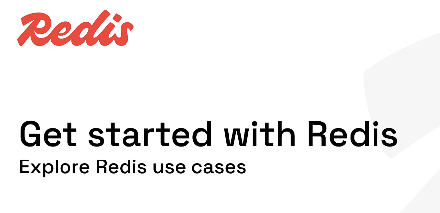

# My Redis Learning Journey — Lesson 12

## Explore Redis Use Cases

In the earlier lessons, I learned Redis from the inside:

- How to create and connect to a Redis database
- How Redis keys and values work
- Strings, lists, sets, hashes, sorted sets, and JSON
- Redis Insight
- Key naming
- Key expiration
- Specialized data structures such as Streams, geospatial indexes, probabilistic structures, and vectors

Now the question changes from:

```text
What commands does Redis provide?
```

to:

```text
What real application problems can Redis solve?
```

This lesson explores four major Redis use cases:

1. Enterprise caching
2. Search and query
3. Session management
4. Vector search

It then combines them into one familiar example:

```text
An online-shopping application
```

---

## Redis Use Cases at a Glance

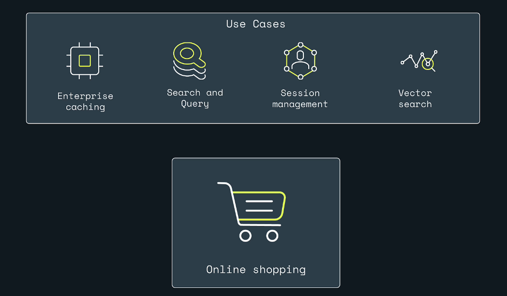

A single application can use Redis in several ways.

```text
Product catalog       -> Caching
Product discovery     -> Search and query
Shopping cart/session -> Session management
Recommendations       -> Vector search
Customer support      -> Vector search and retrieval
```

Redis is not limited to one job.

The same Redis platform can support different access patterns, but each use case should still have:

- Clear key names
- A suitable data structure
- A defined source of truth
- A failure strategy
- Monitoring
- Security rules
- Capacity planning
- An expiration or retention policy where appropriate

---

## Learning Objectives

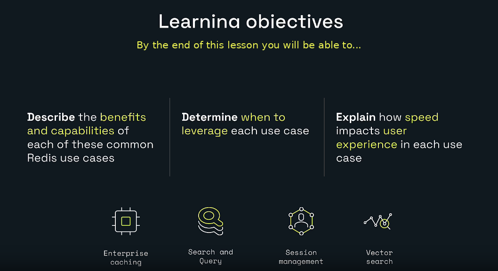

By the end of this lesson, I will be able to:

- Describe the benefits and capabilities of common Redis use cases.
- Determine when each Redis use case is appropriate.
- Explain how speed affects user experience.
- Design a cache-aside workflow.
- Explain how Redis Search works with hashes and JSON.
- Describe distributed session management.
- Explain embeddings and vector similarity search.
- Combine multiple Redis capabilities in an online-shopping architecture.
- Identify important production risks and trade-offs.
- Choose useful next steps for continuing my Redis learning journey.

---

# 1. Access Data Where You Want It, When You Want It


Modern users switch between:

- Phones
- Laptops
- Tablets
- Work computers
- Home computers
- Multiple application servers
- Different geographic regions

They still expect the application to remember:

- Who they are
- What is in their cart
- What they viewed
- What they searched
- Their current workflow
- Their preferences

A local variable inside one server cannot provide that experience.

Example:

```text
Request 1 -> Application Server A
Request 2 -> Application Server B
Request 3 -> Application Server C
```

If the session exists only in Server A's memory, Servers B and C cannot see it.

Redis provides a shared low-latency data layer that multiple application instances can access.

```text
Server A ----\
Server B ----- Redis
Server C ----/
```

This is useful for:

- Shared cache
- Shared sessions
- Search indexes
- Rate limits
- Real-time counters
- Distributed coordination
- Recommendations
- Event processing

---

# 2. Why Speed Matters

A fast database does not automatically make the complete application fast.

The user experiences the total time across:

```text
Device
  |
Network
  |
Load balancer
  |
Application
  |
Redis or database
  |
Other services
  |
Response rendering
```

Every part contributes to end-to-end latency.

Redis is commonly placed on the hot path because frequently requested data can be served from memory with very low latency.

## Perceived performance

A user does not think:

```text
The database returned in 1 millisecond.
```

The user thinks:

```text
The page felt instant.
```

or:

```text
The page felt slow.
```

Good performance improves:

- Conversion
- Engagement
- Search usability
- Checkout completion
- Session continuity
- Customer trust

Performance targets must be measured in the real system, not assumed from a slide or benchmark.

---

# 3. Enterprise Caching


Caching stores frequently needed data in a faster location so the application does not repeatedly perform a slower operation.

The slower operation might be:

- A relational-database query
- An API request
- A file read
- A complex calculation
- A report
- A machine-learning inference
- A remote-service call

Simple idea:

```text
Without cache:
Request -> Slow source -> Response

With cache:
Request -> Redis -> Response
```

When the item is missing:

```text
Request -> Redis miss -> Slow source -> Redis -> Response
```

---

# 4. Milliseconds Matter to Users

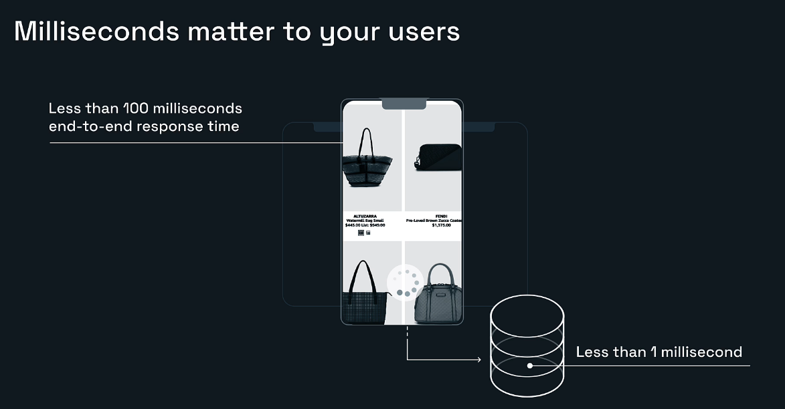

A product page may require:

- Product details
- Price
- Inventory
- Reviews
- Recommendations
- User preferences
- Shipping estimate

Without caching, the application might perform several database and service calls for every page view.

With Redis:

```text
Frequently accessed product data
          |
          v
        Redis
```

The application can avoid repeating the slowest work.

The goal is not merely to make Redis fast.

The goal is to make the entire user request fast and stable under load.

---

# 5. Cache-Aside Pattern

Cache-aside is one of the most common caching patterns.

## Read flow

```text
Client requests product 42
          |
Application checks Redis
          |
     +----+----+
     |         |
 Cache hit   Cache miss
     |         |
Return data   Query primary database
               |
               v
            Store in Redis with TTL
               |
               v
            Return data
```

## Pseudocode

```java
Product getProduct(String id) {
    Product cached = redis.get("cache:product:" + id);

    if (cached != null) {
        return cached;
    }

    Product product = database.findProduct(id);

    redis.set(
        "cache:product:" + id,
        product,
        Duration.ofMinutes(5)
    );

    return product;
}
```

## Write flow

A common update strategy is:

```text
Update primary database
        |
Delete or update cache key
```

Example:

```redis
UNLINK cache:product:42
```

The next read reloads fresh data.

---

# 6. Why Use Redis for Caching?

Redis caching can help:

- Reduce primary-database load
- Improve repeated-read latency
- Absorb traffic spikes
- Protect connection pools
- Reduce repeated calculations
- Share cache across application instances
- Apply per-key TTLs
- Store structured cached records as hashes or JSON
- Invalidate data explicitly

## Common cached data

- Product details
- User profiles
- Configuration
- API responses
- Reference data
- Search suggestions
- Authorization metadata
- Feature flags
- Expensive reports

---

# 7. Cache Data Structures

## String

Use a string for a complete serialized value:

```redis
SET cache:product:42 '{"id":42,"name":"Bow Tie"}' EX 300
```

## Hash

Use a hash for a flat record:

```redis
HSET cache:product:42 \
  name "Bow Tie" \
  price 30 \
  inventory 20

EXPIRE cache:product:42 300
```

## JSON

Use JSON for nested documents:

```redis
JSON.SET cache:product:42 $ \
  '{"name":"Bow Tie","colors":["red","blue"]}'

EXPIRE cache:product:42 300
```

Choose the structure based on the operations the application needs.

---

# 8. Other Caching Patterns

## Prefetch cache

Load important data before the first user request.

```text
Source database
      |
Background synchronization
      |
Redis
      |
Every request starts with a cache hit
```

Useful for:

- Reference data
- Product catalogs
- Configuration
- Data read by nearly every request

## Write-through

The application writes through the cache layer, and the cache coordinates persistence.

## Write-behind

The application writes to Redis quickly, and another process persists changes later.

This can improve write latency but adds durability and consistency risks.

## Semantic cache

A semantic cache reuses an answer for a meaningfully similar query rather than only an identical key.

Example:

```text
"What is your return policy?"
"How can I return an item?"
```

This is especially useful for LLM applications.

---

# 9. Caching Risks

Caching is not free performance.

It creates new design problems.

## Stale data

Redis may contain an older value than the source database.

Mitigation:

- TTL
- Invalidation on write
- Versioning
- Event-driven updates
- Shorter TTLs for frequently changing data

## Cache stampede

Many requests miss the same popular key and all query the database at once.

Mitigation:

- Request coalescing
- Short-lived locks
- Early refresh
- TTL jitter
- Background refresh
- Serving stale data briefly while refreshing

## Cache penetration

Repeated requests ask for data that does not exist.

Mitigation:

- Cache a short-lived not-found marker
- Bloom filter
- Validation
- Rate limiting

## Hot keys

One key receives extremely high traffic.

Mitigation depends on the use case:

- Replication/read scaling
- Local caching
- Data partitioning
- Request collapsing
- Redesigning key granularity

## Memory pressure

The cache grows beyond the intended size.

Mitigation:

- `maxmemory`
- Appropriate eviction policy
- TTLs
- Memory monitoring
- Key-size monitoring
- Avoiding giant values

---

# 10. Search and Query


Redis Search lets applications search indexed hash or JSON documents.

It supports capabilities such as:

- Full-text search
- Identifier/tag filters
- Numeric ranges
- Geospatial filters
- Sorting
- Field projection
- Aggregations
- Vector similarity search
- Combined multi-factor queries

Redis Search is different from looking up one known key.

## Direct key lookup

```redis
HGETALL product:291059
```

The application already knows the exact key.

## Search

```text
Find red polka-dot bow ties
priced between $10 and $30
available in Chicago
```

The application does not know which keys match.

A search index helps find them.

---

# 11. Search by Text, Identifier, Range, or Location

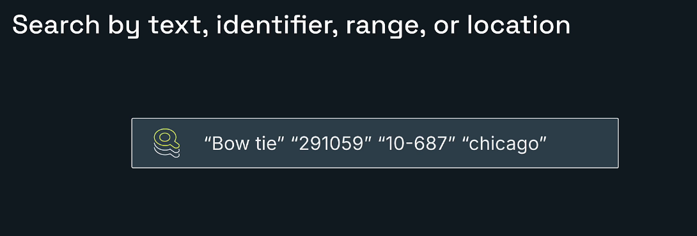

Examples:

## Text

```text
"Bow tie"
```

Search product names and descriptions.

## Identifier

```text
"291059"
```

Find an exact SKU.

## Numeric range

```text
"$10–$30"
```

Filter by price.

## Location

```text
"Chicago"
```

Filter by city, store, region, or geospatial area.

These conditions can be combined.

```text
red polka-dot bow tie
AND price between 10 and 30
AND city is Chicago
```

---

# 12. Search Hashes and JSON

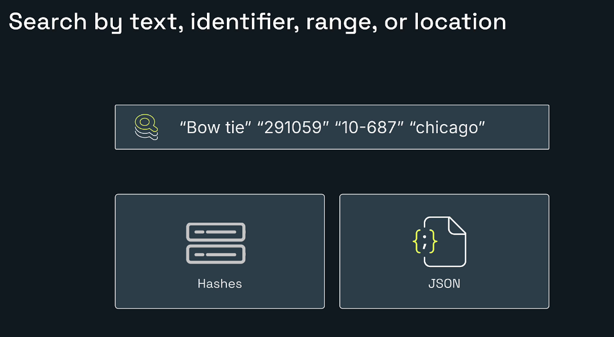

Redis Search can index:

- Hash documents
- JSON documents

## Hash document

```redis
HSET catalog:product:1 \
  name "Red Polka Dot Bow Tie" \
  sku 291059 \
  price 25 \
  city Chicago
```

## JSON document

```redis
JSON.SET catalog:product:1 $ '{
  "name": "Red Polka Dot Bow Tie",
  "sku": "291059",
  "price": 25,
  "city": "Chicago"
}'
```

The index is defined over fields or JSON paths.

After the index exists, matching documents are indexed automatically when they use the configured key prefix.

---

# 13. Search Index Example

Hash index:

```redis
FT.CREATE idx:catalog
ON HASH
PREFIX 1 catalog:product:
SCHEMA
  name TEXT
  sku TAG
  price NUMERIC SORTABLE
  city TAG
  color TAG
  pattern TAG
```

Search by text:

```redis
FT.SEARCH idx:catalog 'bow tie'
```

Search by SKU:

```redis
FT.SEARCH idx:catalog '@sku:{291059}'
```

Search by price:

```redis
FT.SEARCH idx:catalog '@price:[10 30]'
```

Combined query:

```redis
FT.SEARCH idx:catalog \
  '@name:(red polka dot) @price:[10 30] @city:{Chicago}'
```

---

# 14. Search and Find Products

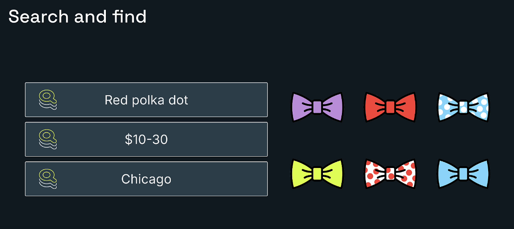

Imagine six bow ties:

- Purple
- Red
- Blue polka dot
- Yellow
- Red polka dot
- Blue

The user asks for:

```text
Red polka dot
$10–$30
Chicago
```

Search filters remove products that do not match.

```text
Text condition
    +
Price condition
    +
Location condition
    =
Relevant result
```

This improves the shopping experience because users find the right product faster.

---

# 15. Search Design Choices

## TEXT

Use for analyzed words and phrases:

```text
Product name
Description
Support content
Article body
```

## TAG

Use for exact categories or identifiers:

```text
SKU
City
Color
Brand
Status
Category
```

## NUMERIC

Use for ranges and sorting:

```text
Price
Age
Quantity
Rating
Timestamp
```

## GEO

Use for coordinates and nearby searches.

## VECTOR

Use for semantic similarity.

One field can be indexed differently depending on how it needs to be queried.

---

# 16. Search Is Not a Relational Join Engine

Redis Search is powerful, but Redis should not automatically replace a relational database.

A relational database remains a strong choice when the system depends on:

- Complex joins
- Foreign-key constraints
- Multi-row transactional workflows
- Mature SQL analytics
- Long-term system-of-record storage

A common architecture is:

```text
PostgreSQL or MySQL -> Source of truth
Redis               -> Fast access, cache, search, sessions, ranking
```

---

# 17. Session Management


A session stores temporary state about a user's interaction with an application.

Examples:

- Logged-in user ID
- Shopping cart
- Recently viewed pages
- Selected language
- Checkout progress
- Temporary permissions
- CSRF or workflow state

A session ID is usually sent by the client.

The application uses that ID to load session data.

```text
Cookie or token
      |
session ID
      |
Redis key
      |
session data
```

---

# 18. Why Redis for Session Management?

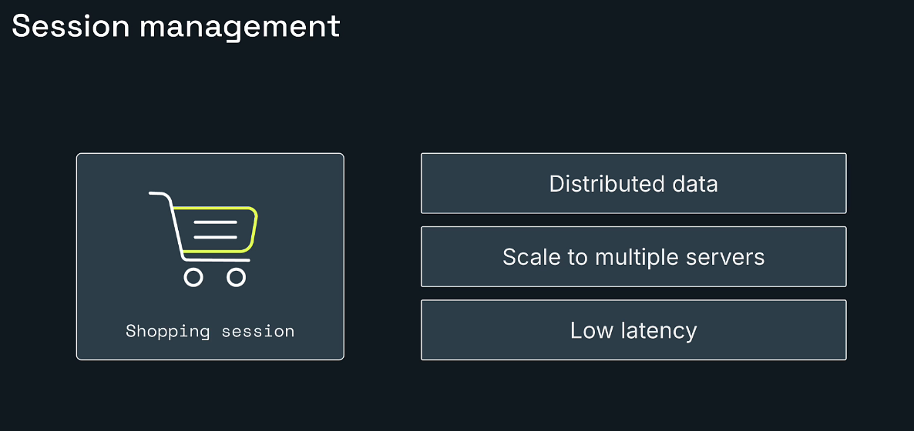

The slide highlights three important benefits.

## Distributed data

All authorized application servers can read the same session.

```text
Server A
Server B -> Redis session
Server C
```

## Scale to multiple servers

The load balancer does not need to send every request to the same application instance.

## Low latency

Session lookup happens on the request path, so it must be fast.

---

# 19. Shopping Session Example

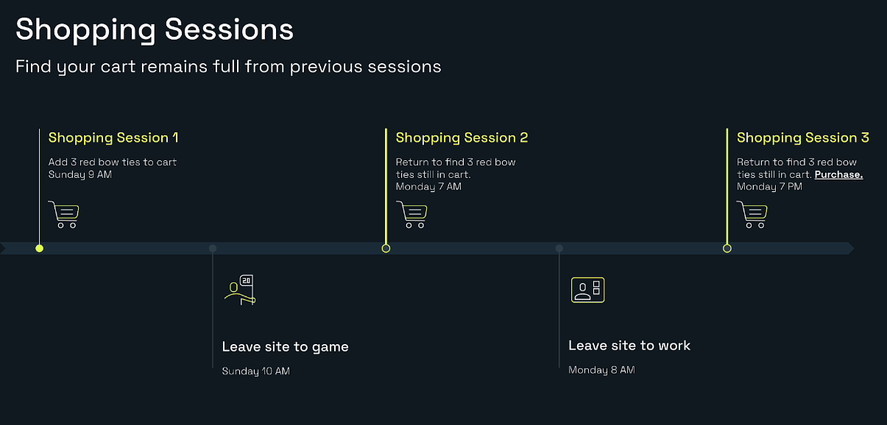

Example timeline:

```text
Sunday 9 AM
User adds three red bow ties to the cart.

Sunday 10 AM
User leaves for a game.

Monday 7 AM
User returns and sees the cart is still full.

Monday 8 AM
User leaves for work.

Monday 7 PM
User returns and purchases the products.
```

The shopping cart survives:

- Different times
- Different requests
- Potentially different devices
- Potentially different application servers

Redis becomes the shared session store.

---

# 20. Session Data Structure

A Redis hash is a simple session representation:

```redis
HSET session:shop:abc123 \
  userId user-101 \
  cartItemCount 3 \
  cartItems '["product:1","product:1","product:1"]' \
  lastPage /bowties/red
```

Add an inactivity timeout:

```redis
EXPIRE session:shop:abc123 1800
```

This means:

```text
Expire after 30 minutes unless refreshed.
```

When the user is active:

```redis
EXPIRE session:shop:abc123 1800
```

The session becomes a sliding session.

---

# 21. Session Security

Session management must be designed as a security feature, not only a performance feature.

Do not store:

- Plaintext passwords
- Raw payment-card details
- Secrets that the application does not need
- Sensitive data without appropriate protection

Consider:

- Random, unguessable session IDs
- Secure and HTTP-only cookies
- TLS
- Authentication and authorization
- Session rotation after login or privilege changes
- Maximum session lifetime
- Inactivity timeout
- Explicit logout and deletion
- Tenant separation
- Auditing
- Encryption requirements
- Replay protection

A fast session store does not replace secure session design.

---

# 22. Fixed and Sliding Sessions

## Fixed lifetime

```text
Session expires 8 hours after creation.
```

The deadline does not move.

## Sliding inactivity timeout

```text
Session expires 30 minutes after the latest valid activity.
```

The application refreshes the TTL.

Many real systems combine:

```text
30-minute inactivity timeout
8-hour absolute maximum lifetime
```

The absolute creation timestamp should be stored separately so repeated TTL refreshes cannot extend the session forever.

---

# 23. Vector Search


Vector search finds items based on similarity rather than only exact keywords.

An embedding model converts an item into a vector:

```text
[0.12, -0.08, 0.74, 0.31, ...]
```

Semantically similar items tend to have vectors that are closer according to a distance metric.

Redis can store vectors and metadata in:

- Hash documents
- JSON documents

Redis Search indexes the vector field.

---

# 24. Vector Embedding Pipeline

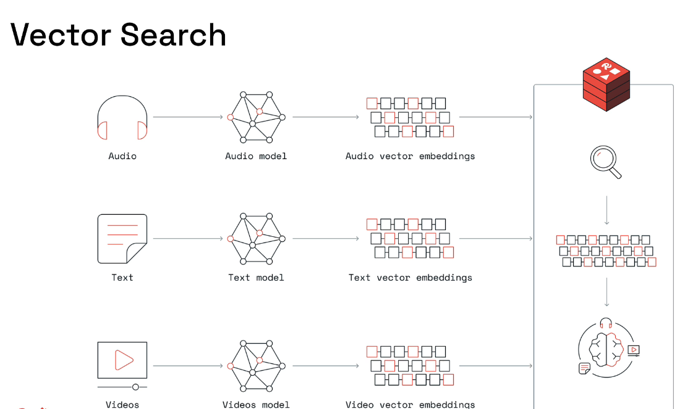

Different content can be converted into embeddings.

## Audio

```text
Audio
  |
Audio model
  |
Audio embedding
```

## Text

```text
Text
  |
Text embedding model
  |
Text embedding
```

## Video

```text
Video
  |
Video model
  |
Video embedding
```

The vectors are stored and indexed in Redis.

A query is also converted into a vector.

Redis compares the query vector with stored vectors and returns nearby results.

---

# 25. Keyword Search Versus Vector Search

## Keyword search

```text
Query: "blue bow tie"
```

Looks for matching words and indexed terms.

## Vector search

```text
Query: "formal sky-colored neckwear"
```

Can potentially find semantically similar blue bow ties even when the exact words differ.

## Hybrid search

The strongest practical design often combines both:

```text
Semantic similarity
AND category = bowtie
AND price < 50
AND inventory > 0
```

Vector similarity provides meaning.

Structured filters enforce business constraints.

---

# 26. Advanced Recommendations

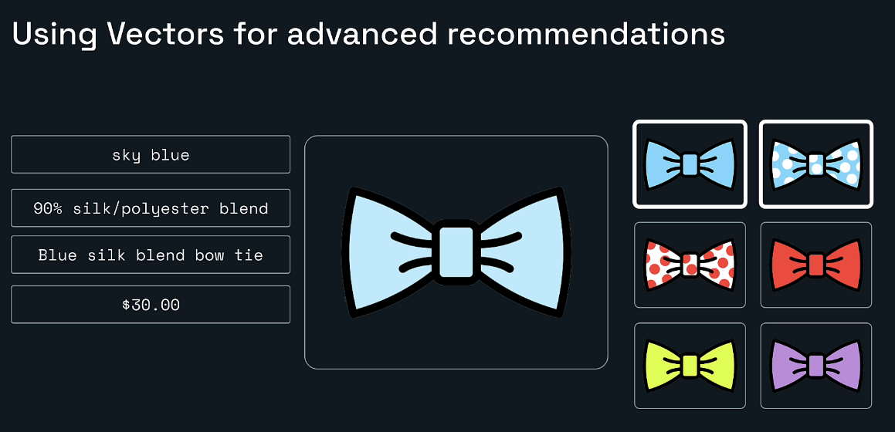

A product has attributes such as:

```text
Sky blue
90% silk/polyester blend
Blue silk blend bow tie
$30.00
```

A vector can represent its meaning and style.

Redis can find similar products:

- Similar color
- Similar material
- Similar description
- Similar appearance
- Similar user preference

## Recommendation flow

```text
Selected product
      |
Product embedding
      |
Vector nearest-neighbor search
      |
Similar products
      |
Business filters
      |
Final recommendations
```

Business filters might remove:

- Out-of-stock items
- Products outside the user's region
- Products above a price limit
- The product already being viewed
- Restricted items

---

# 27. Vector Search Chatbot

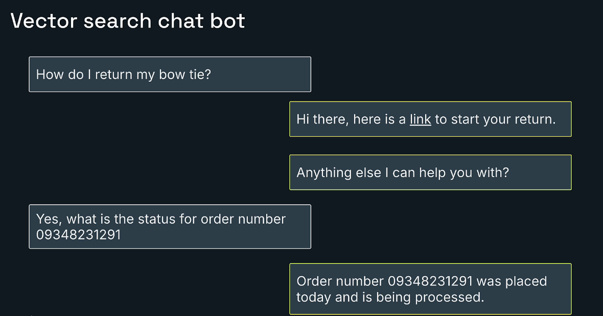

A customer asks:

```text
How do I return my bow tie?
```

The application can:

1. Convert the question into an embedding.
2. Search indexed support documents.
3. Retrieve the return-policy content.
4. Generate or return an answer.
5. Link to the correct workflow.

The user then asks:

```text
What is the status of order 09348231291?
```

This requires more than vector similarity.

The system must securely call an order service or database.

## RAG and tool use

A chatbot may combine:

```text
Vector search -> Find relevant policy or support context
Tool/API call -> Retrieve private order status
LLM          -> Compose the response
```

Vector search should not invent private transactional data.

---

# 28. Vector Search Use Cases

- Semantic product search
- Recommendation engines
- Similar-document search
- Support chatbots
- Retrieval-augmented generation
- Semantic caching
- Duplicate detection
- Image similarity
- Audio similarity
- Content moderation assistance
- Agent memory retrieval

---

# 29. Vector Search Design Decisions

## Embedding model

The chosen model determines:

- Vector dimension
- Supported language
- Supported content type
- Semantic quality
- Cost and speed

## Distance metric

Common choices:

- Cosine
- Euclidean/L2
- Inner product

## Index algorithm

Common Redis vector-index choices include:

- FLAT
- HNSW
- Other supported algorithms depending on Redis version and deployment

## Metadata

Store searchable metadata beside the vector:

```text
price
category
city
tenant
inventory
permissions
document type
```

## Evaluation

Measure:

- Recall
- Precision
- Relevance
- Latency
- Memory
- Cost
- User satisfaction
- Hallucination rate for RAG systems

---

# 30. Online Shopping: Combining All Four Use Cases

A realistic online store can use Redis like this:

```text
                    +-------------------------+
                    |   Product database      |
                    | PostgreSQL / MySQL      |
                    +------------+------------+
                                 |
                 +---------------+----------------+
                 |                                |
          Product updates                  Cache-aside reads
                 |                                |
                 v                                v
        +------------------+              +------------------+
        | Redis Search     |              | Redis cache      |
        | Hash/JSON index  |              | Product records  |
        +------------------+              +------------------+
                 |                                |
                 +---------------+----------------+
                                 |
                           Spring Boot API
                                 |
                 +---------------+----------------+
                 |                                |
                 v                                v
        +------------------+              +------------------+
        | Redis sessions   |              | Vector index     |
        | Cart and state   |              | Recommendations  |
        +------------------+              +------------------+
```

## Product-page request

```text
1. Read product from cache.
2. On miss, read database and cache it.
3. Load shopping session.
4. Run recommendation search.
5. Return page.
```

## Search request

```text
1. Parse text and filters.
2. Run Redis Search query.
3. Retrieve matching products.
4. Apply permissions and availability.
5. Return results.
```

## Checkout request

```text
1. Validate session.
2. Read cart.
3. Re-check price and inventory from authoritative systems.
4. Create order transaction.
5. Clear or update session.
6. Invalidate affected caches.
```

Redis improves the hot path, but authoritative checkout rules still belong in systems designed for durable transactional correctness.

---

# 31. Java and Spring Boot Setup

Typical dependencies:

```xml
<dependency>
    <groupId>org.springframework.boot</groupId>
    <artifactId>spring-boot-starter-data-redis</artifactId>
</dependency>

<dependency>
    <groupId>org.springframework.boot</groupId>
    <artifactId>spring-boot-starter-cache</artifactId>
</dependency>
```

Example configuration:

```yaml
spring:
  data:
    redis:
      host: localhost
      port: 6379
      timeout: 2s
```

For Redis Cloud, use the provided:

- Host
- Port
- Username
- Password
- TLS configuration

Never commit production credentials into source control.

---

# 32. Spring Boot Caching Example

Enable caching:

```java
@Configuration
@EnableCaching
public class CacheConfig {

    @Bean
    RedisCacheConfiguration redisCacheConfiguration() {
        return RedisCacheConfiguration
                .defaultCacheConfig()
                .entryTtl(Duration.ofMinutes(5))
                .disableCachingNullValues();
    }
}
```

Service:

```java
@Service
public class ProductService {

    private final ProductRepository productRepository;

    public ProductService(ProductRepository productRepository) {
        this.productRepository = productRepository;
    }

    @Cacheable(cacheNames = "products", key = "#productId")
    public Product getProduct(String productId) {
        return productRepository.findById(productId)
                .orElseThrow(() ->
                        new ProductNotFoundException(productId));
    }

    @CacheEvict(cacheNames = "products", key = "#product.id")
    public Product updateProduct(Product product) {
        return productRepository.save(product);
    }
}
```

Flow:

```text
getProduct()
    |
Spring cache checks Redis
    |
Hit  -> return cached value
Miss -> run method, cache result, return
```

---

# 33. Manual Cache-Aside Example

```java
@Service
public class ProductCacheAsideService {

    private static final Duration TTL = Duration.ofMinutes(5);

    private final StringRedisTemplate redisTemplate;
    private final ProductRepository productRepository;
    private final ObjectMapper objectMapper;

    public ProductCacheAsideService(
            StringRedisTemplate redisTemplate,
            ProductRepository productRepository,
            ObjectMapper objectMapper) {
        this.redisTemplate = redisTemplate;
        this.productRepository = productRepository;
        this.objectMapper = objectMapper;
    }

    public Product getProduct(String productId) {
        String key = "cache:product:" + productId;
        String cached = redisTemplate.opsForValue().get(key);

        if (cached != null) {
            return readJson(cached);
        }

        Product product = productRepository.findById(productId)
                .orElseThrow(() ->
                        new ProductNotFoundException(productId));

        redisTemplate.opsForValue().set(
                key,
                writeJson(product),
                TTL);

        return product;
    }

    public Product updateProduct(Product product) {
        Product saved = productRepository.save(product);

        redisTemplate.delete(
                "cache:product:" + product.id());

        return saved;
    }

    private Product readJson(String value) {
        try {
            return objectMapper.readValue(value, Product.class);
        } catch (JsonProcessingException exception) {
            throw new IllegalStateException(
                    "Invalid cached product JSON",
                    exception);
        }
    }

    private String writeJson(Product product) {
        try {
            return objectMapper.writeValueAsString(product);
        } catch (JsonProcessingException exception) {
            throw new IllegalStateException(
                    "Unable to serialize product",
                    exception);
        }
    }
}
```

---

# 34. Spring Boot Session Service

```java
@Service
public class ShoppingSessionService {

    private static final Duration SESSION_TTL =
            Duration.ofMinutes(30);

    private final StringRedisTemplate redisTemplate;

    public ShoppingSessionService(
            StringRedisTemplate redisTemplate) {
        this.redisTemplate = redisTemplate;
    }

    public void createSession(
            String sessionId,
            String userId) {

        String key = key(sessionId);

        redisTemplate.opsForHash().put(
                key,
                "userId",
                userId);

        redisTemplate.opsForHash().put(
                key,
                "cartItemCount",
                "0");

        redisTemplate.expire(key, SESSION_TTL);
    }

    public void addItem(String sessionId, String productId) {
        String key = key(sessionId);

        if (!Boolean.TRUE.equals(redisTemplate.hasKey(key))) {
            throw new SessionExpiredException();
        }

        redisTemplate.opsForList().rightPush(
                key + ":cart",
                productId);

        redisTemplate.opsForHash().increment(
                key,
                "cartItemCount",
                1);

        redisTemplate.expire(key, SESSION_TTL);
        redisTemplate.expire(key + ":cart", SESSION_TTL);
    }

    public Map<Object, Object> getSession(String sessionId) {
        return redisTemplate.opsForHash()
                .entries(key(sessionId));
    }

    public void deleteSession(String sessionId) {
        redisTemplate.delete(List.of(
                key(sessionId),
                key(sessionId) + ":cart"));
    }

    private String key(String sessionId) {
        return "session:shop:" + sessionId;
    }
}
```

In a real application, keep related session keys aligned so one component does not expire earlier than another unexpectedly.

---

# 35. Java Search Example with Jedis

Current Jedis APIs provide Redis Search support.

Conceptual service:

```java
import redis.clients.jedis.RedisClient;
import redis.clients.jedis.search.Document;
import redis.clients.jedis.search.SearchResult;

public class ProductSearchService {

    private final RedisClient redis;

    public ProductSearchService(RedisClient redis) {
        this.redis = redis;
    }

    public List<Document> searchChicagoProducts() {
        SearchResult result = redis.ftSearch(
                "idx:catalog",
                "@city:{Chicago} @price:[0 40]"
        );

        return result.getDocuments();
    }
}
```

Production code should also include:

- Pagination
- Query escaping
- Field projection
- Timeouts
- Input validation
- Authorization filters
- Tenant filters
- Error handling
- Index migration strategy

Do not directly concatenate untrusted user input into a complex query without validation and escaping.

---

# 36. Vector Search Application Flow

A Java vector-search service usually performs:

```text
String query
    |
Embedding model or embedding API
    |
float[] queryVector
    |
Convert to binary format required by client/storage
    |
FT.SEARCH KNN query
    |
Ranked documents
```

Conceptual code:

```java
public List<ProductMatch> semanticSearch(
        String userQuery) {

    float[] embedding = embeddingService.embed(userQuery);

    byte[] queryBlob = vectorEncoder.toFloat32Bytes(
            embedding);

    return redisVectorRepository.search(
            queryBlob,
            10,
            Map.of(
                "maxPrice", 50,
                "city", "Chicago"
            )
    );
}
```

The exact API depends on:

- Jedis or Lettuce version
- Hash versus JSON storage
- Embedding provider
- Vector dimension
- Index configuration

---

# 37. Testing Strategy

## Caching tests

Test:

- Cache miss
- Cache hit
- TTL
- Invalidation after update
- Serialization failure
- Redis unavailable
- Cache stampede behavior

## Search tests

Test:

- Text query
- Exact tags
- Numeric ranges
- Combined filters
- Pagination
- No-result query
- Special characters
- Authorization filters

## Session tests

Test:

- Session creation
- Session read
- Sliding expiration
- Explicit logout
- Expired session
- Concurrent cart changes
- Cross-instance access

## Vector tests

Test:

- Relevant nearest neighbors
- Metadata filters
- Dimension mismatch
- Empty result
- Threshold behavior
- Embedding-model changes
- Evaluation dataset quality

Use Testcontainers for Redis integration tests when the project's environment allows it.

---

# 38. Production Checklist

## Availability

- Replication or high availability
- Failover behavior
- Client reconnect strategy
- Health checks
- Regional design

## Security

- TLS
- Authentication
- ACLs
- Private networking
- Secret management
- Session protection
- Audit controls

## Performance

- P50, P95, and P99 latency
- Connection-pool metrics
- Memory usage
- Hit rate
- Search-query latency
- Vector-query latency
- Hot keys
- Slow logs

## Data lifecycle

- TTLs
- Eviction policy
- Stream retention
- Index cleanup
- Session maximum lifetime
- Cache invalidation
- Vector re-indexing

## Cost

- Dataset size
- Replication
- Vector dimensions
- Index overhead
- Traffic
- Network egress
- Persistence requirements

---

# 39. When Not to Use Redis

Redis may not be the best primary solution when the requirement is mainly:

- Large analytical SQL joins
- Long-term archival storage
- Very large inexpensive cold storage
- Complex relational constraints
- Multi-entity ACID transactions
- An event platform requiring Kafka-style long retention and partition semantics
- A specialized GIS workload
- Search needs that exceed the chosen Redis deployment's capabilities

Redis is often strongest when used as part of an architecture rather than forced to replace every other system.

---

# 40. Key Takeaways

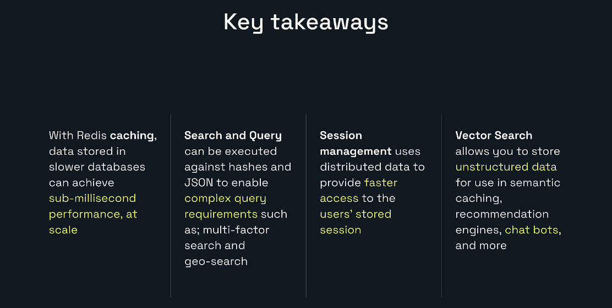

- Redis caching gives applications low-latency access to frequently requested data.
- Cache correctness requires TTLs, invalidation, and miss handling.
- Redis Search can query indexed hashes and JSON using text, tags, numeric ranges, geospatial conditions, aggregations, and vectors.
- Session management uses shared distributed state so multiple application servers can provide a continuous user experience.
- Sessions require TTL and strong security practices.
- Vector search enables semantic retrieval, recommendations, semantic caching, chatbots, and RAG.
- Online shopping can combine caching, search, sessions, and vectors.
- Speed improves user experience only when the entire request path is designed and measured.
- Redis should complement authoritative databases and services rather than automatically replace them.

---

# 41. Redis Learning Journey Recap

## Lesson 1

Explore Redis for developers.

## Lesson 2

Build and connect a Redis database.

## Lesson 3

Use Redis Insight.

## Lesson 4

Explore keys, values, and strings.

## Lesson 5

Build with lists.

## Lesson 6

Build with sets.

## Lesson 7

Build with hashes.

## Lesson 8

Build with sorted sets.

## Lesson 9

Build with JSON.

## Lesson 10

Explore more data structures.

## Lesson 11

Use key expiration.

## Lesson 12

Explore Redis use cases.

At this point, I have moved from commands to architecture:

```text
Data structure
      |
Command
      |
Application pattern
      |
System design
      |
Production decision
```

---

# 42. Next Steps

At this stage, I have:

- Configured and connected to Redis.
- Used Redis Insight.
- Practiced core data structures.
- Practiced expiration.
- Explored advanced structures.
- Studied common application use cases.

The next goal is to build a complete application and prepare it for production.

## Continue with Redis University

Redis University:

```text
https://university.redis.io/
```

Redis Dev Hub:

```text
https://redis.io/dev/
```

Current developer learning paths include:

- Redis for Java Developers
- Redis for JavaScript Developers
- Redis for .NET Developers
- Redis for Python Developers
- Redis for AI

For my backend goals, the strongest next path is:

```text
Redis for Java Developers
        |
Java and Jedis
        |
Spring Boot integration
        |
Caching
        |
Sessions
        |
Search
        |
Streams
        |
Production practices
```

## Learn operations

Redis Cloud and Redis Software learning paths cover:

- Deployment
- High availability
- Persistence
- Monitoring
- Scaling
- Troubleshooting
- Production operations

## Bookmark Redis service status

```text
https://status.redis.io/
```

Use it to check current Redis service-health and incident information.

## Use official support

```text
https://redis.io/support/
```

When troubleshooting is exhausted, use the support portal available for the applicable Redis plan.

## Professional Services

```text
https://redis.io/services/professional-services/
```

Professional Services can help organizations with consulting, assessments, implementation, and skill gaps.

## Join the Redis community

```text
https://redis.io/tutorials/community/discord/
```

The Redis Discord community is useful for:

- Questions
- Peer learning
- Project feedback
- Redis news
- Developer networking

## Keep the docs open

```text
https://redis.io/docs/latest/
```

For Java:

```text
https://redis.io/tutorials/develop/java/getting-started/
```

---

# 43. Suggested Personal Learning Path

Because my target is backend development with:

- Java
- Spring Boot
- Microservices
- Kafka
- RabbitMQ
- Redis
- System design

my next learning sequence should be:

```text
1. Connect Spring Boot to local Redis
2. Connect Spring Boot to Redis Cloud
3. Learn StringRedisTemplate
4. Learn RedisTemplate and serialization
5. Build cache-aside product API
6. Add Spring Cache annotations
7. Add session/cart storage
8. Add rate limiting
9. Add distributed locking carefully
10. Add Redis Streams
11. Compare Streams, Kafka, and RabbitMQ
12. Add Redis Search
13. Add vector search and RAG
14. Add Testcontainers tests
15. Add metrics and failure handling
16. Deploy and load test
```

---

# 44. Final Practice Project

## Project: Redis-Powered Online Store Backend

### Technology

- Java
- Spring Boot
- PostgreSQL
- Redis
- Redis Search
- Docker
- Testcontainers

### Features

#### Product API

```text
GET /products/{id}
```

Use cache-aside.

#### Search API

```text
GET /products/search?q=bow+tie&minPrice=10&maxPrice=30&city=Chicago
```

Use Redis Search.

#### Cart API

```text
POST /sessions/{sessionId}/cart/items
GET  /sessions/{sessionId}/cart
```

Use Redis sessions with TTL.

#### Recommendations API

```text
GET /products/{id}/recommendations
```

Begin with sorted sets, then add vector search.

#### Support API

```text
POST /support/ask
```

Use vector retrieval for public support documents.

### Production features

- Cache TTL
- Cache invalidation
- Session expiration
- Metrics
- Structured logging
- Error handling
- Redis health check
- Testcontainers integration tests
- Docker Compose
- README architecture diagram

---

# 45. Lesson Completion Checklist

- [ ] I can explain enterprise caching.
- [ ] I understand cache hit and cache miss.
- [ ] I can draw cache-aside flow.
- [ ] I understand stale data and invalidation.
- [ ] I understand cache stampedes.
- [ ] I can explain Redis Search.
- [ ] I understand TEXT, TAG, NUMERIC, GEO, and VECTOR fields.
- [ ] I can explain search on hashes and JSON.
- [ ] I can explain distributed sessions.
- [ ] I understand session TTL.
- [ ] I understand fixed versus sliding sessions.
- [ ] I can explain vector embeddings.
- [ ] I understand vector similarity search.
- [ ] I understand recommendations, semantic cache, chatbots, and RAG.
- [ ] I can combine all four use cases in an online-shopping architecture.
- [ ] I know the next Java/Spring Boot learning steps.
- [ ] I know where to find Redis status, support, training, and community resources.

---

# Included Practice Files

The downloadable package includes:

```text
lesson-12-lab-commands.txt
lesson-12-expected-results.md
```

The command file provides mini-labs for:

- Cache-aside
- Temporary cache locks
- Search and query
- Session management
- Ranked recommendations
- Vector-search preparation
- Combined shopping workflow

The expected-results guide explains the result of each section and notes which capabilities require Redis Search support.

---

# Additional Supplied Course Images

The package preserves the alternate images from the first batch as well.

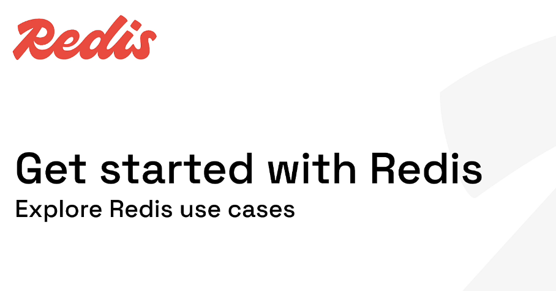

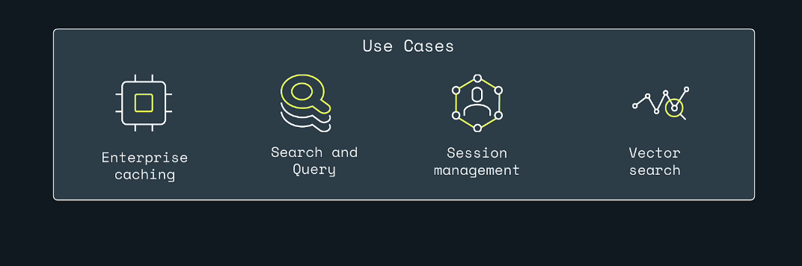

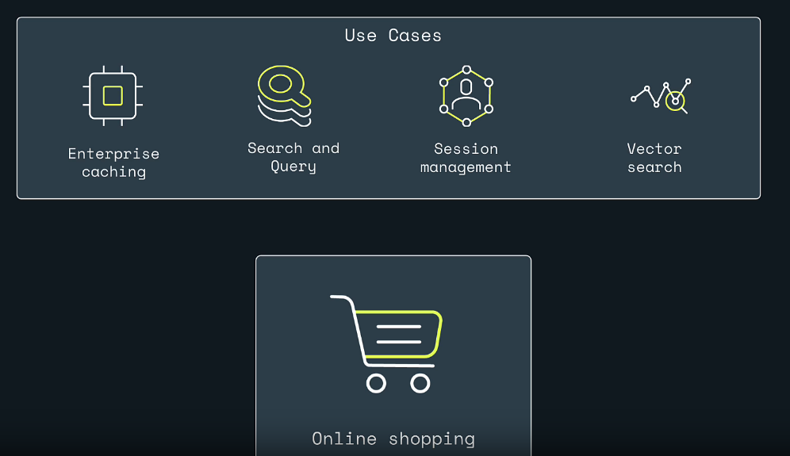

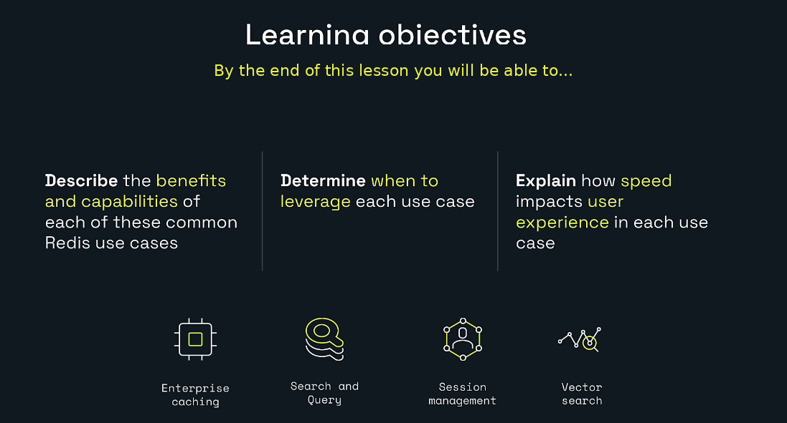


---

# Repository Structure

```text
redis-learning-journey-lesson-12/
|-- README.md
|-- lesson-12-lab-commands.txt
|-- lesson-12-expected-results.md
|-- MANIFEST.txt
`-- images/
    |-- 00-cover-explore-redis-use-cases.png
    |-- 00a-cover-alternate.png
    |-- 01-use-cases-and-online-shopping.png
    |-- 01a-use-cases-overview-alternate.png
    |-- 02-learning-objectives.png
    |-- 02a-online-shopping-overview-alternate.png
    |-- 03-access-data-anywhere.png
    |-- 03a-learning-objectives-alternate.png
    |-- 04-caching-title.png
    |-- 04a-caching-title-alternate.png
    |-- 05-milliseconds-matter.png
    |-- 06-search-and-query-title.png
    |-- 07-search-types.png
    |-- 08-search-hashes-and-json.png
    |-- 09-search-and-find-products.png
    |-- 10-session-management-title.png
    |-- 11-session-management-benefits.png
    |-- 12-shopping-session-timeline.png
    |-- 13-vector-search-title.png
    |-- 14-vector-embedding-pipeline.png
    |-- 15-vector-recommendations.png
    |-- 16-vector-search-chatbot.png
    `-- 17-key-takeaways.png
```

---

# Official References

## Redis use cases

- https://redis.io/docs/latest/develop/use-cases/

## Caching

- https://redis.io/docs/latest/develop/use-cases/cache-aside/
- https://redis.io/docs/latest/develop/use-cases/prefetch-cache/
- https://redis.io/docs/latest/develop/use-cases/semantic-cache/
- https://redis.io/docs/latest/develop/reference/eviction/

## Search and query

- https://redis.io/docs/latest/develop/ai/search-and-query/
- https://redis.io/docs/latest/develop/clients/jedis/queryjson/

## Vector search

- https://redis.io/docs/latest/develop/ai/search-and-query/vectors/
- https://redis.io/docs/latest/develop/clients/jedis/vecsearch/

## Java development

- https://redis.io/tutorials/develop/java/getting-started/
- https://redis.io/docs/latest/develop/clients/

## Learning and production resources

- https://redis.io/dev/
- https://university.redis.io/
- https://status.redis.io/
- https://redis.io/support/
- https://redis.io/services/professional-services/
- https://redis.io/tutorials/community/discord/

---

# Next Lesson

## Lesson 13: Build Redis with Java and Spring Boot

Suggested topics:

- Create a Spring Boot project
- Add Redis dependencies
- Configure local Redis
- Configure Docker Redis
- Configure Redis Cloud
- Use Lettuce and Jedis
- Use `StringRedisTemplate`
- Configure object serialization
- Implement cache-aside
- Implement Spring Cache
- Build shopping sessions
- Add key expiration
- Add Redis Search
- Add Streams
- Add tests with Testcontainers
- Add observability and production error handling
